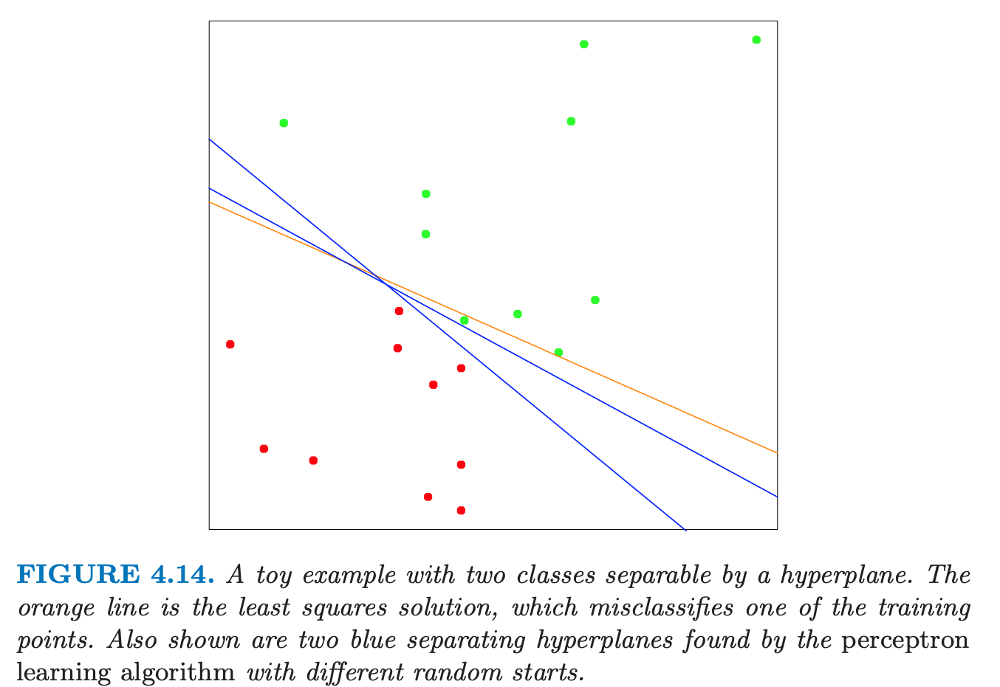
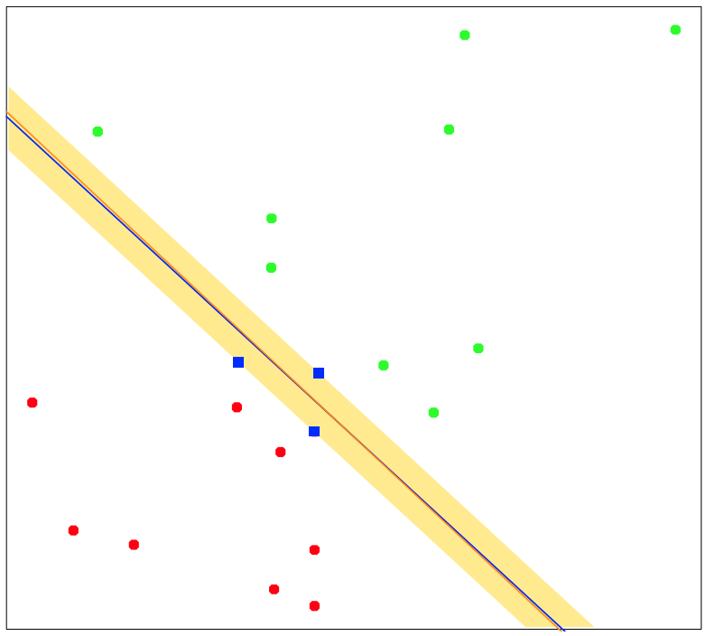
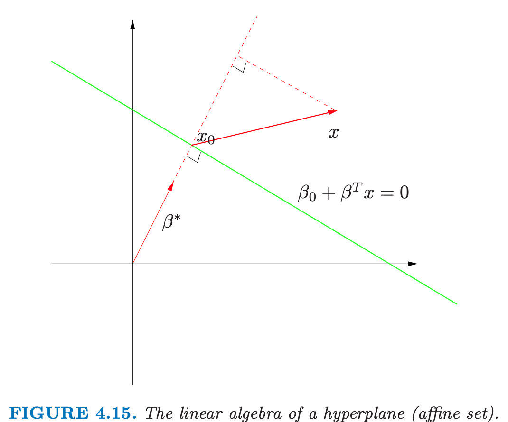
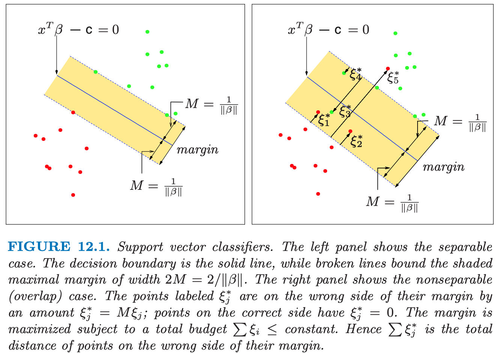
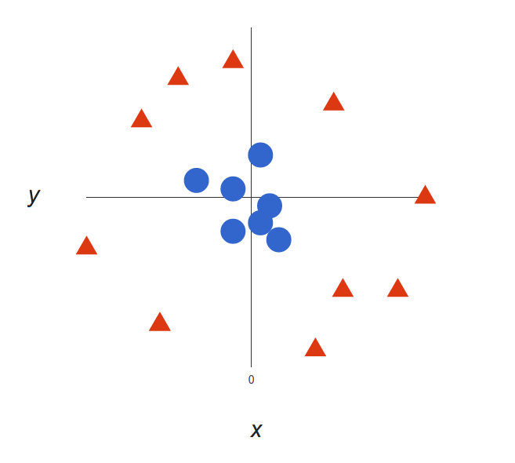
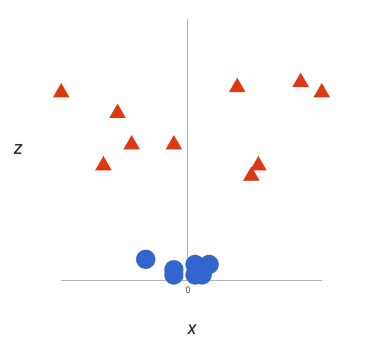
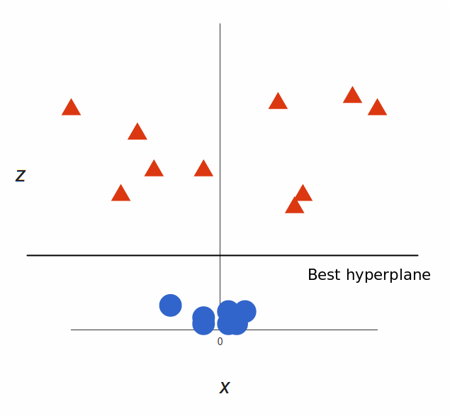
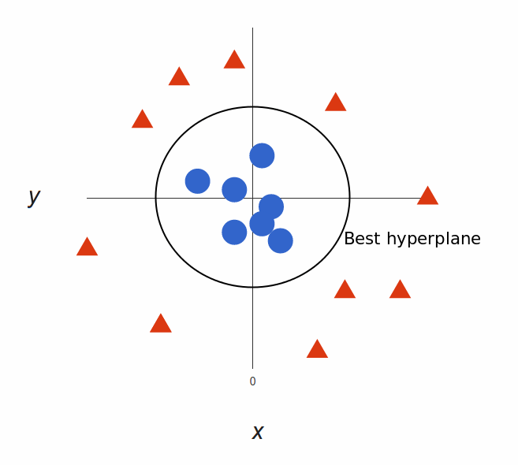

\begin{center} \fbox{\Large{\bf Notes 11: More Classification}} \end{center}

\tableofcontents

```{r setup, include=FALSE}
knitr::opts_chunk$set(echo = TRUE, fig.align="center", cache = F)
library(caret)
library(tidyverse)
```

# Introduction

In this set of notes, we will explore a couple more common classification techniques. The first one puts some of our new Bayesian knowledge to good use and then we will explore one of the most popular machine learning techniques for classification: support vector machines.


# Naïve Bayes Classifier

The naïve Bayes classifier is based on using Bayes' Theorem for assigning posterior probabilities of belonging to a certain class given the data vector. This is not a single algorithm but a family of algorithms where all of them share a common principle: every pair of features being classified is independent of each other. It is highly used in text classification where data contains high dimension (as each word represent one feature in the data). It is used in spam filtering, rating classification, and more. One big advantage of using naïve Bayes is its speed. It is fast and making prediction is easy with high dimension of data.

**Assumptions**:

* Independence: The observations are conditionally independent of each other, given the class label.
* Continuous variables are normally distributed: If a predictor variable is continuous, then it is assumed to be normally distributed within each class.
* Discrete variables have multinomial distributions: If a predictor variable is discrete, then it is assumed to have a multinomial distribution (a more general case of the binomial) within each class. (This can be adjusted.)
* Variables are equally important: All variables are assumed to contribute equally to the prediction of the class label.
* No missing data: The data should not contain any missing values.

These assumptions are what make this Bayesian classifier "naïve". If these are not satisfied, more advanced versions of this classifier exist.

## Algorithm

We have discussed Bayes' theorem: 
$$
P(A|B)=\dfrac{P(B|A)P(A)}{P(B)}
$$
In this context, we replace these events with the data:
$$
P(y_i|\Xb_i) = \dfrac{P(\Xb_i|\yb_i)P(\yb_i)}{P(\Xb_i)}
$$
where $\Xb_i$ is the $i$th row of the model matrix or data frame. Written another way, we can say
$$
P(y_i|x_{i1},\dots, x_{ip-1}) = \dfrac{P(x_{i1},\dots, x_{ip-1}|y_i)P(y_i)}{P(x_{i1},\dots, x_{ip-1})}.
$$
Assuming independence, we have that $P(x_{i1},\dots, x_{ip-1}|y_i) = P(x_{i1}|y_i)\times\dots\times P(x_{ip-1}|y_i)$. That gives us 
$$
P(y_i|x_{i1},\dots, x_{ip-1}) = \dfrac{P(x_{i1}|y_i)\times\dots\times P(x_{ip-1}|y_i)P(y_i)}{P(x_{i1},\dots, x_{ip-1})}=\dfrac{P(y_i)\prod_{j=1}^{p-1}P(x_{ij}|y_i)}{P(x_{i1},\dots, x_{ip-1})}.
$$
Since the denominator does not have a $y_i$ in it, we can do our proportional trick:
$$
P(y_i|x_{i1},\dots, x_{ip-1}) \propto P(y_i)\prod_{j=1}^{p-1}P(x_{ij}|y_i).
$$

## Naïve Bayes Example

Let's try this out on a small example. 

\begin{tabular}{|c|c|c|c|c|c|}
\hline
$Y$: Heart Attack & $X_1$: diastolic blood pressure & $X_2$: sex & $X_3$: age\\
\hline
1 & 92 & F & 71\\
1 & 97 & F & 64\\
0 & 66 & F & 53\\
0 & 83 & F & 75\\
0 & 82 & F & 69\\
0 & 91 & F & 63\\
0 & 77 & F & 71\\
1 & 90 & M & 57\\
1 & 86 & M & 82\\
1 & 96 & M & 73\\
0 & 69 & M & 86\\
1 & 92 & M & 65\\
1 & 84 & M & 78\\
\hline
\end{tabular}

Let's focus on the first row. We have 
$$
P(Y=1|X_1=92, X_2=F, X_3=71)\propto P(Y=1) P(X_1=92|Y=1)P(X_2=F|Y=1) P(X_3=71|Y=1)
$$
These probabilities (or densities in the case of the numeric values) are computed from the data. For the categorical probabilities: 

* $P(Y=1) = 7/13$ since 7 out of the 13 observations in the data set had a $Y$ value of 1. 
* $P(X_2=F|Y=1)$ is the probability of female given a heart attack, which is $2/7$ since two of the seven people that had a heart attack were female. 

For the continuous probabilities, we assume they have a normal distribution. The mean and variance of this normal are going to be the sample mean and sample variance from the class we are conditioning on. Let's call this class $k$. We call the sample mean conditioned on that class $\hat{\mu}_k$ and we call the sample variance conditioned on that class $\hat{\sigma}^2_k$. So, we get
$$
P(X_j=x_{ij}|Y=y_i)=\dfrac{1}{\sqrt{2\pi\hat{\sigma}_k^2}}\exp\left(-\frac{1}{2\hat{\sigma}_k^2}(x_{i1}-\hat{\mu}_k)^2\right)
$$

For $P(X_1=x_{i1}|Y=1)$, the data values are 92, 97, 90, 86, 96, 92, and 84. The mean of those values is 91 and the variance is 23. So we have
$$
P(X_1=92|Y=1)=\dfrac{1}{\sqrt{2\pi\cdot 23}}\exp\left(-\frac{1}{2\cdot 23}(92-91)^2\right)=\texttt{dnorm(92, 91, sqrt(23))}=0.08140.
$$

For $P(X_3=x_{i3}|Y=1)$, we have the data values 71, 64, 57, 82, 73, 65, and 78. So $\hat{\mu}_k=70$ and $\hat{\sigma}^2_k=74.67$. That gives
$$
P(X_3=71|Y=1)=\dfrac{1}{\sqrt{2\pi\cdot 74.67}}\exp\left(-\frac{1}{2\cdot 74.67}(71-70)^2\right)=\texttt{dnorm(71, 70, sqrt(74.67))}= 0.04586.
$$

Putting it all together, we get 
\begin{align*}
P(Y=1|X_1=92, X_2=F, X_3=71)&\propto P(Y=1) P(X_1=92|Y=1)P(X_2=M|Y=1) P(X_3=71|Y=1)\\
&=\dfrac{7}{13}\times 0.08140 \times \frac{2}{7}\times 0.04586\\
&=0.0005743
\end{align*}

Great, but that tells us almost nothing about if this person would be classified as a 0 or a 1. This is not the conditional probability of being in that class, it is only proportion to that probability. We need something to compare it to. We also need to compute $P(Y=0|X_1=92, X_2=F, X_3=71)$.

\vspace{0.1in}

Data values for $X_1|Y=0$: 
<!-- 66, 83, 82, 91, 77, and 69. The mean is 78 and the variance is 87.2. `dnorm(92, 78, sqrt(87.2)) = 0.01388573` -->

<!-- Data values for $X_3|Y=0$: 53, 75, 69, 63, 71, 86. The mean is 69.5 and the variance is 123.9. `dnorm(71, 69.5, sqrt(123.9)) = 0.03551657` -->

<!-- \begin{align*} -->
<!-- P(Y=0|X_1=92, X_2=F, X_3=71)&\propto P(Y=0) P(X_1=92|Y=0)P(X_2=F|Y=0) P(X_3=71|Y=0)\\ -->
<!-- &=\dfrac{6}{13}\times 0.01388573 \times \frac{5}{6}\times 0.03551657\\ -->
<!-- &=0.0001896821 -->
<!-- \end{align*} -->

\newpage

\phantom{.} \vspace{.3in}

So, we can say $P(Y=1|X_1=92, X_2=F, X_3=71) =$ \vspace{.4in}
<!-- \dfrac{0.0005742885}{0.0005742885 + 0.0001896821}=0.7517$ and -->

And $P(Y=0|X_1=92, X_2=F, X_3=71) =$  \vspace{.4in}
<!-- 0.04586\dfrac{0.0001896821}{0.0005742885 + 0.0001896821}= 0.2483$.\ -->

```{r naive_bayes}
library(naivebayes) |> suppressPackageStartupMessages()
library(caret) |> suppressPackageStartupMessages()
heart <- data.frame(y = factor(c(1, 1, 0, 0, 0, 0, 0, 1, 1, 1, 0, 1, 1)),
                    x1 = c(92, 97, 66, 83, 82, 91, 77, 90, 86, 96, 69, 92, 84),
                    x2 = c(rep("F", 7), rep("M", 6)),
                    x3 = c(71, 64, 53, 75, 69, 63, 71, 57, 82, 73, 86, 65, 78)
                    )
nb <- naive_bayes(y ~ x1 + x2 + x3, data = heart)
head(predict(nb, type = "prob")) |> round(3)

confusionMatrix(predict(nb, type = "class"), heart$y)$table
```
\vspace{.1in}

**More Classes**

We can extend this idea to more than 2 classes. For instance, if a `y` value of `2` indicates the person has had more than 1 heart attack:
```{r}
heart2 <- data.frame(y = factor(c(1, 2, 0, 0, 0, 0, 0, 1, 2, 1, 0, 2, 1)),
                    x1 = c(92, 97, 66, 83, 82, 91, 77, 90, 86, 96, 69, 92, 84),
                    x2 = c(rep("F", 7), rep("M", 6)),
                    x3 = c(71, 64, 53, 75, 69, 63, 71, 57, 82, 73, 86, 65, 78)
                    )
predict(naive_bayes(y ~ x1 + x2 + x3, data = heart2), type = "prob")[1,]
```

\vspace{.1in}

If we are uncomfortable with the assumption that the quantitative variables are normally distributed (as we should be here), kernel density estimation can be used instead.

\newpage

**Kernel density estimation** (KDE) works by\
smoothing over a horizontal bandwidth of data\
values to obtain an estimation for the density\
function used to generate the data values.

The image on the right shoes KDE with different\
bandwidths of a random sample of 100 points\
from a standard normal distribution.\
Grey: true density (standard normal).\
Red: KDE with bandwidth 0.05.\
Black: KDE with bandwidth 0.337.\
Green: KDE with bandwidth 2.

\vspace{-2.3in}
\begin{figure}[h]
\raggedleft
\includegraphics[width=3in]{svmFigs/kernel_compare.png}
\end{figure}

```{r kernel, fig.width = 6, fig.height = 4.5}
nb_kernel <- naive_bayes(y ~ x1 + x2 + x3, data = heart, usekernel = T)
head(predict(nb_kernel, type = "prob")) |> round(3)
predict(nb_kernel, type = "class")
heart$y
par(mfrow = c(2, 2))
plot(density(heart$x1[heart$y == 1]), main = "Density Estimate for X1|Y=1")
plot(density(heart$x1[heart$y == 0]), main = "Density Estimate for X1|Y=0")
plot(density(heart$x3[heart$y == 1]), main = "Density Estimate for X3|Y=1")
plot(density(heart$x3[heart$y == 0]), main = "Density Estimate for X3|Y=0")
par(mfrow = c(1, 1))
```


\newpage

# Support Vector Machines

In machine learning, **support vector machines** or **SVM**s are supervised learning models with associated learning algorithms that analyze data used for classification and regression analysis. However, they are mostly used in classification problems. Here we will focus on developing intuition rather than rigor and develop a basic understanding of the working principles.

\vspace{.2in}
Material for this content was obtained and adapted from: 
\footnotesize

* [https://www.datacamp.com/community/tutorials/support-vector-machines-r](https://www.datacamp.com/community/tutorials/support-vector-machines-r) 
* [_The Elements of Statistical Learning_, Hastie, et al., Springer](https://hastie.su.domains/Papers/ESLII.pdf)
* [https://www.geeksforgeeks.org/classifying-data-using-support-vector-machinessvms-in-r/amp/](https://www.geeksforgeeks.org/classifying-data-using-support-vector-machinessvms-in-r/amp/)

\normalsize

## Support Vector Machines--Linear Data
Let’s imagine we have two tags: _red_ and _blue_, and our data has two features: $x$ and $y$. We can plot our training data on a plane:
\vspace{-.1in}

\begin{figure}
\centering
\includegraphics[width=2.1in]{svmFigs/svm1.png}
\includegraphics[width=2.1in]{svmFigs/svm2.png}
\end{figure}


An **SVM** identifies the **decision boundary** or **hyperplane** (a line in two dimensions) that best separates the tags.


But, what exactly is the best hyperplane? For SVM, it’s the one that maximizes the margins from the data from both tags:  \vspace{-.2in}
\begin{figure}
\centering
\includegraphics[width=2.5in]{svmFigs/svm3.png}
\end{figure}


**Types of margins**:

There are two types of margins for SVMs: hard margin and soft margin. 

* **Hard margin**: This is used when the hyperplane can be drawn in such a way that there are no misclassifications. This is uncommon on real datasets since this would mean the data have no overlap. 
* **Soft margin**:  This is used when the data are not perfectly separable or contain outliers. Each data point has a slack variable introduced by the soft-margin SVM formulation, which softens the strict margin requirement and permits certain misclassifications or violations. There is a compromise between increasing the margin and reducing violations.


## A Look into SVM Methodology

We will focus first on the hard margin case where we can get perfect separation. The hyperplane in 2D is a line. We can think of the equation of this line first in standard form $ax+by=c$. Now, to make this more general, we will write it as $ax_1+bx_2-c=0$. Reparametarizing this, we get
$$
\beta_1x_1 + \beta_2x_2 - c=0.
$$
Then we can write $x_2=-\frac{\beta_1}{\beta_2}x_1-\frac{\beta_0}{\beta_2}$. So, the slope of this line is $-\frac{\beta_1}{\beta_2}$ and the $y$-intercept is $\frac{c}{\beta_2}$.

In $k$ dimentions, we get the equation of our hyperplane as 
$$
\beta_1x_1 + \beta_2x_2+\beta_3x_3+\dots+\beta_kx_k-c=0.
$$
this is equivalently written 
$$
\boldsymbol{\beta}^T\xb-c=0.
$$

**Hard-Margin Case**

Now, in the hard-margin case, we will classify anything on or above the boundary $\boldsymbol{\beta}^T\xb-c=1$ is one class (say a 1) and everything on or below the boundary $\boldsymbol{\beta}^T\xb-c=-1$ as the other class (say a $-1$). 

The distance between those two hyperplanes is $\dfrac{2}{\Vert \boldsymbol{\beta}\Vert}$ where $\Vert \boldsymbol{\beta}\Vert$ is the Euclidean norm (or the 2 norm): $\Vert \boldsymbol{\beta}\Vert=\sqrt{\sum_{i=1}^k \beta_i^2}$. To maximize the distance between the hyperplanes, that is, to maximize the margin, we want to minimize $\Vert \boldsymbol{\beta}\Vert$.

We also need to prevent any point from falling in the margin, so we need $\boldsymbol{\beta}^T\xb_i-c\ge 1$ if $y_i=1$ and $\boldsymbol{\beta}^T\xb_i-c\le -1$ if $y_i=-1$. We can combine these constraints by writing $y_i(\boldsymbol{\beta}^T\xb_i-c)\ge 1$ for all $1\le i\le n$ and for $y_i\in \{-1, 1\}$. Therefore, finding the $\beta_i$ values is the same as the constrained optimization problem
\begin{align*}
\underset{\boldsymbol{\beta}, c}{\text{minimize }} & \Vert\boldsymbol{\beta}\Vert^2_2\\
\text{subject to } & y_i(\boldsymbol{\beta}^T\xb_i-c)\ge 1 \text{ for all } i
\end{align*}

An important property of this optimization problem is that the max-margin hyperplane is completely determined by those $\boldsymbol{x}_i$ that lie nearest to it. These $\boldsymbol{x}_i$ are called **support vectors**.

\newpage

**Soft-Margin Case**

Much remains the same in the soft-margin case except now it is not possible to prevent values from falling in the margin. So, we introduce new variables, $\xi_i$ that are equal to zero for points on the correct side of the margin and equal to the distance to the end of the margin for points on the wrong side of the margin. See Figure 12.1 below, which comes from *Elements of Statistical Learning*:

<!-- Now, we can find the distance between any point and the decision boundary using $d_i=\dfrac{\boldsymbol{\beta}^T\xb_i-c}{\Vert{\boldsymbol{\beta}}\Vert}$. Why?? -->

<!-- \center -->
<!-- {width=75%} -->

<!-- \center -->
<!-- {width=75%} -->


<!-- \center -->
<!-- {width=75%} -->


\center
{width=90%}
\raggedright

Therefore, the new optimization problem can be stated
\begin{align*}
\underset{\boldsymbol{\beta}, c, \xi}{\text{minimize }} & \Vert\boldsymbol{\beta}\Vert^2_2 + C\sum_{i=1}^n \xi_i\\
\text{subject to } & y_i(\boldsymbol{\beta}^T\xb_i-c)\ge 1-\xi_i \text{ where } \xi_i\ge 0\text{ for all } i 
\end{align*}
where $C>0$ is a cost parameter that determines the trade-off between increasing the margin size and ensuring that point $i$ lie on the correct side of the margin. The smaller the cost, the more misclassifications are allowed in the data and the more potential to under fit. The higher the cost, the fewer misclassifications and the more potential to over fit. The higher the cost, the more this behaves like the hard-margin case. Using cross validation may be a good way to choose this cost value. 

# Support Vector Machines in R

## Hard-margin Case


First generate some data in 2 dimensions, and make them a little separated:
```{r,out.width="60%",fig.align='center'}
set.seed(10111)
x = matrix(rnorm(40), 20, 2)
y = rep(c(-1, 1), c(10, 10))
x[y == 1,] = x[y == 1,] + 1.6
plot(x, col = y + 3, pch = c(16, 0, 17)[as.numeric(y + 2)])
```


We will use the **e1071** package which contains the svm function and make a dataframe of the data, turning $y$ into a factor variable. The `cost` option in the `svm()` function controls training errors and margins.  <!--After that, you make a call to svm on this dataframe, using y as the response variable and other variables as the predictors. The dataframe will have unpacked the matrix x into 2 columns named x1 and x2. You tell SVM that the kernel is linear, the tune-in parameter cost is 10, and scale equals false. In this example, you ask it not to standardize the variables.-->

```{r,out.width="60%",fig.align='center'}
library(e1071)
dat <- data.frame(X1 = x[,1], X2 = x[,2], y = as.factor(y))
# The variable entered first will be plot on the y axis
svmfit <- svm(y ~ X2 + X1, data = dat, 
             kernel = "linear", cost = 10, scale = FALSE)
print(svmfit)
```

\vspace{.1in}

Printing the `svmfit` gives its summary. You can see that the number of support vectors is 6 - they are the points that are close to the boundary or on the wrong side of the boundary.


There's a plot function for SVM that shows the decision boundary, as you can see below. The points plotted as "X" are support vectors.

```{r,out.width="75%",fig.align='center'}
plot(svmfit, dat, grid = 100, dataSymbol = 16)
```

```{r, eval = F, echo = F}
plot(svmfit, dat, fill = T, grid = 100, svSymbol = "x", 
     dataSymbol = 16, col = c("lightblue", "pink"), 
     symbolPalette = c("blue", "red"))
```


<!-- Or plotting it more cleanly: -->

<!-- ```{r,out.width="75%",fig.align='center'} -->
<!-- make.grid <- function(x, n = 75) { -->
<!--   grange <- apply(x, 2, range) -->
<!--   x1 <- seq(from = grange[1,1], to = grange[2,1], length = n) -->
<!--   x2 <- seq(from = grange[1,2], to = grange[2,2], length = n) -->
<!--   expand.grid(X1 = x1, X2 = x2) -->
<!-- } -->
<!-- xgrid <- make.grid(x) -->
<!-- ygrid <- predict(svmfit, xgrid) -->
<!-- plot(xgrid, col = c("red","blue")[as.numeric(ygrid)], pch = 20, cex = .2) -->
<!-- points(x, col = y + 3, pch = 19) -->
<!-- points(x[svmfit$index,], pch = 5, cex = 2) -->
<!-- ``` -->


Unfortunately, the `svm()` function is not super friendly. We have to do some work to get back the linear coefficients. The reason is probably that this only makes sense for linear kernels, and the function is more general. So let's use some coded to extract the coefficients. We can extract $\boldsymbol{\beta}$ and $c$, which are the linear coefficients using the following:

```{r}
(beta = drop(t(svmfit$coefs)%*%x[svmfit$index,]))
(c = svmfit$rho)
```

Now we can replot the points on the grid, then put the points back in (including the support vector points). Then you can use the coefficients to draw the decision boundary using a simple equation of the form:
$$x_1\beta_1+x_2\beta_2-c=0$$

Solving for $x_2$ gives us 
$$
x_2 = \dfrac{c}{\beta_2} - \dfrac{\beta_1}{\beta_2}x_1
$$

Now plotting the line on a graph:
```{r, out.width="80%", fig.align='center', echo=T, eval = T}
make.grid <- function(x, n = 75) {
  grange <- apply(x, 2, range)
  x1 <- seq(from = grange[1,1], to = grange[2,1], length = n)
  x2 <- seq(from = grange[1,2], to = grange[2,2], length = n)
  expand.grid(X1 = x1, X2 = x2)
}
xgrid <- make.grid(x)
ygrid <- predict(svmfit, xgrid)
plot(xgrid, col = c("red", "blue")[as.numeric(ygrid)], 
     pch = c(16, 17)[as.numeric(ygrid)], cex = .3)
points(x, col = y + 3, pch = c(16, 0, 17)[as.numeric(y + 2)])
points(x[svmfit$index,], pch = 5, cex = 2)
abline(c / beta[2], -beta[1] / beta[2])
abline((c - 1) / beta[2], -beta[1] / beta[2], lty = 2)
abline((c + 1) / beta[2], -beta[1] / beta[2], lty = 2)
```


## Soft-margin Case


Now generate similar data in 2 dimensions, but make them less separated:
```{r,out.width="60%",fig.align='center'}
set.seed(10111)
x2 = matrix(rnorm(40), 20, 2)
y2 = rep(c(-1, 1), c(10, 10))
x2[y2 == 1,] = x2[y2 == 1,] + 1
plot(x2, col = y2 + 3, pch = c(16, 0, 17)[as.numeric(y2 + 2)])
```


```{r,out.width="60%",fig.align='center'}
dat2 <- data.frame(X1 = x2[,1], X2 = x2[,2], y2 = as.factor(y2))
# The variable entered first will be plot on the y axis
svmfit2 <- svm(y2 ~ X2 + X1, data = dat2, 
             kernel = "linear", cost = 10, scale = FALSE)
print(svmfit2)
```

\vspace{.1in}

Now the number of support vectors is 6 - they are the points that are close to the boundary or on the wrong side of the boundary.

```{r,out.width="75%",fig.align='center'}
plot(svmfit2, dat2, grid = 100, dataSymbol = 16)
```

Obtain the coefficients:

```{r}
(beta = drop(t(svmfit2$coefs)%*%x2[svmfit2$index,]))
(c = svmfit2$rho)
```

\newpage

Plot the lines:
```{r, out.width="70%", fig.align='center', echo=F, eval = T}
xgrid <- make.grid(x2)
ygrid <- predict(svmfit2, xgrid)
plot(xgrid, col = c("red", "blue")[as.numeric(ygrid)], 
     pch = c(16, 17)[as.numeric(ygrid)], cex = .3)
points(x2, col = y2 + 3, pch = c(16, 0, 17)[as.numeric(y2 + 2)])
points(x2[svmfit2$index,], pch = 5, cex = 2)
abline(c / beta[2], -beta[1] / beta[2])
abline((c - 1) / beta[2], -beta[1] / beta[2], lty = 2)
abline((c + 1) / beta[2], -beta[1] / beta[2], lty = 2)
```

If the cost was 100 instead of 10:
```{r, out.width="70%", fig.align='center', echo=F, eval = T}
svmfit3 <- svm(y2 ~ X2 + X1, data = dat2, 
             kernel = "linear", cost = 100, scale = FALSE)
beta = drop(t(svmfit3$coefs)%*%x2[svmfit3$index,])
c = svmfit3$rho
xgrid <- make.grid(x2)
ygrid <- predict(svmfit3, xgrid)
plot(xgrid, col = c("red", "blue")[as.numeric(ygrid)], 
     pch = c(16, 17)[as.numeric(ygrid)], cex = .3)
points(x2, col = y2 + 3, pch = c(16, 0, 17)[as.numeric(y2 + 2)])
points(x2[svmfit3$index,], pch = 5, cex = 2)
abline(c / beta[2], -beta[1] / beta[2])
abline((c - 1) / beta[2], -beta[1] / beta[2], lty = 2)
abline((c + 1) / beta[2], -beta[1] / beta[2], lty = 2)
```

If the cost was 1 instead of 10:

```{r, out.width="70%", fig.align='center', echo=F, eval = T}
svmfit4 <- svm(y2 ~ X2 + X1, data = dat2, 
             kernel = "linear", cost = 1, scale = FALSE)
beta = drop(t(svmfit4$coefs)%*%x2[svmfit4$index,])
c = svmfit4$rho
xgrid <- make.grid(x2)
ygrid <- predict(svmfit4, xgrid)
plot(xgrid, col = c("red", "blue")[as.numeric(ygrid)], pch = 20, cex = .3)
points(x2, col = y2 + 3, pch = c(16, 0, 17)[as.numeric(y2 + 2)])
points(x2[svmfit4$index,], pch = 5, cex = 2)
abline(c / beta[2], -beta[1] / beta[2])
abline((c - 1) / beta[2], -beta[1] / beta[2], lty = 2)
abline((c + 1) / beta[2], -beta[1] / beta[2], lty = 2)
```

\newpage

# Support Vector Machines for Non-Linear Data
Now the examples before were easy since clearly, the data was linearly separable. Often things aren’t that simple. Take a look at this case:

\center
{width=55%}
\raggedright

It’s pretty clear that there’s not a linear decision boundary (a single straight line that separates both tags). However, the vectors are very clearly segregated, and it looks as though it should be easy to separate them.

So here’s what we’ll do: we will **add a third dimension**. Up until now, we had two dimensions: $x$ and $y$. We create a new $z$ dimension, and we rule that it be calculated a certain way that is convenient for us: $z=x^2+y^2$ (you’ll notice that’s the equation for a circle).

This will give us a three-dimensional space. Taking a slice of that space:
\center
{width=50%}

\raggedright

What can SVM do with this? Let’s see:

\hfil {width=50%} \hfil

That’s great! Note that since we are in three dimensions now, the hyperplane is a plane parallel to the $x$ axis at a certain $z$ (let’s say $z$=1).

What’s left is mapping it back to two dimensions:

\hfil {width=50%} \hfil

And there we go! Our decision boundary is a circumference of radius 1, which separates both tags using SVM.


## Kernel Trick
In this example, we found a way to classify nonlinear data by cleverly mapping our space to a higher dimension. However, it turns out that calculating this transformation can get pretty computationally expensive: there can be a lot of new dimensions, each one of them possibly involving a complicated calculation. Doing this for every vector in the dataset can be a lot of work, so it’d be great if we could find a cheaper solution.

Here’s a trick: SVM doesn’t need the actual vectors to work its magic, it actually can get by only with the dot products between them. This means that we can sidestep the expensive calculations of the new dimensions! This is what we do instead:

* Imagine the new space we want: $$z=x^2+y^2$$
* Figure out what the dot product in that space looks like. For $\boldsymbol{a}=[x_a,y_a,z_a]^T$ and $\boldsymbol{b}=[x_b,y_b,z_b]^T$: $$\boldsymbol{a}\cdot \boldsymbol{b}=\boldsymbol{a}^T\boldsymbol{b} = x_a\cdot x_b + y_a\cdot y_b + z_a\cdot z_b = x_a\cdot x_b + y_a\cdot y_b + (x_a^2+y_a^2)\cdot (x_b^2+y_b^2)$$
* Tell SVM to do its thing, but using the new dot product---we call this a **kernel function**.

This often called the **kernel trick**, which enlarges the feature space in order to accommodate a non-linear boundary between the classes. 

Common types of kernels used for SVM are:

* Linear: $\boldsymbol{\beta}^T\xb-c$
  - The linear kernel is fast and easy to implement, but it may not capture the complexity and non-linearity of the data. The linear kernel is suitable for high-dimensional and sparse data, where adding more features may cause overfitting or computational problems.
* Polynomial: $(\gamma\boldsymbol{\beta}^T\xb-c)^d$. This allows some curvature in the decision boundary. 
  - The polynomial kernel is suitable for low-dimensional and dense data, where adding more features may improve the performance and accuracy of the SVM algorithm.
* Radial: $\exp(-\gamma\Vert \boldsymbol{\beta} - \xb\Vert^2)$. This allows for a lot of curvature in the decision boundary.
  - The radial kernel is suitable for medium-dimensional and diverse data, where the data points may have different scales and distributions. The radial kernel is also known as the Gaussian kernel or the exponential kernel.
* Sigmoid: $\tanh(\gamma\boldsymbol{\beta}^T\xb-c)$. Similar to radial, but the curvature behaves differently. 
  - The sigmoid kernel is suitable for binary and categorical data, where the data points may have discrete and logical values.

Simply, these kernels transform our data to pass a linear hyperplane and thus classify our data.

## Support Vector Machines in R: Non-linear SVM

Now let's apply a non-linear (polynomial) SVM to our prior simulated dataset. 
```{r,out.width="60%",fig.align='center', echo = T, eval = F}
svmfit_poly = svm(y2 ~ X2 + X1, data = dat2, 
             kernel = "polynomial", cost = 10, scale = FALSE, degree = 3)
print(svmfit_poly)
```
```{r,out.width="60%",fig.align='center', eval = T, echo = F}
svmfit_poly = svm(y2 ~ X2 + X1, data = dat2, 
             kernel = "polynomial", cost = 10, scale = FALSE, degree = 3)
```
```{verbatim}
Parameters:
   SVM-Type:  C-classification 
 SVM-Kernel:  polynomial 
       cost:  10 
     degree:  4 
     coef.0:  0 

Number of Support Vectors:  5
```

\newpage

:::::: {.cols data-latex=""}
::: {.col data-latex="{0.50\textwidth}"}
Degree 3 polynomial kernel
```{r,out.width="100%",fig.align='center', echo=F, eval = T}
plot(svmfit_poly, dat2, grid = 100, dataSymbol = 16)
```

:::
::: {.col data-latex="{0.03\textwidth}"}
\phantom{.}\

:::
::: {.col data-latex="{0.50\textwidth}"}

Degree 4 polynomial kernel
```{r,out.width="100%",fig.align='center', echo=F, eval = T}
plot(svm(y2 ~ X2 + X1, data = dat2, kernel = "polynomial", cost = 10, 
         scale = FALSE, degree = 4), 
     dat2, grid = 100, dataSymbol = 16)
```

:::
::::::::::::::

:::::: {.cols data-latex=""}
::: {.col data-latex="{0.50\textwidth}"}

Using a radial kernel: 
```{r,out.width="100%",fig.align='center', echo=F, eval = T}
plot(svm(y2 ~ X2 + X1, data = dat2, 
         kernel = "radial", cost = 10, scale = FALSE), 
     dat2, grid = 100, dataSymbol = 16)
```

:::
::: {.col data-latex="{0.03\textwidth}"}
\phantom{.}\

:::
::: {.col data-latex="{0.50\textwidth}"}

Using a sigmoid kernel (not good in this case):
```{r,out.width="100%",fig.align='center', echo=F, eval = T}
plot(svm(y2 ~ X2 + X1, data = dat2, 
         kernel = "sigmoid", cost = 10, scale = FALSE), 
     dat2, grid = 100, dataSymbol = 16)
```


:::
::::::::::::::

Here is a more complicated example from _Elements of Statistical Learning_, where the decision boundary needs to be non-linear and there is no clear separation. 
```{r}
#download.file(
#  "http://www-stat.stanford.edu/~tibs/ElemStatLearn/datasets/ESL.mixture.rda", 
#  destfile='ESL.mixture.rda')
load(file = "ESL.mixture.rda")
mix_x <- ESL.mixture$x
mix_y <- ESL.mixture$y
```


:::::: {.cols data-latex=""}
::: {.col data-latex="{0.35\textwidth}"}

Plotting the data:
```{r, out.width="75%", fig.align='center', eval = F, echo = T}
plot(mix_x, col = mix_y + 1, 
     pch = mix_y + 16)
```

:::
::: {.col data-latex="{0.03\textwidth}"}
\phantom{.}\

:::
::: {.col data-latex="{0.65\textwidth}"}

```{r, out.width="100%", fig.align='center', eval = T, echo = F}
plot(mix_x, col = mix_y + 1, pch = mix_y + 16)
```

:::
::::::::::::::


Now make a data frame with the response `mix_y`, and turn that into a factor. We will fit an SVM with radial kernel.
```{r}
dat_mix = data.frame(y = factor(mix_y), mix_x)
fit_mix = svm(y ~ X2 + X1, data = dat_mix, scale = FALSE, 
          kernel = "radial", cost = 5)
print(fit_mix)
```

\vspace{.2in}

Plotting the boundary:
```{r, out.width="100%", fig.align='center', echo=T}
plot(fit_mix, dat_mix, grid = 100, dataSymbol = 16)
```

Notice that the response variable labels are 0 and 1 here instead of $-1$ and 1.

\newpage

Let's see the effect of adjusting $\gamma$. By default, $\gamma=1/2$. Let's adjust it to 1/10, 1 and 2.\vspace{.1in}

:::::: {.cols data-latex=""}
::: {.col data-latex="{0.5\textwidth}"}

$\gamma=1/10$:\vspace{-.25in}
```{r, out.width="95%", fig.align='center', eval = T, echo = F}
plot(svm(y ~ X2 + X1, data = dat_mix, scale = FALSE, 
          kernel = "radial", cost = 5, gamma = 0.1), 
     dat_mix, grid = 100, dataSymbol = 16)
```

:::
::: {.col data-latex="{0.03\textwidth}"}
\phantom{.}\

:::
::: {.col data-latex="{0.5\textwidth}"}

$\gamma=1/2$:\vspace{-.25in}
```{r, out.width="95%", fig.align='center', eval = T, echo = F}
plot(svm(y ~ X2 + X1, data = dat_mix, scale = FALSE, 
          kernel = "radial", cost = 5, gamma = 1/2), 
     dat_mix, grid = 100, dataSymbol = 16)
```

:::
::::::::::::::


:::::: {.cols data-latex=""}
::: {.col data-latex="{0.5\textwidth}"}

$\gamma=1$:\vspace{-.25in}
```{r, out.width="95%", fig.align='center', eval = T, echo = F}
plot(svm(y ~ X2 + X1, data = dat_mix, scale = FALSE, 
          kernel = "radial", cost = 5, gamma = 1), 
     dat_mix, grid = 100, dataSymbol = 16)
```

:::
::: {.col data-latex="{0.03\textwidth}"}
\phantom{.}\

:::
::: {.col data-latex="{0.5\textwidth}"}

$\gamma=2$:\vspace{-.25in}
```{r, out.width="95%", fig.align='center', eval = T, echo = F}
plot(svm(y ~ X2 + X1, data = dat_mix, scale = FALSE, 
          kernel = "radial", cost = 5, gamma = 2), 
     dat_mix, grid = 100, dataSymbol = 16)
```

:::
::::::::::::::

\vspace{-.05in}

# Advantages and Disadvantages of SVMs
**Advantages:**

* **High Dimensionality:** SVM is an effective tool in high-dimensional spaces, which is particularly applicable to document classification and sentiment analysis where the dimensionality can be extremely large.
* **Memory Efficiency:** Since only a subset of the training points are used in the actual decision process of assigning new members, just these points need to be stored in memory (and calculated upon) when making decisions.
* **Versatility:** Class separation is often highly non-linear. The ability to apply new kernels allows substantial flexibility for the decision boundaries, leading to greater classification performance.


**Disadvantages:**

* **Kernel Selection:** SVMs are very sensitive to the choice of the kernel parameters. In situations where the number of features for each object exceeds the number of training data samples, SVMs can perform poorly. This can be seen intuitively as if the feature space is much larger than the samples. Then there are less effective support vectors on which to support the optimal linear hyperplanes.
* **Non-Probabilistic:** Since the classifier works by placing objects above and below a classifying hyperplane, there is no direct probabilistic interpretation for group membership. However, one potential metric to determine the "effectiveness" of the classification is how far from the decision boundary the new point is.


<!-- ## Session Info -->
<!-- \tiny -->
<!-- ```{r session} -->
<!-- sessionInfo() -->
<!-- ``` -->
