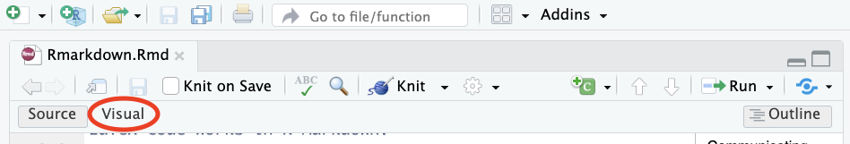
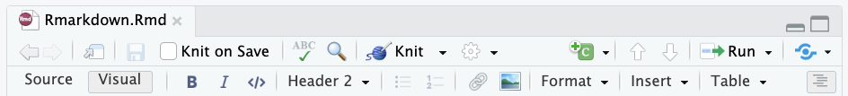
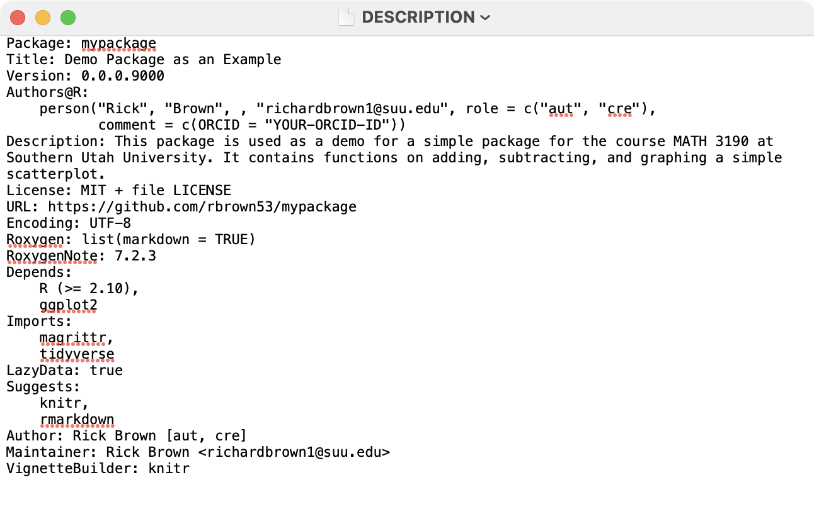
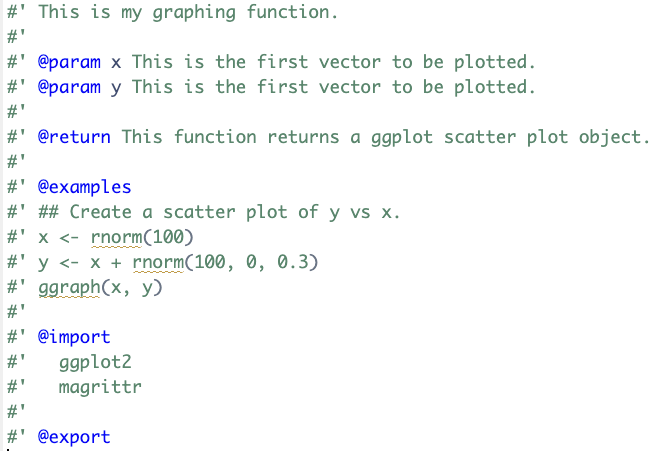

## Table of Contents

\tableofcontents

# Communicating Science

## Communicating Science

Effective science communicators educate non-specialist audiences about scientific topics, issues, and debates in ways that are informative, accessible, and empowering. \vspace{.1in}

Science communicators should be able to answer the following questions:

-   Who is my audience?
-   What is my message for my audience?
-   What medium am I going to use to communicate my message to my audience?

## Communicating Science

The **lay public** is made up of all the people who are not experts in a specific field. When addressing the lay public:

-   Keep the story simple and front-load exciting aspects
-   Make the story relevant to your audience
-   Use analogies and visuals
-   Front-load the story
-   Avoid jargon - simple language but don't oversimplify
-   Include the people and the process (challenges, successes, collaborations, etc.)

## Communicating Science

The **media** is a "mediator" between scientists and the public. Note the media is not a homogeneous group. \vspace{.1in}

Describing your process, challenges, successes, and collaborations are important for writing an informative and engaging press release. Read a few popular science articles to get a sense of how your research might eventually appear in the news and magazines. \vspace{.1in}

Articles about your work should include visuals--videos or photos--that will draw readers' attention to the article and help them grasp the gist of the piece.

## Communicating Science

Scientists can share their knowledge with **policy makers** through meetings, testimonies, and open presentations. Suggestions for communicating with policy makers:

-   Know what issues policy makers are currently discussing and debating
-   Keep your explanations simple and relevant
-   Think of some actionable solutions to the problem
-   Think about the problem and solution in the context of the policy maker's constituency
-   Be confident in yourself and what you know
-   Approach a meeting as a conversation, not a presentation
-   Create a one-pager with your message and key points

## Communicating Science

Visuals make the data supporting your message clear and accessible to your audience. Science visualizations include:

1.  Graphs, tables, and infographics
2.  Conceptual diagrams
3.  Maps, Satellite photos
4.  Photographs

Keep the following points in mind:

1.  Use a consistent style and format
2.  Use colors with purpose
3.  Use high-resolution graphics when possible
4.  Format your graphics and include labels, legends, and captions

# R Markdown

## Reproducible Reports

The final product of a data analysis project is often a report: scientific publications, news articles, an analysis report for your company, or lecture notes for a class. \vspace{.1in}

Now imagine after you are done you realize you:

-   had the wrong data set
-   have a new data set for the same analysis
-   made a mistake and fix the error, or
-   your boss or someone you are training wants to see the code and be able to reproduce the results \vspace{.1in}

Situations like these are common for a data scientist.

## R Markdown

R Markdown is a format for **literate programming** documents. \vspace{.2in}

It is based on **markdown**, a markup language that is widely used to generate html pages. \vspace{.2in}

You can learn more about markdown here: [click here](https://www.markdowntutorial.com/)

\vspace{.2in}

R Markdown is similar to environments like Jupityer Notebooks, Google Colab, and Quarto (Quarto is just like R Markdown but is not dependent on **R**). 

## R Markdown

Literate programming weaves instructions, documentation, and detailed comments in between machine executable code. \vspace{.1in}

With R Markdown, you need to **compile** the document into the final report. \vspace{.1in}

You can start an R Markdown document in RStudio by clicking on **File**, **New File**, then **R Markdown**. You will then be asked for a title and author. \vspace{.1in}

Final reports can be to be in: HTML, PDF, Microsoft Word, or presentation formats like PowerPoint, Beamer, or HTML slides.

## R Markdown

As a convention, we use the `.Rmd` extension for these files.\vspace{.2in}

Once you gain experience with R Markdown, you will be able to do this without the template and can simply start from a blank template.\vspace{.2in}

In the template, you will see several things to note (in the following slides).

## The Header

At the top you see:

```{r eval=F}
---
title: "Project Title"
author: "Your Name"
date: "1/10/2024"
output: html_document:
---
```
This is known as the YAML header. YAML stands for YAML Ain't Markup Language. 

One parameter that we will highlight is `output`. By changing this to, say, `pdf_document`, we can control the type of output that is produced.

## The Header

```{r eval=F}
---
title: "Project Title"
author: "Your Name"
date: "1/10/2024"
output:
  html_document:
    code_folding: hide
    toc: true
    toc_float: true
    theme: "flatly"
editor_options: 
  chunk_output_type: console
---
```

## **R** Code Chunks

In various places in the document, we see something like this:

````{verbatim}
```{r}
summary(pressure)
```
````

These are the code chunks. When you compile the document, the **R** code inside the chunk, in this case `summary(pressure)`, will be evaluated and the result included in that position in the final document.

## **R** Code Chunks

To add your own **R** chunks, you can type the characters above quickly with the key binding Command-Option-I (that is a capital i) on the Mac and Ctrl-Alt-I on Windows. \vspace{.2in}

This applies to plots as well; the plot will be placed in that position. We can write something like this:

````{verbatim}
```{r}
plot(pressure)
```
````

## **R** Code Chunks

By default, the code will show up as well. To avoid having the code show up, you can use an argument. To avoid this, you can use the argument `echo=FALSE`. For example:

````{verbatim}
```{r, echo=FALSE}
summary(pressure)
```
````

Its a good habit to add a label to the **R** code chunks. This can be useful when debugging, among other situations. You do this by adding a descriptive word like this:

````{verbatim}
```{r pressure-summary}
summary(pressure)
```
````


## Global Options and knitR

One of the **R** chunks may contain a complex looking call:

````{verbatim}
```{r setup, include=FALSE}
knitr::opts_chunk$set(echo = TRUE)
```
````

We use the **knitR** package to compile R Markdown documents. The specific function used to compile is the `knit` function, which takes a filename as input. RStudio provides a button that makes it easier to compile the document.


## Adding Equations

You can add formatted equations using between dollar signs `$`. Example, if you type

```{verbatim}
$x^2+\frac{1}{2}$
```

It will look like $x^2+\frac{1}{2}$. In fact, nearly all LaTeX code works in R Markdown.

If you put two dollar signs, the equation will appear on its own line. 
```{verbatim}
$$\sum_{i=1}^{10}\left(\lambda_i+\frac{10}{\alpha}\right)$$
```
$$\sum_{i=1}^{10}\left(\lambda_i+\frac{10}{\alpha}\right)$$

## Adding and Adjusting Images

We can add images to our R Markdown file by using 
```{verbatim}
{width=50%}
```
if the image is already in the same directory. Otherwise, you can put the path to the file in those parentheses. We can adjust the width of the image as well by changing the number in the `width=50%`.

## Adding and Adjusting Images

If the image is generated by **R** code, we can adjust the size by using `fig.width`, `fig.height`, `out.width` and/or `out.height` options in the code chunk.

````{verbatim}
```{r image_code, eval = T, echo = T, out.width="25%"}
x <- rnorm(100)
plot(x)
```
````
```{r image_code, eval = T, echo = F, out.width="25%"}
x <- rnorm(100)
plot(x)
```
```{r image_code2, eval = T, echo = F, out.width="20%"}
plot(x)
```

## Visual Editor

If you prefer, you can also use the Visual editor in R Markdown.



This will transform the top bar to this interface that relies less on code and more on pointing and clicking. 




## Other R Markdown Options

We will explore other R Markdown options: headers, tabsets, and latex equations in class and in your homework. 

\underline{Note:} From now on, all homework should be completed using an **R** Markdown document (uploaded to GitHub). Your document should include headers, descriptive text, **R** code, and plots/figures!

## More on R Markdown

There is a lot more you can do with R Markdown. I highly recommend you continue learning as you gain more experience writing reports in **R**. There are many free resources on the internet including:

1.  R Studio's tutorial: <https://rmarkdown.rstudio.com>
2.  The cheat sheet and reference guide: in RStudio -> Help -> Cheat Sheets -> R Markdown Cheat Sheet or R Markdown Reference Guide
3.  The knitR book: <https://yihui.name/knitr/>
4. \LaTeX\ command guide: <https://www.bu.edu/math/files/2013/08/LongTeX1.pdf>

## Extra - Mac Quick Look Previewing

If you use the preview feature in macOS (pressing the space bar when highlighting a file in preview), you'll notice that there is no preview available for `.md` files, `.Rmd` files, or files without an extension. You can install \href{https://github.com/sbarex/QLMarkdown}{QLMarkdown} and \href{https://github.com/sbarex/SourceCodeSyntaxHighlight}{Syntax Highlight} to enable quick viewing of those files.

# Python in **R** Markdown

## Python Intro

One useful feature in **R** Markdown is the ability to run code chunks from other languages. One of the most useful is the ability to run Python inside of **R** Markdown. 

Technically, Python is running through **R**, which can be achieved using the `reticulate` package. This will make it a bit slower than running Python natively. 

```{r, echo = T, eval = F}
install.packages("reticulate")
library(reticulate)
```


## Installing Python and Python Packages

To install Python, we can run the `install_python()` function from the `reticulate` package. Just indicate which Python version you want to install. As of the time these notes were created, the latest version is 3.12.1, but you can look up the latest version or go with the default.

```{r, echo = T, eval = F}
install_python("3.12.1") 
```

This can take a while to install. Please be patient! 

To install Python packages, we need to use an **R** code chunk using the `py_install()` function. 

```{r, echo = T, eval = F}
py_install(packages = "matplotlib")
py_install(packages = "numpy")
py_install(packages = "pandas")
```

## Running Python

Once we have installed Python, we can insert a Python code chunk just like an **R** code chunk:

````{verbatim}
```{python}
import numpy as np
import pandas as pd
x = np.array([1, 2, 3, 4, 5])
print(x)
```
````
```{python, echo = F, eval = T}
import numpy as np
import pandas as pd
x = np.array([1, 2, 3, 4, 5])
print(x)
```

## Python Envirnoment

When running Python in RStudio, the arrows in the console change and the environment switched to a Python environment. We can view what objects are stored in the **R** and Python envirnoments by clicking on the dropdown button. 

\begin{center}
\includegraphics[width=3.3in]{figs/python_env2.png}
\end{center}

## Switch Between Python and **R**

We can switch from an **R** enviornment (indicated by a single `>`) to a Python one (indicated by three arrows `>>>`) by

* Running a Python code chunk.
* Running the line `reticulate::repl_python()`.
* Double clicking on a Python object in the Python environment list.

We can switch from a Python enviornment back to **R** by

* Running a Python code chunk.
* Typing `exit`.

## Using Python Objects in **R** and Vise-Versa

We can send objects from Python to **R** and vise-versa. Everything defined in Python is stored in the `py` object, which can be called from **R** using `py$name_of_object`. To use an **R** object in Python, we can use preface it with `r.`, so it would be `r.name_of_object`.

```{r, eval = T, echo = T}
# R Code
library(reticulate)
py$x
y = 2 * py$x
```
```{python}
# Python Code
print(r.y)
```

## Type Conversions

While many objects are stored similarly in **R** and Python, it is good to know how things are stored when they are passed back and forth. This table shows the conversion:

\begin{center}
\begin{tabular}{|c|c|c|}
\hline
{\bf R} & {\bf Python} \\
\hline
Single-element vector & Scalar\\
\hline
Multi-element vector & List\\
\hline
List of multiple types & Tuple\\
\hline
Named list & Dict\\
\hline
Matrix/Array & NumPy ndarray\\
\hline
Data Frame & Pandas DataFrame\\
\hline
Function & Python function\\
\hline
Raw & Python bytearray\\
\hline
NULL, TRUE, FALSE & None, True, False\\
\hline
\end{tabular}
\end{center}


<!-- ## Next Slide -->

<!-- ```{r package3, eval = T, echo = T} -->
<!-- 1/2 + 1/6 -->
<!-- ``` -->

<!-- ```{python, eval = T, echo = T, out.width="50%"} -->
<!-- import numpy as np -->
<!-- import pandas as pd  -->
<!-- import matplotlib.pyplot as plt -->
<!-- import plotly.express as px -->
<!-- x = np.array([1, 2, 3, 4, 5]) -->
<!-- y = np.array([2, 4, 3, 5, 6]) -->
<!-- df = px.data.iris() # iris is a pandas DataFrame -->
<!-- fig = px.scatter(df, x="sepal_width", y="sepal_length", color="species", -->
<!--                  size='petal_length', hover_data=['petal_width']) -->
<!-- fig.show() -->

<!-- import plotly.express as px -->

<!-- df2 = px.data.election() -->
<!-- geojson = px.data.election_geojson() -->

<!-- fig = px.choropleth(df2, geojson=geojson, color="Bergeron", -->
<!--                     locations="district", featureidkey="properties.district", -->
<!--                     projection="mercator" -->
<!--                    ) -->
<!-- fig.update_geos(fitbounds="locations", visible=False) -->
<!-- fig.update_layout(margin={"r":0,"t":0,"l":0,"b":0}) -->
<!-- fig.show() -->
<!-- ``` -->

<!-- ```{r, echo=FALSE} -->
<!-- library(ggplot2) -->
<!-- library(plotly) -->
<!-- library(reticulate) -->
<!-- DF = py$df -->
<!-- DF -->
<!-- g <- ggplot(DF, aes(x = sepal_width, y = sepal_length, color = species, size = petal_length, text = paste("petal_width:", petal_width))) +  -->
<!--   geom_point() -->
<!-- # Putting "text = in" aes() function allows the petal_width value to appear when hovering in ggplotly. -->
<!-- # Adding tooltip = "text" in ggplotly will only show what is in that text argument. -->
<!-- ggplotly(g) -->
<!-- ``` -->


<!-- \newpage -->

<!-- ## Next slide -->

<!-- ```{python, eval = T, echo = T, out.width="50%"} -->
<!-- plt.plot(x, y) -->
<!-- plt.show() -->
<!-- print(df) -->
<!-- ``` -->

<!-- ```{python} -->
<!-- from pandas import Series, DataFrame -->
<!-- data = {'state': ['Ohio', 'Ohio', 'Ohio', 'Nevada', 'Nevada'], 'year': [2000, 2001, 2002, 2001, 2002], -->
<!-- 'pop': [1.5, 1.7, 3.6, 2.4, 2.9]} -->
<!-- frame = DataFrame(data) -->
<!-- ``` -->

<!-- ## Next slide -->

<!-- ```{r , eval=T, echo=T, out.width="50%"} -->
<!-- library(ggplot2) -->
<!-- py_df <- data.frame(x = py$x, y = py$y) -->

<!-- py$frame -->

<!-- ggplot(py_df, aes(x = x, y = y)) + -->
<!--   geom_line(linewidth = 2) -->
<!-- ``` -->

<!-- ## Next Slide -->

<!-- ```{python} -->
<!-- print(x) -->
<!-- print(y) -->
<!-- ``` -->


# Creating **R** Packages

## Importance of Developing Software

"As a modern statistician, one of the most fundamental contributions you can make is to create and distribute software that implements the methods you develop. I have gone so far as to say if you write a paper without software, that paper doesn't exist." (Jeff Leek)

(Note: to give proper credit, I borrowed some material from Jeff Leek's **R** package [tutorial on GitHub](https://github.com/jtleek/rpackages) for these slides and code.)


## Getting Started

\small
```{r install, eval=FALSE}
install.packages(c("devtools", "styler", "testthat"))
library(devtools)
library(styler)
library(testthat)
```
```{r install2, eval=T, echo = F, message = F}
library(devtools)
library(styler)
library(testthat)
```

We will first create our package structure. Go to the directory where you want your package to be created:
```{r create, eval = F}
setwd("~/github/")
devtools::create("mypackage")
```

This will create a folder called "mypackage" and add some important files in it. Now we need to connect it to GitHub. Create a repo in GitHub with the same name: "mypackage". Then we need to navigate to the local mypackage directory in the terminal that was just created. Add a `README.md` file in there. 

## Getting Started

Then we can issue the following commands

\small
```{bash, eval = F, echo = T}
git init
git remote add origin https://github.com/username/mypackage.git
git add *
git add .gitignore
git commit -m "initial commit"
git push -u origin main
```
\normalsize
You may want to make sure all of these lines are in the `.gitignore` file:
`.Rproj.user`, `.Rbuildignore`, `.gitignore`, `inst/doc`, `.DS_Store`, and `.Rhistory` so they are not tracked by git.

## License

Every package should have a license that informs how other people may use it. The most common are the MIT license, which allows people to do pretty much anything with your code, and the GPLv3 license, which says that anyone who uses this code must also keep it open source.

You can automate your license selection with the **usethis** package in the tidyverse: 

```{r license, eval = F}
setwd("~/github/mypackage")
usethis::use_mit_license()
```


For more information, check out the following: [https://blog.codinghorror.com/pick-a-license-any-license/](https://blog.codinghorror.com/pick-a-license-any-license/)

## Formatting Functions
The **tidyverse** gives you some more advanced code formatting help through the **styler** package (install and check out the Add In for RStudio!).

\scriptsize
```{r before, eval=FALSE}
# Before
x=3; y<-10
if (x >3) {stop("this is an error")} else {
    c(there_are_fairly_long,
      1 / 33 * 
          2 * long_long_variable_names)|> k(     ) }
```
\vspace{-.1in}
Go to **Addins$\rightarrow$style active file**
```{r after, eval=FALSE}
# After
x <- 3
y <- 10
if (x > 3) {
  stop("this is an error")
} else {
  c(
    there_are_fairly_long,
    1 / 33 *
      2 * long_long_variable_names
  ) |> k()
}
```

## Adding Functions
Okay! We are ready to start adding functions to our **R** package. In the R/ directory, we can add a new file (RStudio$\rightarrow$R Script) named **hello.R** and add the code: 

```{r hello,eval=F}
hello <- function() {
  print("hello world!")
}
```


And just this once, we can go to the NAMESPACE and add "export(hello)" to the file.

## Installing Packages
Now we can install the package using **devtools::install**. From the **mypackage** package directory, enter:
```{r install0, eval=FALSE }
devtools::install()
```

Now check if it worked!
```{r install1, eval=FALSE }
library(mypackage)
hello()
```

Now go and add two more functions to your package: __addition.R__ and __subtraction.R__. And make sure to add them to the NAMESPACE (this is the last time you should ever do this in your career!!

Install the package and confirm that it works!

## Documenting **R** Packages
There are some AMAZING tools, such as **roxygen2**, that are available that make documenting your packages very easy!  So no excuses!

To document your code, add the following to your .R function files: 

\scriptsize
```{r document 0, eval=F}
#' A one sentence description of what your function does
#' 
#' A more detailed description of what the function is and how
#' it works. It may be a paragraph that should not be separated
#' by any spaces. 
#'
#' @param inputParameter1 A description of the input parameter \code{inputParameter1}
#' @param inputParameter2 A description of the input parameter \code{inputParameter2}
#'
#' @return output A description of the object the function outputs 
#'
#' @keywords keywords
#'
#' @export
#' 
#' @examples
#' R code here showing how your function works

myfunction <- function(inputParameter1, inputParameter2){
	## Awesome code!
	return(result)
}
```

## Documenting **R** Packages

Then we can put the rest of the function below that documentation:

```{r document_0, eval=F}
#' @return output A description of the object the function outputs 
#'
#' @keywords keywords
#'
#' @export
#' @examples
#' R code here showing how your function works

myfunction <- function(inputParameter1, inputParameter2) {
	## Awesome code!
	return(result)
}
```

## Documenting **R** Packages

Once you have added documentation to all of your functions, use **devtools::document** to compile your documented code.

```{r document 1, eval=F}
devtools::document()
```

Now check to see how this changes your **mypackage** directory. Then reinstall the package, and look at the help for your functions, for example:
```{r document 2, eval=F}
?hello
?addition
?subtraction
```

## More Documentation: Vignettes

Documentation in the help files is important and is the primary way that people will figure out your functions if they get stuck. But it is equally (maybe more) critical that you help people get started. The way that you do that is to create a **vignette**. Vignettes can generate either HTML from R Markdown, or pdf from latex.

To create a vignette, we can run the code
```{r vignette, echo = T, eval = F}
usethis::use_vignette("my-vignette")
```
\vspace{-.1in}
This will automatically create a vignettes folder and add some lines to the DESCRIPTION file. 


## More Documentation: Vignettes

After we have create the vignette template, we should edit the vignette with examples of functions in our package. 

When the vignette is finished, we need to Knit it so there is both a `.Rmd` and `.html` file in the the `vignettes` folder. 

When installing the package, we should use
```{r vignette2, echo = T, eval = F}
devtools::install(build_vignettes = TRUE)
```

To view the vignette of a package, type 
```{r vignette3, echo = T, eval = F}
utils::browseVignettes("package_name")
```

## Imports and Depends

Often times we will need to use functions from other packages in our package functions. We can have **R** load in the needed package by adding a line to the DESCRIPTION file and our function file. If we want to just use a function from the package, then we need to put the package name in the `Imports` section. We will then have to put 
```{r, eval = F}
#' @import package_name
```
\vspace{-.1in}
in the function file. 

Alternatively, we can use 
```{r, eval = F}
#' @importFrom package_name function_name
```
\vspace{-.1in}
to important a specific function from a package.

If we want a package loaded upon loading our package, then we need to put the package name in the `Depends` section. Then we can use any of its functions in our functions.

## Imports and Depends



## Imports and Depends

{#id .class width=4.3in height=4.3in}

## Adding Data Sets to the Package

To add data files to the package, we can type 
```{r, eval = F, echo = T}
usethis::use_data_raw("name_of_dataset")
```
This will set up a new folder called "data-raw" with a file called `name_of_dataset.R`. You should name this the same thing as the data set you want to be a part of your package. 

In this `name_of_dataset.R` file, the last line will already be added for you. Above that, you should read in the data file and do any cleaning necessary. Then you can run the code in that file to create a `.rda` object in a new folder called "data". That folder will contain all the data sets that will be read in when you load your package. 

## Adding Data Sets to the Package

It is a good idea to add the line 
```{bash, eval = F}
LazyData: true
```
to the DESCRIPTION file since that will prevent needing to type `data(dataset_name)` every time you load the package.


## Data Set Documentation

Like functions, you should also document any data sets. You can type 
```{r, eval = F}
usethis::use_r(name = "data", open = T)
```
\vspace{-.1in}
and a `data.R` file will be created in the `R/` folder. In that file, we should document all of our data sets. A template for this could look like:
\small
```{r, eval = F}
#' Data set name
#'
#' Data set description.
#'
#' @format A data frame with p variables: \code{var_1}, 
#' \code{var_2}, and \code{var_p}.
#'
#' @source Put the url of the data set if it was found online.
"name_of_dataset"
```
This will allow us to get documentation by typing `?data_set_name`.

## Creating a Package Manual

Once the package is all finished, it is a good idea to build a manual that has information about the package, all the functions, and all the data sets. This is remarkably simple as long as everything has been properly documented. All that needs to be done is to run 
```{r, eval = F}
devtools::build_manual()
```
\vspace{-.1in}
By default, the manual will be added to the parent directory (one folder back) of your package.


## Installing a Package from GitHub

While creating a package for yourself is fine, the primary reason we want to create a package is to share it. Once you've pushed the package to GitHub, it is easy to install directly from your GitHub repo. We can use the `install_github()` function in the `devtools` library. 

```{r, eval = F}
library(devtools)
install_github("Username/PackageRepoName")
```
If there is a vignette, we should add `build_vignettes = T` in that function.

So, to install `mypackage` from my GitHub repo, one can type
```{r, eval = F}
library(devtools)
install_github("rbrown53/mypackage", build_vignettes = T)
```

## R Packages Recap

1. Set up the directory that will contain your **R** package by setting the working directory to the place you want your package folder saved and then running \vspace{-0.05in}
```{r, eval = F}
devtools::create("package_name")
```
\vspace{-.1in}
2. Create a repository on GitHub with the same name as your package folder. Do not add any files to it. 
3. Set up git and sync with GitHub. In the terminal, type:\vspace{-0.05in}
```{bash, eval = F, echo = T}
cd package_name
git init
git remote add origin https://github.com/username/repo.git
git add .
git commit -m "commit message"
git push -u origin main
```
\vspace{-.1in}

4. Add a README.md file to your directory using  \vspace{-0.05in}
```{bash, eval = F, echo = T}
touch READEME.md
```

## R Packages Recap

5. Write functions and put them in the R/ directory. Be sure to include all of the `roxygen2` documentation and use the styler to style them in tidyverse style.

6. Add and document any data sets by typing the following command after changing the working directory in RStudio to be your project folder. Put the code for obtaining the data set in the file created by the `use_data_raw()` function. Run the code in that file and document the data set in a `data.R` file in the `R/` folder.
```{r, eval = F, echo = T}
usethis::use_data_raw("name_of_dataset")
```

7. Optionally, add a vignette by running 
```{r, echo = T, eval = F}
usethis::use_vignette("my-vignette")
```
\vspace{-.1in}
Edit the vignette and then Knit it. 

## R Packages Recap

8. Add any packages yours depends on or imports to the DESCRIPTION file. Also, edit the Title, Authors@R, and Description sections.

9. Optionally, add URL:, Author:, and Maintainer: lines to the DESCRIPTION file. The URL usually goes below the license and the Author and Maintainer usually go near the bottom.

10. To have `roxygen2` fill in the proper files, run
```{r, eval = F, echo = T}
devtools::document()
```

11. Add a \href{https://r-pkgs.org/license.html}{license} by typing one of the following depending on the license you want. More can be found at that link.
```{r, eval = F, echo = T}
usethis::use_mit_license()
usethis::use_gpl_license()
```

## R Packages Recap

12. Install the package with one of the following:
```{r, eval = F, echo = T}
devtools::install() # If no vignette
devtools::install(build_vignettes = TRUE) # If vignette
```

13. Create a manual using 
```{r, eval = F, echo = T}
devtools::build_manual()
```
\vspace{-.1in}
The manual will be put in the parent directory. You are free to keep it there or add it to your package directory and upload it to GitHub.

14. In the terminal, add, commit, and push the package to the GitHub repo. 
```{bash, eval = F, echo = T}
git add . # Or add one at a time by specifying the file name
git commit -m "new commit message"
git push
```


## Session info

\tiny

```{r session info}
sessionInfo()
```
