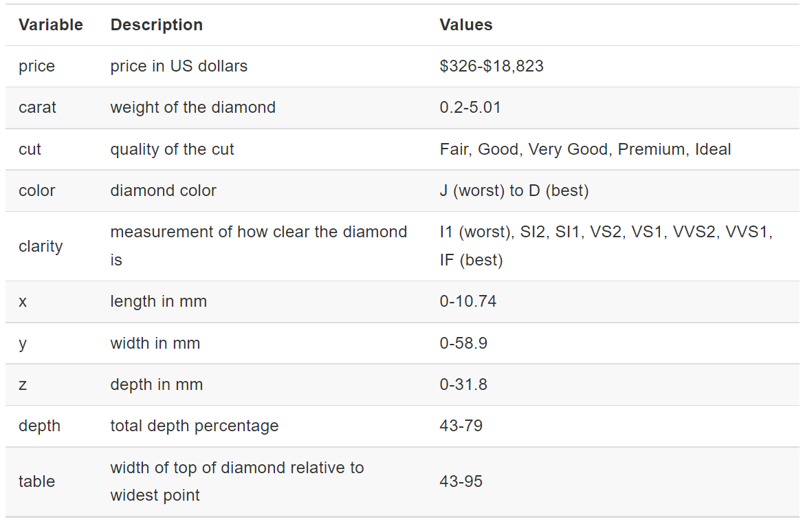

```{r setup, include=FALSE}
knitr::opts_chunk$set(echo = TRUE, cache = TRUE)
options(width = 55)
library(dslabs)
library(tidyverse)
```


\tableofcontents

# Tidyverse

## Introduction

Modern **R** users are migrating away from many base **R** packages and functions to instead work in the **tidyverse**.

The tidyverse is both a philosophy for coding and organizing data as well as a collection of packages in **R**. 
```{r load_tidy, eval = F, echo = T}
library(tidyverse)
```


## Tidy Format (murders data)

We say that a data table is in **tidy** format if each row represents
one observation and columns represent the different variables available
for each of these observations. For example, the following data set is in tidy format:

```{r murder data}
library(dslabs)
data(murders)
head(murders)
```

## Not Tidy Format (fertility)

The following dataset is organized, but not tidy. Why?

\includegraphics[width=2.5in]{figs/not_tidy.png}

\normalsize

## Tidy Format (fertility)

Here is what the data would look like in tidy format:

\vspace{.2in}

```{r fertility_tidy, echo=F}
data("gapminder")
tidy_data <- gapminder |>
  filter(country %in% c("South Korea", "Germany") 
         & !is.na(fertility)) |>
  select(country, year, fertility)
head(tidy_data, 6)
```
\vspace{.1in}
The same information is provided, but there are important differences in
the format. For the **tidyverse** packages to be optimally used, data
need to be reshaped into \`tidy' format. The advantage of working in
tidy format allows the data analyst to focus on more important aspects
of the analysis rather than the format of the data.


## Tibbles
A __tibble__ is a modern version of a data.frame. 

```{r message=FALSE}
library(tidyverse)
dat1 <- tibble(x = 1:4, y = 5:8, z = c("A", "B", "C", "D"))
```

Or convert a data frame to a tibble
```{r}
dat <- data.frame(x=1:4, y = 5:8, z = c("A", "B", "C", "D"))
dat1 <- as_tibble(dat)
dat1
```


## Tibbles
Important characteristics that make tibbles unique: 

1. Tibbles are primary data structure for the `tidyverse`
2. Tibbles display better and printing is more readable
3. Tibbles can be grouped
4. Subsets of tibbles are tibbles
5. Tibbles can have complex entries--numbers, strings, logicals, lists, functions, other tibbles, etc.

## Subsetting Tibbles

Note: tibbles work just like data frames in just about every way except one. With data frames, using brackets `[]` will give vectors and with tibbles, using `[]` will give tibbles. 
```{r}
class(dat[,1])  # Class of first column from a data frame
class(dat1[,1]) # Class of first column from a tibble
mean(dat[,1])
mean(dat1[,1])
```

## Subsetting Tibbles

We can choose the columns of a tibble as a vector using the `$` operator or by putting double brackets `[[]]`.
```{r}
dat1$x    # Gives the first column (whose name is x)
dat1[[1]] # Gives the first column
mean(dat1[[1]])
```

This subsetting is not a problem for rows. Rows of data frames are data frames and rows of tibbles are tibbles, so nothing of note changes there.


## Data Import in the Tidyverse

The `tidyverse` has its own functions that will read in data sets as tibbles. They are the functions

* `read_csv()`
* `read_table()`

These work very much like the `read.csv()` and `read.table()` functions. The primary difference is that `read.csv()` and `read.table()` read in the data has a data frame whereas `read_csv()` and `read_table()` read in the data as a tibble.

The `read_excel()` function in the `readxl` library also reads in data files as tibbles even though the `readxl` library is not technically part of the tidyverse.

## `dplyr` Functions

One of the most useful packages in the `tidyverse` is the **dplyr** package that is used for data wrangling. `dplyr` is called that since it is a tool (like a set of pliers) for data frames (or tibbles).

The `dplyr` package has the following useful functions:

* `mutate()` adds new variables that are functions of existing variables.
* `filter()` picks cases based on their values. Selects rows. 
* `select()` picks variables based on their names. Selects columns.
* `summarize()` or `summarise()` reduces multiple values down to a single summary.
* `arrange()` changes the ordering of the rows.
* `group_by()` allows you to perform any operation “by group”

Note an important point: most dplyr functions (and most functions in the
tidyverse) input a tibble and then output a modified tibble, although many can also work with data frames.

## Mutate

The function **mutate** takes the data frame or tibble, the instructions for the
new columns in next arguments, and returns a modified data frame. For
example:

```{r mutate_1}
murders <- as_tibble(murders)
head(murders)
```

## Mutate
To add murder rates, we mutate as follows:

```{r mutate_2}
murdersRate <- mutate(murders,
  rate = total / population * 100000
)
head(murdersRate)
```

## Filter

Now suppose that we want to filter the data table to only show the
entries for which the murder rate is lower than 0.71. We do this as
follows:
\small
```{r filter_1, eval=F, echo=T}
filter(murdersRate, rate <= 0.71)
murdersRate[murdersRate$rate <= 0.71,] # How do get the same
                                       # result without
                                       # filter function
```
```{r, eval=T, echo=F}
options(width=75)
filter(murdersRate, rate <= 0.71)
options(width=55)
```

## Select

If we want to view just a few of our columns, we can use the following:

\small
```{r select_1, eval = F}
murdersRate <- mutate(murders, rate = total / population * 100000)
murdersRateSelect <- select(murdersRate, state, rate) 
filter(murdersRateSelect, rate <= 0.71)
# The above is the same as the following
murdersRate[murdersRate$rate <= 0.71, c("state", "rate")]
```
```{r select_2, echo = F}
murdersRate <- mutate(murders, rate = total / population * 100000)
murdersRateSelect <- select(murdersRate, state, rate) 
filter(murdersRateSelect, rate <= 0.71)
```

## Nesting Functions

Instead of defining new objects along the way, we could do everything in
one complex nested function:
\small
```{r nest}
filter(select(mutate(murders, rate = total / population * 100000),
              state, rate), rate <= 0.71)
```
\normalsize
This is fairly concise but a little confusing. Is there a better, clearer way?

## Pipes

In the previous example, we performed the following wrangling
operations:
$$ \mbox{original data } \rightarrow \mbox{ mutate } \rightarrow \mbox{ select } \rightarrow \mbox{ filter } $$
We can perform a series of operations in **R** by sending the
results of one function to another using the **pipe operator**: `|>` that was added in **R** version 4.1.

There is also a pipe (that was actually added first) in the `magrittr` package that is loaded with the tidyverse with the syntax `%>%`. This `magrittr` pipe can do a few things the native pipe cannot^[https://magrittr.tidyverse.org], but for the vast majority of cases they work the same, so it is recommended to use the native pipe since it is built-in and runs slightly faster. 

## Pipes

The pipe is a combination of characters that when used properly does two things: *It shortens and simplifies the code* and it makes the code more intuitive to read.

There is a keyboard shortcut in RStudio for inserting the pipe. While you can always just type `|>`, you can also type:

Mac: Command-Shift-M\
Windows: Control-Shift-M

However, this will not give you the default pipe unless you change a setting in RStudio. Go to \
Tools $\rightarrow$ Global Options $\rightarrow$ Code $\rightarrow$ Select "Use native pipe operator".

## Pipes

All the pipe does is provide **forward application** of an object to the
first argument of a function. The pipe sends left side of the input to
the function to the right of the pipe. For example, if we wanted to
calculate $$\log_2(\sqrt{16})$$

\vspace{-.3in}
We could use:

```{r pipes_1}
16 |> sqrt() |> log2()
```

Since the pipe sends values to the first argument, we can define other
arguments as follows:

```{r pipes_2}
16 |> sqrt() |> log(base = 2)
```

While piping works the way it is formatted above, it is better practice to use a new line after each pipe.

## Pipes (murders)
Creating the prior tibble operation using pipes:

```{r pipes_3}
murders |>
  mutate(rate = total / population * 100000) |>
  select(state, rate) |>
  filter(rate <= 0.71)
```


## Piping into Other Arguments

By default, pipes will send the object being piped to the first argument of the next command, but we can send it to another argument by using the underscore (`_`) placeholder and specifying the argument.

\small
```{r pipes_4}
murdersRate |>
  lm(rate ~ population, data = _)
```
\vspace{.1in}

\normalsize
We can also use the pipe placeholder along with `$`, `[]`, and `[[]]`:
\small
```{r pipes_5}
murdersRate |> _$rate |> head(5)
```

## Arrange

We know about the **order** and **sort** functions, but for ordering
entire tables, the **arrange** function is much more useful. For
example, here we order the tibble by the state's murder rate:

\small
```{r, eval=F, echo=T}
murdersRate |>
  arrange(rate) |>
  head()
```
```{r arrange_1, eval=T, echo=F}
options(width = 65)
murdersRate |>
  arrange(rate) |>
  head()
options(width = 55)
```


## Arrange (descending order)
Note that the default behavior is to order in ascending order. The
function **desc** transforms a vector so that it is in descending order.
To sort the table in descending order, we can type:

\footnotesize
```{r arrange_2, echo=T, eval = F}
murdersRate |> 
  arrange(desc(rate)) |>
  head()
```
```{r, echo=F, eval=T}
options(width = 75)
murdersRate |>
  arrange(desc(rate)) |>
  head()
options(width = 55)
```

## Nested sorting

If we are ordering by a column with ties, we can use a second (or third)
column to break the tie. for example:

\small
```{r, eval=F, echo=T}
murdersRate |>
  arrange(region, rate) |>
  head()
```
```{r arrange_3, eval=T, echo=F}
options(width = 75)
murdersRate |>
  arrange(region, rate) |>
  head()
options(width = 55)
```

## Summarize

The **summarize** function computes summary statistics in an intuitive
way. The 'heights' dataset includes heights and sex reported by students
in an in-class survey.

```{r summarize_1}
data(heights)
heights |>
  filter(sex == "Female") |>
  summarize(
    avg = mean(height),
    std_dev = sd(height)
  )
```

## Group then summarize with `group_by()`

A common operation in data exploration is to first split data into
groups and then compute summaries for each group. For example, we may
want to compute the average and standard deviation for men's and women's
heights separately. We can do the following

\small
```{r group_by_1}
heights |>
  group_by(sex) |>
  summarize(
    average = mean(height),
    standard_deviation = sd(height)
  )
```

## `pivot_longer()` Function

Sometimes it is the case that the data need to be manually put into tidy format. This is where the `pivot_longer()` function can help. 

```{r pivot_longer1, echo = T, eval = T}
prices <- read.csv("data/houseprice.txt")
head(prices, 10)
```

## `pivot_longer()` Function
```{r pivot_longer2, echo = T, eval = T}
new_prices <- pivot_longer(prices, cols = everything()) 
head(new_prices)
```

This looks much better! Except the column names are just set to the default of `name` and `value`. Also, there are some NA values as we saw in the original data set.

## `pivot_longer()` Function

```{r pivot_longer3, echo = T, eval = T}
house_prices <- pivot_longer(prices, cols = everything()) |>
  na.omit() |>
  rename(city = name, price = value) |>
  arrange(city)
head(house_prices)
```


## `pivot_wider()` Function

It's relatively rare to need `pivot_wider()` to make tidy data, but it can be useful for creating summary tables for presentation, or data in a format needed by other tools. We won't focus too much on `pivot_wider()`, but here is an example. We do need an "id" or a "row number" variable to make this work. 
```{r pivot_wider, echo = T, eval = T}
price_wide <- house_prices |> 
  mutate(row_num = c(1:11, 1:8, 1:10)) |>
  pivot_wider(names_from = city, values_from = price)
head(price_wide, 3)
```


## More on the tidyverse

There are some other tidyverse operations, including the `inner_join()`, `left_join()`, `right_join()`, `full_join()`, `pull()`, `dot()`, `reframe()`, `nest_by()`, and `pick()` functions. We will work with a few of these throughout the course.

\vspace{.4in}

# Graping with `ggplot2`


## `ggplot2 ` Introduction

Note: these slides were adapted from slides created by Aubrey Odom.

While knowing how to plot using the base **R** packages is important, many **R** users are using the `ggplot2` package (which is part of the tidyverse) more and more for making better-looking plots.

**Advantages of ggplot2**

-   It's consistent! gg = "grammar of graphics"; easy base system for adding/removing plot elements, with room for being fancy too
-   Very flexible
-   Themes available to polish plot appearance
-   Active maintenance/development = getting better all the time!
-   It can do quick-and-dirty and complex, so you only need one system
-   Plots, or whole parts of plots, can be saved as objects
-   Easy to add complexity or revert to earlier plot

## Introduction

**Disadvantages of ggplot2**

-   Sometimes more complicated than base **R** plotting
-   Difficult to work with in iterated functions
-   No 3-D graphics
-   ggplot is often slower than base graphics
-   The default colors can be difficult to change
-   You might need to change the structure of your data frame to make certain plots (use `tidyr::pivot_longer()`)

## `ggplot` Basics

There are three primary components to plotting with `ggplot2`:

-   The **data** component. This is what data set and variables we are actually plotting.
-   The **geometry** component. This describes what it is we are plotting. Examples include barplots, scatter plots, histograms, smooth densities, qqplots, boxplots, etc.
-   The **aesthetic mapping** or just the **mapping**. The two most important cues in this plot are the point positions on the x-axis and y-axis. Each point represents a different observation, and we map data about these observations to visual cues like x- and y-scale. Color is another visual cue that we map to region. How this is defined depends on what type of geometry we are using.

## Example dataset: Diamonds

```{r install ggplot2, eval = FALSE}
install.packages("ggplot2")
```

```{r load ggplot2}
library(ggplot2)
```

{width="50%"}

## Example dataset: Diamonds

```{r diamonds}
head(diamonds)
```

## Example dataset: Diamonds

{width="50%"}

-   The dataset contains information about 53,940 round-cut diamonds

-   There are 10 variables measuring various pieces of information about the diamonds.

-   There are 3 variables with an ordered factor structure: cut, color, & clarity

## Example in Base Plotting

There is essentially just one primary function to know: `ggplot()`. However, `ggplot()` needs lots of other basic functions.

```{R compare functions, out.width="48%"}
# load the diamonds dataset and take a sample of 2000
data(diamonds); set.seed(2023)
diam <- diamonds[sample(1:53940,2000),] 
plot(diam$carat, diam$price, main = "I'm a base plot",
     xlab = "Caret", ylab = "Price")
```

## Example in `ggplot2`

In a ggplot, we need to begin with the `ggplot()` function and then add on (literally with a `+` sign) to that plot using other commands. In this case, I put `geom_point()` to add those solid dots.

```{r ggplot1, echo=T, eval=T, out.width="50%"}
ggplot(data = diam) +
  geom_point(aes(x = carat, y = price)) + 
  ggtitle("I'm a ggplot") + labs(x = "Carat", y = "Price")
```

## Example in `ggplot2`

Here is an example adding text to the plot.

```{r ggplot_text, echo=T, eval=T, out.width="50%"}
ggplot(data = diam) +
  geom_point(aes(x = carat, y = price)) +
  geom_text(aes(x = carat, y = price, label = price)) +
  ggtitle("I'm a ggplot with text") +
  labs(x = "Carat", y = "Price")
```

## Global vs Local Aesthetic Mapping

Instead of putting the `x` and `y` in the `geom_()` function, we can put it in the `ggplot()` and it will apply everywhere.

Anything put into the `ggplot()` function will apply globally to the entire plot whereas anything put into the geometry will only apply to that geometry. Some options, like size, can only be put into the geometry.

## Example in `ggplot2`

This will make both the points and text red. The `nudge_x` option will move the text to the right 0.1 units.

```{r ggplot_text_red, echo=T, eval=T, out.width="50%"}
ggplot(data = diam, aes(x = carat, y = price, color = "red")) +
  geom_point() +
  geom_text(aes(label = price), nudge_x = 0.1) +
  labs(x = "Carat", y = "Price")
```

## Example in `ggplot2`

This will make the points red, but the text blue.

```{r ggplot_red_blue, echo=T, eval=T, out.width="50%"}
ggplot(data = diam, aes(x = carat, y = price)) +
  geom_point(color = "red") +
  geom_text(aes(label = price), nudge_x = 0.1, color="blue") +
  ggtitle("I'm a ggplot") +
  labs(x = "Carat", y = "Price")
```

## Piping in `ggplot2`

Pipes work very well with `ggplot` also. Remember that pipes are a part of the tidyverse (in thr `dplyr` package) and by default, piping puts the thing being piped into the first argument of the function.

```{r ggplot_pipe1, echo=T, eval=F, out.width="50%"}
library(tidyverse)
diam |> 
  ggplot(aes(carat, price)) + geom_point(col = "brown") + 
  ggtitle("I'm a ggplot") + labs(x = "Carat", y = "Price")
```

```{r ggplot_pipe2, echo=F, eval=T, out.width="45%"}
diam |> 
  ggplot(aes(carat, price)) + geom_point(col = "brown") + 
  ggtitle("I'm a ggplot") + labs(x = "Carat", y = "Price")
```

## Example in `ggplot2`

We can change the background using `theme_...()`. There are `theme_bw()`, `theme_dark()`, `theme_classic()`, and more.

```{r ggplot_theme, echo=T, eval=T, out.width="50%"}
ggplot(data = diam, aes(x = carat, y = price)) +
  geom_point() + ggtitle("I'm a ggplot") +
  labs(x = "Carat", y = "Price") + theme_bw()
```

## Changing the Graph Options in `ggplot2`

We can change the type of points added in the `geom_point()` function.

```{r ggplot_shape, echo=T, eval=T, out.width="50%"}
ggplot(data = diam, aes(x = carat, y = price)) +
  geom_point(size = 2, color = "red", shape = 2) + 
  ggtitle("I'm a red, triangular ggplot")
```

The `shape` argument works just like `pch` in base plotting.

## Changing the Graph Type in `ggplot2`

Instead of adding `geom_point()`, we can add something else, like `geom_line()`

```{r ggplot_line, echo=T, eval=T, out.width="50%"}
ggplot(data = diam, aes(x = carat, y = price)) +
  geom_line() + ggtitle("I'm a line ggplot")
```

This looks strange for this plot, though.

## Changing the Graph Type in `ggplot2`

Or even something like shading the area under the points.

```{r ggplot_area, echo=T, eval=T, out.width="50%"}
ggplot(data = diam, aes(x = carat, y = price)) +
  geom_area() + ggtitle("I'm a area ggplot")
```

This looks even stranger in this case.

## Grouping by Another Variable

ggplot makes it easy to split the data using another variable. Simply put the `col` argument in the `aes()` function in `ggplot`. This will automatically add a legend as well. We can change the shape based on another variable too.

```{r ggplot_group1, echo=T, eval=T, out.width="50%"}
ggplot(data = diam, aes(x = carat, y = price, col = cut)) +
  geom_point() + ggtitle("I'm a grouped ggplot")
```

## Grouping by Another Variable

We can manually change the colors using the `values` option in the `scale_color_manual()` add on function.

```{r ggplot_group2, echo=T, eval=T, out.width="50%"}
ggplot(data = diam, aes(x = carat, y = price, col = cut)) +
  geom_point() + ggtitle("I'm a grouped ggplot") + 
  scale_color_manual(values = c("red", "orange", "yellow", 
                               "green","lightblue"))
```

## Grouping by Another Variable

We can manually change the order of the categories in the legend using the `breaks` option in the `scale_color_manual()` add on function.

```{r ggplot_group3, echo=T, eval=T, out.width="45%"}
ggplot(data = diam, aes(x = carat, y = price, col = cut)) +
  geom_point() + ggtitle("I'm a grouped ggplot") + 
  scale_color_manual(
    breaks = c("Ideal","Premium","Very Good","Good","Fair"),
    values = c("lightblue", "green","yellow","orange","red"))
```

## Grouping by Another Variable

We can also group by a continuous variable. In this case, we can change the color based on the `depth` variable.

```{r ggplot_group4, out.width="50%"}
# color by a continuous variable
ggplot(data = diam, aes(x = carat, 
          y = price, color = depth)) + geom_point() +
  scale_colour_continuous(type = "viridis")
```

## Changing Font Size and Type

We can change font size and type in the `theme()` function:

\small
```{r ggplot_font, out.width="48%"}
# color by a continuous variable
ggplot(data = diam, aes(x = carat, y = price)) + 
  geom_point(shape = 16, size = 1.5) +
  ggtitle("Check out this Font!") + 
  theme(axis.title = element_text(size = 20),
        plot.title = element_text(size = 24, face = "bold"))
```

## `ggplot2` for a Single Quantitative Variable: Histogram

Of course, we can also use `ggplot()` for plotting a single variable. We can make histograms, boxplots, dotplots, etc.

```{r ggplot_hist1, echo=T, eval=T, out.width="50%"}
# Save the base plot as an object p. Then add to p.
p <- ggplot(data = diam, aes(x = price))
p + geom_histogram(color = "black", fill = "lightblue",
                   bins = 20)
```

## `ggplot2` for a Single Quantitative Variable: Histogram

```{r ggplot_hist2, echo=T, eval=T, out.width="50%"}
# We already created p, so we can add other options to it.
# Smaller alpha makes the plot more transparent.
p + geom_histogram(color = "darkgreen", fill = "green",
                   bins = 50, alpha = 0.1, lty = 2, lwd = 2)
```

## `ggplot2` for a Single Quant. Variable: Layered Histograms

A layered histogram is a good way to compare the distribution of a variable across groups. `geom_histogram` works well for two groups, but geom_density is easier to look at for several groups.

```{r ggplot_density, out.width="50%"}
ggplot(data = diam, aes(x = price, fill = cut)) +
  geom_density(alpha = 0.3)
```

## `ggplot2` for a Single Quantitative Variable: Boxplot

Creating a basic boxplot. We can also make it vertical by putting\
`y = price` in the `aes()` function instead of `x = price`.

```{r ggplot_box1, echo=T, eval=T, out.width="50%"}
ggplot(data = diam, aes(x = price)) +
  geom_boxplot(color = "black", fill = "lightblue")
```

## `ggplot2` for a Single Quant. Variable: Side-by-Side Boxplots

We can make side-by-side boxplots grouped by a categorical variable as `x` (or as `y` if you want side-by-side horizontal boxplots).

```{r ggplot_box2, echo=T, eval=T, out.width="50%"}
ggplot(data = diam, aes(x = cut, y = price)) +
  geom_boxplot(color = "black", fill = "lightblue")
```

## `ggplot2` for a Single Categorical Variable: Barplot

We can make plots for categorical variables as well.

```{r ggplot_bar1, echo=T, eval=T, out.width="50%"}
ggplot(data = diam, aes(x = cut)) +
  geom_bar(color = "black", fill = "lightblue") +
  labs(x = "Diamond Cut", y = "Frequency")
```

## `ggplot2` for a Single Categ. Variable: Side-by-Side Barplots

We can split the bars by another variable. In this case, we will make a plot of diamond cut and break it up by diamond color and put the bars side by side.

```{r ggplot_bar2, echo=T, eval=T, out.width="45%"}
ggplot(data = diam, aes(x = cut, fill = color)) +
  geom_bar(color = "black", position = "dodge") +
  labs(x = "Diamond Cut", y = "Frequency",
       fill = "Diamond Color")
```

## `ggplot2` for a Single Categ. Variable: Side-by-Side Barplots

We can change the fill colors using `scale_fill_manual()`.

```{r ggplot_bar3, echo=T, eval=T, out.width="45%"}
ggplot(data = diam, aes(x = cut, fill = color)) +
  geom_bar(color = "black", position = "dodge") +
  labs(x = "Diamond Cut", y = "Frequency",
       fill = "Diamond Color") + 
  scale_fill_manual(values = c("lightblue","green","yellow",
                    "orange","red","brown","black"))
```

## `ggplot2` for a Single Categorical Variable: Stacked Barplot

We can split the bars by another variable. In this case, we will make a plot of diamond cut and break it up by diamond color and stack the bars.

```{r ggplot_bar4, echo=T, eval=T, out.width="45%"}
ggplot(data = diam, aes(x = cut, fill = color)) +
  geom_bar(color = "black", position = "stack") +
  labs(x = "Diamond Cut", y = "Frequency",
       fill = "Diamond Color")
```

## `ggplot2` for a Single Categorical Variable: Stacked Barplot

We can split the bars by another variable. In this case, we will make a plot of diamond cut and break it up by diamond color, stack the bars, and adjust them so each bar totals 100%.

```{r ggplot_bar5, echo=T, eval=T, out.width="45%"}
ggplot(data = diam, aes(x = cut, fill = color)) +
  geom_bar(color = "black", position = "fill") +
  labs(x = "Diamond Cut", y = "Proportion",
       fill = "Diamond Color")
```

## `ggplot2` Barplot Identity

We often want to use a column of a data frame or tibble as the heights of our bar plot instead of having ggplot tabulate them for us. For this, we need to put `stat = identity` in the `geom_bar()` function.

```{r ggplot_bar6, echo=T, eval=T, out.width="30%"}
diam |> group_by(cut) |>
  summarize(avg_price = mean(price)) |>
  ggplot(aes(x = cut, y = avg_price)) +
  geom_bar(color = "black", stat = "identity", 
           fill = "lightblue") +
  labs(x = "Diamond Cut", y = "Average Price")
```


## Using `ggplot2` for more complex plots

Use facet_grid() or facet_wrap() to create a separate plot for each value of a factor variable. We don't have to change any of the original plotting code, just add the facet command to it. Faceting can also be done on more than one categorical variable to create a grid of plots.

Additionally, it is sometimes helpful to save a simpler version of a plot, and then add onto it later with additional layers (for example, an if/else statement that plots different layers dependent on if a criterion is met or not).

We might want to summarize the data in the previous plot with a smoother on top of the points. With ggplot, we can simply add the geom_smooth command. Each geom just adds another layer to the plot.

## Using `ggplot2` for more complex plots

```{r ggplot_facet1,fig.height = 2, fig.width = 6}
# make the basis for a plot using ggplot save it as p
p <- ggplot(data = diamonds, aes(x = carat, y = price))
# add a geom (points) and display the plot
p + geom_point(size=0.1) + facet_grid(cols = vars(color),
     labeller = label_both) + labs(x = "Carat", y = "Price",
       title = "Carat versus price, separated by color")
```

## Using `ggplot2` for more complex plots

```{r ggplot_facet2,out.width="50%", echo=T, eval=F}
# make the basis for a plot using ggplot save it as p
p <- ggplot(data = diam, aes(x = carat, y = price))
# add a geom (points) and display the plot
p + geom_point(size=0.1) + facet_grid(rows = vars(cut),
        cols = vars(color), labeller = label_both) + 
  labs(x = "Carat", y = "Price",
       title = "Carat versus price, separated by color")
```

## Using `ggplot2` for more complex plots

```{r ggplot_facet3,out.width="90%", echo=F, eval=T}
# make the basis for a plot using ggplot save it as p
p <- ggplot(data = diam, aes(x = carat, y = price))
# add a geom (points) and display the plot
p + geom_point(size=0.5) + facet_grid(rows = vars(cut),
        cols = vars(color), labeller = label_both) + 
  labs(x = "Carat", y = "Price",
       title = "Carat versus price, separated by color")
```

<!-- # Ian's 2 cents -->

<!-- ## The wrong way to use pipes -->
<!-- Due to the way R's compiler works, pipes are forced to go at the end of the line: -->
<!-- ```{r pipes_wrong} -->
<!-- murders |> -->
<!--   mutate(rate = total / population * 100000) |> -->
<!--   select(state, rate) |> -->
<!--   filter(rate <= 0.71) -->
<!-- ``` -->

<!-- ## The right way to use pipes -->
<!-- However, pipes were designed to go at the beginning of the line. We can surround the code with parenthesis to trick R's compiler into accepting this  style: -->
<!-- ```{r pipes_right} -->
<!-- ( -->
<!-- murders  -->
<!--   |> mutate(rate = total / population * 100000)  -->
<!--   |> select(state, rate)  -->
<!--   |> filter(rate <= 0.71) -->
<!-- ) -->
<!-- ``` -->


## Ian's 2 Cents -- Plots with emojis

Have you ever wanted to make a scatter plot where each point is an emoji? We can thanks to the emoGG library by dill on github: <https://github.com/dill/emoGG> 

We can install the library using the following code:
```{r emoGG_install, eval=F}
devtools::install_github("dill/emoGG")
```
It builds upon ggplot, so we need to load both libraries:
```{r emoGG_loads}
library(ggplot2)
library(emoGG)
```

## Ian's 2 Cents -- Finding an emoji
To make a plot using emojis, we first need to know which emojis to use. The `emoji_search` function will show emojis that somewhat match a given string:
```{r emoji_search}
emoji_search("dinosaur") |> head(5)
```

Sauropod seems like a good option, so let's keep track of its code: `1f995`.

## Ian's 2 Cents -- Making an emoji scatter plot
To create a scatter plot using emojis we simply need to substitute the `geom_point()` function with `geom_emoji()`. This function takes in an emoji code as an argument. In this case, the emoji code for a sauropod is `1f995`.

\small
```{r emoGG_plot1, out.width="45%", message = F, eval = F}
library(gridExtra) # Allows outputted plots to be arranged
# make the basis for a plot using ggplot and save it as p
x <- rnorm(100)
y <- x + rnorm(100, 0, 0.5)
p <- ggplot(data = data.frame(x = x, y = y), aes(x = x, y = y))
# add geom_point and geom_emoji and display the plots in a grid
#  with 2 columns
grid.arrange(p + geom_point(), 
             p + geom_emoji(emoji="1f995"), 
             ncol = 2)
```

## Comparing Regular and Emoji Scatter Plots
```{r emoGG_plot2, fig.width=8, fig.height=4, message = F, echo = F}
library(gridExtra) # Allows outputted plots to be arranged
# make the basis for a plot using ggplot and save it as p
x <- rnorm(100)
y <- x + rnorm(100, 0, 0.5)
p <- ggplot(data = data.frame(x = x, y = y), aes(x = x, y = y))
# add geom_point and geom_emoji and display the plots in a grid
#  with 2 columns
grid.arrange(p + geom_point(), 
             p + geom_emoji(emoji="1f995"), 
             ncol = 2)
```


## Summary

The syntax of a ggplot is `ggplot(data, aes(x, y))` and you add on to the plot with `+` at the end of each line.

The most useful functions to add onto a ggplot are:

* `geom_point()`, `geom_line()`, `geom_histogram()`, `geom_boxplot()`, `geom_text()`, etc.
* `labs()` for labels.
* `ggtitle()` for a plot title.
* `lims()` for limits.
* `theme()` for text size and visually changing other things.
* `scale_color_manual()` or `scale_fill_manual()` for changing the color or fill of the plot manually. 


## Further Resources & Assistance

-   Cheat sheet for data visualization with ggplot2 (accessible in Rstudio by going to Help -\> Cheat Sheets -\> Data visualization with ggplot2)
-   ggplot2 documentation
-   Google
-   Stack overflow
-   Hadley Wickham's book: <https://ggplot2-book.org/>
-   Rafael Irizarry's book: <http://rafalab.dfci.harvard.edu/dsbook-part-1/dataviz/ggplot2.html>.
-   Note: these slides were adapted from slides created by Aubrey Odom.


## Session info
\tiny
```{r pressure, warning = FALSE, cache = F}
sessionInfo()
```

