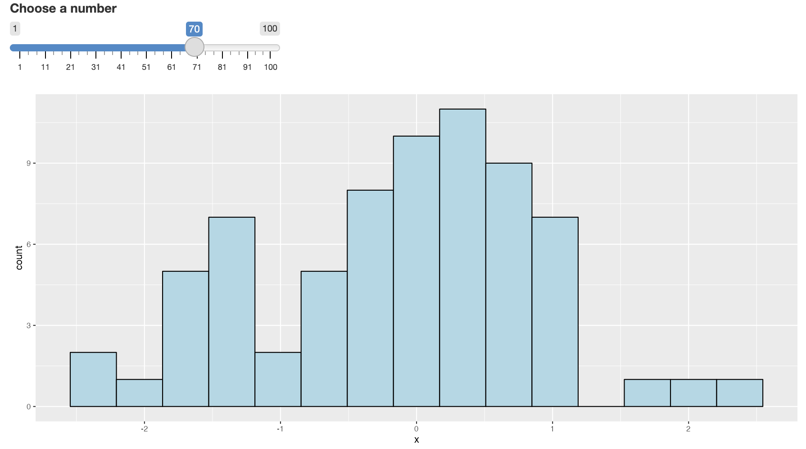

```{r setup, include=FALSE}
knitr::opts_chunk$set(echo = TRUE, cache = FALSE)
options(width = 55)
library(tidyverse)
library(dslabs)
```

## What is Shiny?

`Shiny` is an **R** package that allows you to easily create rich, interactive web apps around your **R** functions and packages. `Shiny` allows you to take your work in **R** and disseminate it via a web browser so that anyone can use it. `Shiny` makes you look awesome by making it easy to produce polished web apps with a minimum amount of pain.

(Credit: Some of the images and slide text were taken and adapted from <https://mastering-shiny.org> and RStudio's `Shiny` tutorials)

## What is Shiny?

`Shiny` is designed primarily with data scientists in mind, and to that end, you can create pretty complicated `Shiny` apps with no knowledge of HTML, CSS, or JavaScript. On the other hand, `Shiny` doesn't limit you to creating trivial or prefabricated apps: its user interface components can be easily customized or extended, and its server uses reactive programming to let you create any type of back end logic you want.

## What is Shiny?

Some of the things people use `Shiny` for are:

-   Create dashboards
-   Replace hundreds of pages of PDFs with interactive apps
-   Communicate complex models informative visualizations
-   Provide self-service data analysis for common workflows
-   Create interactive demos for teaching statistics and data science

In short, `Shiny` gives you the ability to pass on some of your **R** superpowers to anyone who can use the web.

## Getting Started

To create your first `Shiny` App you will need:

-   **R** installed (of course).
-   **RStudio** installed. (strongly recommended): <https://www.rstudio.com/products/rstudio/download>
-   The **R** `Shiny` package: `install.packages("shiny")`
-   Knowledge and experience in developing **R** packages (recommended).
-   Git and GitHub (recommended): to share your Apps.

## Getting Started

If you haven't already installed `Shiny`, install it now with:

```{r shiny_install, eval=F, echo=T}
install.packages("shiny")
```

If you've already installed `Shiny`, use the following to check that you have version 1.5.0 or greater:

```{r shiny_install2, echo=T}
packageVersion("shiny") 
```

\vspace{.2in}

**RStudio**'s [Shiny Showcase](https://shiny.posit.co/r/gallery/) is an exciting assembly of exciting apps!

Or we can start with a very simple example

```{r intro, eval=F, echo=T}
library(shiny)
runExample("01_hello")
```


## Introduction to Shiny Development

Here we'll create a simple `Shiny` app, staring with the minimum boilerplate, followed by the two key components of every `Shiny` app: the UI (short for user interface) which defines how your app looks, and the server function which defines how your app works. `Shiny` uses **reactive** programming to automatically update outputs when inputs change.

## Template: Shortest Viable App

The simplest way to start an app is to create a new **R** script and start with the following code:

```{r first app,eval=F,echo=T}
library(shiny)

ui <- fluidPage()

server <- function(input, output) {}

shinyApp(ui = ui, server = server)
```

## Close your App

To close the Shiny app, press the stop button, close the window, or press escape from the console. 

\center

{width=65%}

## Inputs and Outputs

\center


## Inputs and outputs

\center


## Adding Elements to the UI

Add elements to your app as arguments to fluidPage()

```{r shiny ui 1,eval=F,echo=T}
library(shiny)

ui <- fluidPage(
    # Input() functions,
    # Output() functions
    )

server <- function(input, output) {}

shinyApp(ui = ui, server = server)
```

Take note that the `ui` (or `fluidPage` function) is what controls what the app looks like and takes inputs from the user. The `server` function controls what the app is doing. 

## Adding Elements to the UI

Add elements to your app as arguments to `fluidPage()`

```{r first app UI,eval=F,echo=T}
library(shiny)

ui <- fluidPage(
  "Hello World!"
  )

server <- function(input, output) {}

shinyApp(ui = ui, server = server)
```

## Input Functions

Create an input with a function that ends in **Input()**. 

```{r inputs,eval=F,echo=T}
sliderInput(inputId = "num", 
            label = "Choose a number", 
            value = 25, min = 1, max = 100)
```

<!-- Here is the actual HTML code for this slider: \footnotesize -->

<!-- ```{html inputsHTML,eval=F,echo=T} -->
<!-- <div class="form-group shiny-input-container"> -->
<!--   <label class="control-label" for="num">Choose a number</label> -->
<!--   <input class="js-range-slider" id="num" data-min="1" data-max="100" -->
<!--   data-from="25" data-step="1" data-grid="true" data-grid-num="9.9" -->
<!--   data-grid-snap="false" data-prettify-separator="," data-keyboard="true" -->
<!--   data-keyboard-step="1.01010101010101"/> -->
<!-- </div> -->
<!-- ``` -->

\center
{width=75%}

## Input Functions in an App

```{r input2,eval=F,echo=T}
library(shiny)

ui <- fluidPage(
  sliderInput(inputId = "num",
    label = "Choose a number",
    value = 25, min = 1, max = 100)
  )

server <- function(input, output) {}

shinyApp(server = server, ui = ui)
```

The ID of in the `Input()` function, `inputId` in this case, creates an attribute of `input` that can be used in the `server` function inside of a `render()` function.

## Server inputs

You can access inputs from the UI using **input\$** \center 

## 

\center

 \## Server outputs You can save your outputs to return to the UI using **output\$** \center 


## Render Functions in an App

A `render...()` function is used in the `server` function to create an attribute of `output`. 

You can save your outputs to return to the UI using **output\$** and build objects to display with a function whose name begins with `render`.

\center {width=60%}

## Render Functions in an App

```{r render1,eval=F,echo=T}
ui <- fluidPage(
  sliderInput(inputId = "num",
    label = "Choose a number",
    value = 25, min = 1, max = 100)
  )

server <- function(input, output) {
  output$hist <- renderPlot({
    hist(rnorm(input$num))
    })
}

shinyApp(server = server, ui = ui)
```


## Output Functions in an App

Now that an attribute of `output` has been created, we need an `Output()` function inside `fluidPage()` in the `ui`. The name of the output attribute created in the `server` function must go in quotes.

```{r output,eval=F,echo=T}
ui <- fluidPage(
  sliderInput(inputId = "num",
    label = "Choose a number",
    value = 25, min = 1, max = 100), # Comma! 
    plotOutput("hist")
  )

server <- function(input, output) {
  output$hist <- renderPlot({
    hist(rnorm(input$num))
    })
}

shinyApp(server = server, ui = ui)
```

## Shiny App


## Output Functions in an App

We can also make the graph look nicer with ggplot. 

\small
```{r output2,eval=F,echo=T}
library(tidyverse)
ui <- fluidPage(
  sliderInput(inputId = "num",
    label = "Choose a number",
    value = 25, min = 1, max = 100), # Comma! 
    plotOutput("hist")
  )
server <- function(input, output) {
  output$hist <- renderPlot({
    DF <- data.frame(x = rnorm(input$num))
    ggplot(DF, aes(x = x)) + 
      geom_histogram(color = "black", fill = "lightblue",
                     bins = 15)
    })
}
shinyApp(server = server, ui = ui)
```

## Shiny App



## Shiny Buttons (Inputs)

\center


## Shiny Renders

\center


## Shiny Outputs

\center


## Interactive Plots with `plotly`

A package that pairs very nicely with Shiny is the `plotly` package. This package allows us to create interactive plots with hover features. Some esspecially nice functions in `plotly` are:

* `ggplotly()`: This takes a ggplot object and coverts it to a plotly object to make it interactive. 
* `renderPlotly()`: This can be put in the `server` function to render an interactive plot that can be saved to an output. 
* `plotlyOutput()`: This can be put in the `fluidPage()` function to generate an interactive plot in the Shiny app.


## Interactive Plots with `plotly`

Taking the plot from the last output and making it interactive:

\footnotesize
```{r output_plotly, eval=F, echo=T}
library(shiny); library(tidyverse); library(plotly)
ui <- fluidPage(
  sliderInput(inputId = "num",
    label = "Choose a number",
    value = 25, min = 1, max = 100), # Comma! 
    plotlyOutput("hist") # Note: changed from plotOutput to plotlyOutput
  )
server <- function(input, output) {
  output$hist <- renderPlotly({ # Note: changed to renderPlotly
    DF <- data.frame(x = rnorm(input$num))
    p <- ggplot(DF, aes(x = x)) + # Save object as p
      geom_histogram(color = "black", fill = "lightblue",
                     bins = 15)
    ggplotly(p) # Make the ggplot interactive
    })
}
shinyApp(server = server, ui = ui)
```


## Shiny Recap

\vspace{-.2in}

\center


## Server Recap

\vspace{-.2in}

\center


## Building the Server

There are 2 basic rules for your **fluidPage()** function:

1. Save input values with one of the Shiny buttons. Most of these functions end with `Input()` or `Button()`. 
2. Use a function that ends with `output()` in `fluidPage()` to display objects built with a render...()** function in the server. 

There are 3 basic rules for your **server** function:

1. Access input values with `input$`.
2. Save objects to display as `output$`.
3. Build objects to display with `render...()`.


## Reactivity 

Shiny is built on reavtive objects. The term **reactivity** refers to the idea that the inputs and outputs are connected to each other: when you change and input, you change all outputs that require the input.

If we ever want to do anything with the input out of a `render...()` function, we need to use the `reactive()` function around it. Then, to use any variable defined with a `reactive()` function, we need to call it with parentheses. This is most common if you want to use that object in multiple `render...()` functions. 

## Reactivity 

\scriptsize
```{r reactivity,eval=F,echo=T}
ui <- fluidPage(
  sliderInput(inputId = "num", label = "Choose a number",
    value = 25, min = 1, max = 100), # Comma! 
  plotOutput("hist"), 
  plotOutput("box")
  )
server <- function(input, output) {
  rand_DF <- reactive(data.frame(x = rnorm(input$num)))
  # rand_values <- input$num |> rnorm() |> reactive()
  output$hist <- renderPlot({
    ggplot(rand_DF(), aes(x = x)) + 
      geom_histogram(color = "black", fill = "lightblue", bins = 15) +
      geom_vline(xintercept = median(rand_DF()$x), linewidth = 1) +
      coord_cartesian(xlim = c(-3, 3))
    })
  output$box <- renderPlot({
    ggplot(rand_DF(), aes(x = x)) + 
      geom_boxplot(color = "black", fill = "lightblue") +
      coord_cartesian(xlim = c(-3, 3))
    })
}
shinyApp(server = server, ui = ui)
```

## Without Reactivity 

\scriptsize
```{r reactivity2,eval=F,echo=T}
ui <- fluidPage(
  sliderInput(inputId = "num", label = "Choose a number",
    value = 25, min = 1, max = 100), # Comma! 
  plotOutput("hist"),
  plotOutput("box")
  )
server <- function(input, output) {
  output$hist <- renderPlot({
    rand_DF <- data.frame(x = rnorm(input$num))
    ggplot(rand_DF, aes(x = x)) + 
      geom_histogram(color = "black", fill = "lightblue", bins = 15) +
      geom_vline(xintercept = median(rand_DF$x), linewidth = 1) +
      coord_cartesian(xlim = c(-3, 3))
    })
  output$box <- renderPlot({
    rand_DF <- data.frame(x = rnorm(input$num))
    ggplot(rand_DF, aes(x = x)) + 
      geom_boxplot(color = "black", fill = "lightblue") + 
      coord_cartesian(xlim = c(-3, 3))
    })
} # In this case, different values are plotted in each plot!
shinyApp(server = server, ui = ui)
```


## Multi-file apps:

When these Shiny apps get larger, it is common practice to create two files: a **ui.R** file and a **server.R** file.

\footnotesize
```{r final multifile,eval=F,echo=T}
#ui.R
library(shiny)
ui <- fluidPage(
  sliderInput(inputId = "num",
    label = "Choose a number",
    value = 25, min = 1, max = 100), 
  plotOutput("hist")
  )
```


\footnotesize
```{r final multifile3, eval=F, echo=T}
#server.R
library(shiny)
server <- function(input, output){
  output$hist <- renderPlot({
    hist(rnorm(input$num))
    })
  }
```

## Multi-file apps:

And then finally the program file, **app.R**:

```{r final multifile2, eval=F, echo=T}
#app.R
library(shiny)

source("ui.R")
source("server.R")

shinyApp(server = server, ui = ui)
```


## Shiny Example

```{r full_app, echo = F, eval = T, outwidth="20%"}
library(shiny)
ui <- fluidPage(
  shinyjs::useShinyjs(),
  textInput("cor_guess", "Guess the correlation!"),
  actionButton(
    inputId = "submit_guess",
    label = "Submit Guess"
  ),
  plotOutput("graph"),
  textOutput("message"),
  actionButton("reset_input", "Press to Play Again!")
)

server <- function(input, output, session) {
    guess <- reactive(as.numeric(input$cor_guess))
    num_rand <- reactive(rchisq(input$num, 10))
    x <- rnorm(100, rnorm(1, 100, 50), rchisq(1, 10, 5))
    y <- sign(runif(1, -1, 1))*x + rnorm(100, 0, 10)
    DF = data.frame(x, y)
    true_cor <- cor(x, y)
    
    output$graph <- renderPlot({
      ggplot(DF, aes(x, y)) +
        geom_point(size = 3)
    }#, width=5*96, height=2*96, res=96
    )
    
    observeEvent(
      eventExpr = input[["submit_guess"]],
      handlerExpr = {
        output$message <- renderText(
          paste0("Your guess was ",guess(),".\n\n
             The true value was ", round(true_cor,3),".\n
             That is a difference of ", abs(guess() - round(true_cor,3))
                 ,".")
        )
      }
    )
    
    observeEvent(input$reset_input, {
      #shinyjs::reset()
      session$reload() # Works, but won't store guesses.
    })
}

shinyApp(ui = ui, server = server)
```


## Hosting Shiny Apps

You can put your Shiny app in a GitHub repository and then run it (or have someone else run it) by using the `runGitHub()` function in the `shiny` library. The syntax is either of the following:

```{r runGitHub, echo = T, eval = F}
runGitHub("repository_name", "username")
runGitHub("username/repository_name")
```


By default, this will only work if your entire app is in a file called `app.R` with `shinyApp(ui = ui, server = server)` as the last line or if your app is split up into two files: `ui.R` and `server.R`. 

If the Shiny app is in a different directory in your repository, you can specify what folder it is in by using the `subdir` option in the `runGitHub()` function:
```{r runGitHub2, echo = T, eval = F}
runGitHub("repository_name", "username", 
          subdir = "path/to/shiny/app/in/repo")
```

## Building Apps in **R** Packages

We can also add a Shiny app to any **R** package we create. In the package directory, create an `inst/shiny/app_name` directory and place either the `app.R` file or the `ui.R` and `server.R` files in there. Once this is done, be sure to add "shiny" to the "Depends:" section of your `DESCRIPTION` file.

Then, in the package `R/` folder, add a function that calls the Shiny app. A template for this is on the next slide.  

Also:

* Write the package functions first!
  - You can use any functions defined in your package in your shiny app.
* `Shiny` app should call functions, provide inputs, display results, etc.

<!-- Also, see examples from Dr. Johnson's research, e.g.: <https://github.com/compbiomed/animalcules> -->

<!-- Tutorial: <https://deanattali.com/2015/04/21/r-package-shiny-app/> -->

You can check out the mypackage repo in my GitHub page for an example.

## Building Apps in **R** Packages:

\scriptsize
```{r shiny_call_template}
#' Shiny App Name
#' 
#' App description
#' 
#' @export

# Change the name of the function to be relevant.
# It is convention to begin the name of this function with "run"
runShinyApp <- function() {  
  appDir <- system.file("shiny", "app_name", package = "package_name")
  if (appDir == "") {
    stop("Could not find example directory. Try re-installing `package_name`.", 
         call. = FALSE)
  }
  
  shiny::runApp(appDir, display.mode = "normal")
}
```


## shinylive

It is also possible to run Shiny completely in a browser using WebR and shinylive. In fact, you can host Shiny apps on github. This is a beyond the scope of our class, but here are some links to some tutorials:

1. <https://github.com/posit-dev/r-shinylive>
2. <https://medium.com/@rami.krispin/deploy-shiny-app-on-github-pages-b4cbd433bdc>
3. <https://hypebright.nl/index.php/en/2023/10/02/run-a-shiny-app-in-the-browser-with-shinylive-for-r/>

An example of this is given at this link:
<https://rbrown53.github.io/ShinyCorrelation/>


## Session info

\tiny

```{r pressure, warning = FALSE}
sessionInfo()
```
