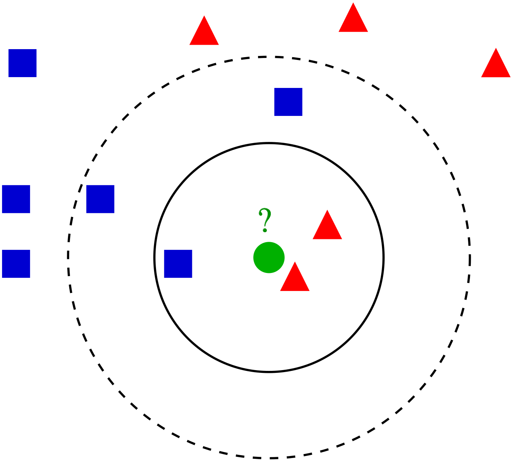
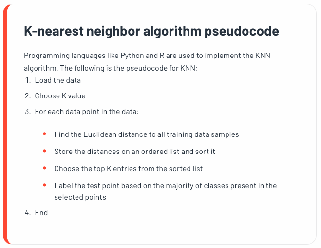
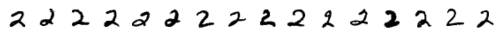
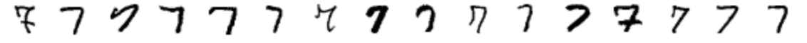

\tableofcontents

```{r setup, include=FALSE, cache=T}
knitr::opts_chunk$set(echo = TRUE, cache = TRUE)
img_path <- "img/"
```

# Evaluation Metrics and the Confusion Matrix

## Evaluation Metrics

Before we start describing approaches to optimize the way we build
algorithms, we first need to define what we mean when we say one
approach is better than another.

We use the `caret` package, which has several useful functions for
building and assessing machine learning methods.

```{r, message=FALSE, warning=FALSE}
library(tidyverse)
library(caret)
```

## Evaluation Metrics

For a first example, we use the height data in `dslabs`:

```{r, message = F}
library(dslabs)
data(heights)
```

To summarize the data, consider the following boxplot:

```{r,out.width="40%", fig.align="center"}
ggplot(heights, aes(x = sex, y = height)) + 
  geom_boxplot(fill = "gray")
```

## Evaluation Metrics

We will start with a simple example: suppose we want to predict sex
using height. We start by defining the outcome and predictors.

```{r}
y <- heights$sex
x <- heights$height
```

## Evaluation Metrics

In this case, we have only one predictor, height, and `y` is clearly a
categorical outcome since observed values are either `Male` or `Female`.

We know that we will not be able to predict $Y$ very accurately based on
$X$ because male and female average heights are not that different
relative to within group variability. But can we do better than
guessing? To answer this question, we need a quantitative definition of
better.

## Training and Test Sets {#training-test}

Ultimately, a machine learning algorithm is evaluated on how it performs
in the real world with completely new datasets. However, we usually have
a dataset for which we know the outcomes, as we do with the heights: we
know the sex of every student in our dataset. Therefore, to mimic the
ultimate evaluation process, we typically split the data into two parts
and act as if we don't know the outcome for one of these.

We refer to the group for which we know the outcome, and use to develop
the algorithm, as the **training** set. We refer to the group for which
we pretend we don't know the outcome as the **test** set.

## Training and Test Sets

The `caret` package includes the function `createDataPartition` that
helps us generates indexes for randomly splitting the data into training
and test sets:

```{r}
set.seed(2024)
test_index <- createDataPartition(y, times = 1, 
                                  p = 0.5, list = FALSE)
```

The argument `times` is used to define how many random samples of
indexes to return, `p` is used to define what proportion of the data is
represented by the index, and `list` is used to decide if we want the
indexes returned as a list or not.

If `times = 1`, this is essentially the same as doing

```{r, eval = F}
set.seed(2024)
test_index <- sample(1:nrow(heights), 
                     size = round(nrow(heights)*0.5))
```

## Training and Test Sets

We can use the result of the `createDataPartition` function call to
define the training and test sets like this:

```{r}
test_set <- heights[test_index, ]
train_set <- heights[-test_index, ]
```

We develop an algorithm using **only** the training set. Once we are
done developing the algorithm, we will **freeze** it and evaluate it
using the test set. The simplest way to evaluate the algorithm when the
outcomes are categorical is by simply reporting the proportion of cases
that were correctly predicted in the test set. This metric is usually
referred to as **overall accuracy**.

## Overall Accuracy

To demonstrate the use of overall accuracy, we will build two competing
algorithms and compare them.

Let's start by developing the simplest possible machine algorithm:
guessing the outcome.

```{r, eval = F}
y_hat <- sample(c("Male", "Female"), 
                length(test_index), replace = TRUE)
```

We are completely ignoring the predictor and simply guessing the sex.

## Overall Accuracy

In machine learning applications, it is useful to use factors to
represent the categorical outcomes because **R** functions developed for
machine learning, such as those in the `caret` package, require or
recommend that categorical outcomes be coded as factors. So convert
`y_hat` to factors using the `factor` function:

```{r, eval = T}
set.seed(2024)
y_hat <- sample(c("Male", "Female"), 
                length(test_index), replace = TRUE) |>
  factor(levels = levels(test_set$sex))
```

## Overall Accuracy

The *overall accuracy* is simply defined as the overall proportion that
is predicted correctly:

```{r}
mean(y_hat == test_set$sex)
```

Not surprisingly, our accuracy is about 50%. We are guessing!

## Overall Accuracy

Can we do better? Exploratory data analysis suggests we can because, on
average, males are slightly taller than females:

```{r}
heights |> 
  group_by(sex) |> 
  summarize(means = mean(height), sds = sd(height))
```

## Overall Accuracy

But how do we make use of this insight? Let's try another simple
approach: predict `Male` if height is within two standard deviations
from the average male:

```{r}
y_hat <- ifelse(x > 62, "Male", "Female") |> 
  factor(levels = levels(test_set$sex))
```

The accuracy goes up from 0.50 to about 0.80:

```{r}
mean(y == y_hat)
```

## Overall Accuracy

But can we do even better? In the example above, we used a cutoff of 62,
but we can examine the accuracy obtained for other cutoffs and then pick
the value that provides the best results.

But remember, **it is important that we optimize the cutoff using only
the training set**: the test set is only for evaluation.

Although for this simplistic example it is not much of a problem, later
we will learn that evaluating an algorithm on the training set can lead
to **overfitting**, which often results in dangerously over-optimistic
assessments.

## Overall Accuracy

Here we examine the accuracy of 10 different cutoffs and pick the one
yielding the best result:

```{r}
cutoff <- seq(61, 70)
accuracy <- map_dbl(cutoff, function(x){
  y_hat <- ifelse(train_set$height > x, "Male", "Female") |> 
    factor(levels = levels(test_set$sex))
  mean(y_hat == train_set$sex)
})
```

We can make a plot showing the accuracy obtained on the training set for
males and females:

## Overall Accuracy

```{r accuracy-vs-cutoff, echo=FALSE, out.width="90%", fig.align="center"}
data.frame(cutoff, accuracy) |> 
  ggplot(aes(cutoff, accuracy)) + 
  geom_point() + 
  geom_line() 
```

## Overall Accuracy

We see that the maximum value is:

```{r}
max(accuracy)
```

which is much higher than 0.5. The cutoff resulting in this accuracy is:

```{r}
best_cutoff <- cutoff[which.max(accuracy)]
best_cutoff
```

## Overall Accuracy

We can now test this cutoff on our test set to make sure our accuracy is
not overly optimistic: \small

```{r}
y_hat <- ifelse(test_set$height > best_cutoff,"Male","Female") |> 
  factor(levels = levels(test_set$sex))
mean(y_hat == test_set$sex)
```

\normalsize

We see that it is a bit lower than the accuracy observed for the
training set, but it is still better than guessing. And by testing on a
dataset that we did not train on, we know our result is not due to
cherry-picking a good result.

## The Confusion Matrix

The prediction rule we developed in the previous section predicts `Male`
if the student is taller than `r best_cutoff` inches. Given that the
average female is about `r best_cutoff` inches, this prediction rule
seems wrong. What happened? If a student is the height of the average
female, shouldn't we predict `Female`?

## The Confusion Matrix

Generally speaking, overall accuracy can be a deceptive measure. To see
this, we will start by constructing what is referred to as the
*confusion matrix*, which basically tabulates each combination of
prediction and actual value. We can do this in **R** using the function
`table`:

```{r}
table(predicted = y_hat, actual = test_set$sex)
```

## The Confusion Matrix

If we study this table closely, it reveals a problem. If we compute the
accuracy separately for each sex, we get:

```{r}
test_set |> 
  mutate(y_hat = y_hat) |>
  group_by(sex) |> 
  summarize(accuracy = mean(y_hat == sex))
```

## The Confusion Matrix

There is an imbalance in the accuracy for males and females: too many
females are predicted to be male. We are calling almost half of the
females male! How can our overall accuracy be so high then? This is
because the **prevalence** of males in this dataset is high. These
heights were collected from three data sciences courses, two of which
had more males enrolled:

```{r}
prev <- mean(y == "Male")
prev
```

## The Confusion Matrix

So when computing overall accuracy, the high percentage of mistakes made
for females is outweighed by the gains in correct calls for men. **This
can actually be a big problem in machine learning.** If your training
data is biased in some way, you are likely to develop algorithms that
are biased as well. The fact that we used a test set does not matter
because it is also derived from the original biased dataset. This is one
of the reasons we look at metrics other than overall accuracy when
evaluating a machine learning algorithm.

## The Confusion Matrix

There are several metrics that we can use to evaluate an algorithm in a
way that prevalence does not cloud our assessment, and these can all be
derived from the confusion matrix. A general improvement to using
overall accuracy is to study **sensitivity** and **specificity**
separately.

## Sensitivity and Specificity

In general, **sensitivity** is defined as the ability of an algorithm to
predict a positive outcome when the actual outcome is positive:
$\hat{Y}=1$ when $Y=1$. Stated in terms of probability, this is
$P(\text{Predicted Positive}|\text{Actually Positive})$.\vspace{.2in}

Because an algorithm that calls everything positive
($\hat{Y}=1$ no matter what) has perfect sensitivity, this metric on its
own is not enough to judge an algorithm.

## Sensitivity and Specificity

For this reason, we also examine **specificity**, which is generally
defined as the ability of an algorithm to not predict a positive
$\hat{Y}=0$ when the actual outcome is not a positive $Y=0$. Stated in
terms of probability, this is
$P(\text{Predicted Negative}|\text{Actually Negative})$.

## Sensitivity and Specificity

We name the four entries of the **confusion matrix**:

```{r, echo=FALSE}
mat <- matrix(c("True positives (TP)", "False negatives (FN)", 
                "False positives (FP)", "True negatives (TN)"), 2, 2)
colnames(mat) <- c("Actually Positive", "Actually Negative")
rownames(mat) <- c("Predicted positive", "Predicted negative")
tmp <- as.data.frame(mat)
if(knitr::is_html_output()){
  knitr::kable(tmp, "html") |>
    kableExtra::kable_styling(bootstrap_options = "striped", full_width = FALSE)
} else{
  knitr::kable(tmp, "latex", booktabs = TRUE) |>
    kableExtra::kable_styling(font_size = 8)
}
```

## Sensitivity and Specificity

**Sensitivity** is typically quantified by $TP/(TP+FN)$, the proportion
of actual positives (the first column = $TP+FN$) that are called
positives ($TP$). This quantity is also referred to as the **true
positive rate** (TPR) or **recall**.

\vspace{.2in}


**Specificity** is defined as $TN/(TN+FP)$ or the proportion of
negatives (the second column = $FP+TN$) that are called negatives
($TN$). This quantity is also called the **true negative rate** (TNR).

## Sensitivity and Specificity

There is another way of quantifying accuracy which is $TP/(TP+FP)$ or
the proportion of outcomes called positives (the first row or $TP+FP$)
that are actually positives ($TP$). This quantity is referred to as
**positive predictive value (PPV)** and also as **precision**. Note
that, unlike TPR and TNR, precision depends on prevalence since higher
prevalence implies you can get higher precision even when guessing.

## Sensitivity and Specificity

The multiple names can be confusing, so we include a table to help us
remember the terms. The table includes a column that shows the
definition if we think of the proportions as probabilities.

<!-- | Measure of | Name 1 | Name 2 | Definition | Probability representation | -->

<!-- |---------|-----|----------|--------|------------------| -->

<!-- sensitivity | TPR | Recall | $\frac{\mbox{TP}}{\mbox{TP} + \mbox{FN}}$ | $\mbox{Pr}(\hat{Y}=1 \mid Y=1)$ | -->

<!-- specificity | TNR | 1-FPR | $\frac{\mbox{TN}}{\mbox{TN}+\mbox{FP}}$ | $\mbox{Pr}(\hat{Y}=0 \mid Y=0)$ | -->

<!-- Precision |  PPV |  | $\frac{\mbox{TP}}{\mbox{TP}+\mbox{FP}}$ | $\mbox{Pr}(Y=1 \mid \hat{Y}=1)$| -->

```{=tex}
\begin{tabular}{ccccc}
\hline
Measure of & Name 1 & Name 2 & Definition & Prob. Representation\\
\hline
Sensitivity & TPR & Recall & $\dfrac{\text{TP}}{\text{TP}+\text{FN}}$ & $P(\hat{Y}=1|Y=1)$\\
\hline
Specificity & TNR & $1-\text{FPR}$ & $\dfrac{\text{TN}}{\text{TN}+\text{FP}}$ & $P(\hat{Y}=0|Y=0)$\\
\hline
Precision & PPV &  & $\dfrac{\text{TP}}{\text{TP}+\text{FP}}$ & $P(Y=1|\hat{Y}=1)$\\
\hline
 & NPV &  & $\dfrac{\text{TN}}{\text{TN}+\text{FN}}$ & $P(Y=0|\hat{Y}=0)$\\
 \hline
\end{tabular}
```
Here TPR is True Positive Rate, FPR is False Positive Rate, PPV is
Positive Predictive Value, and NPV is Negative Predictive Value.

## Sensitivity and Specificity

The `caret` function `confusionMatrix` computes all these metrics for us
once we define what category "positive" is. The function expects factors
as input, and the first level is considered the positive outcome or
$Y=1$. In our example, `Female` is the first level because it comes
before `Male` alphabetically. If you type this into **R** you will see
several metrics including accuracy, sensitivity, specificity, and PPV.

```{r}
cm <- confusionMatrix(data = y_hat, 
                      reference = test_set$sex)
cm$table
```

## Sensitivity and specificity

You can acceess these directly, for example, like this:

```{r}
cm$overall["Accuracy"]
cm$byClass[c("Sensitivity", "Specificity", "Prevalence")]
cm$byClass["Balanced Accuracy"]
```

The balanced accuracy is calculated by taking the average of sensitivity
and specificity.

## Sensitivity and Specificity

We can see that the high overall accuracy is possible despite relatively
low sensitivity. As we hinted at above, the reason this happens is
because of the low prevalence (0.23): the proportion of females is low.
Because prevalence is low, failing to predict actual females as females
(low sensitivity) does not lower the accuracy as much as failing to
predict actual males as males (low specificity).

## Sensitivity and Specificity

Let's increase the cutoff to 67 inches.

```{r}
y_hat2 <- ifelse(test_set$height > 67, "Male", "Female") |> 
  factor()
cm2 <- confusionMatrix(data=y_hat2, reference=test_set$sex)
cm2$overall["Accuracy"]
cm2$byClass[c("Sensitivity","Specificity", "Prevalence")]
cm2$byClass["Balanced Accuracy"]
```

# Cross Validation with kNN Example

## Cross Validation

In the previous example, we split our data into training and testing
groups so as not to overfit and to get an idea of how the model works
for new data.

**Cross-validation** takes this one step forward. Cross-validation is
one of the most important ideas in machine learning. Here we focus on
the conceptual and mathematical aspects. We will describe how to
implement cross validation in practice in later examples.

## K-Nearest Neighbors (kNN)

To motivate the concept, we will introduce an actual machine learning
algorithm: **k-nearest neighbors (kNN)**. \center
{width="60%"}

## K-Nearest Neighbors (kNN)

\center

{width="85%"}

## K-Nearest Neighbors (kNN)

With k-nearest neighbors (kNN) we estimate the conditional probability
function: $$p(x_1, x_2) = \text{P}(Y=1 \mid X_1=x_1 , X_2 = x_2).$$
First we define the distance between each of the observations. Then, for
any point $(x_1,x_2)$ for which we want an estimate of $p(x_1, x_2)$, we
look for the $k$ nearest points to $(x_1,x_2)$ and then take an average
of the 0s and 1s associated with these points. We refer to the set of
points used to compute the average as the *neighborhood*. This gives us
an estimate $\hat{p}(x_1,x_2)$.

## K-Nearest Neighbors (kNN)

\center

Using *k=1*:                 and *k*=5:

{width="45%"} {width="45%"}

## K-Nearest Neighbors (kNN): Example

We will use the `mnist_27` data set in the `dslabs` package. This
dataset contains information about predicting hand-written numbers. In
this dataset, only 2's and 7's are considered. The data have already
been split into a testing and training set. Each of these have three
columns: `y`, `x_1`, and `x_2`. `y` is the true number, `x_1` is the
proportion of dark pixels in the upper-left quadrant, and `x_2` is the
proportion of dark pixels in the lower-right quadrant.

 

## K-Nearest Neighbors (kNN): Example

Using this data set: \small

```{r mnist-27-data, warning=FALSE, message=FALSE, fig.height = 3, fig.width = 6, out.width="75%", fig.align="center"}
library(dslabs); data("mnist_27")
mnist_27$test |> 
  ggplot(aes(x_1, x_2, color = y, shape = y)) + 
    geom_point()
```

## K-Nearest Neighbors (kNN): Example

We can use the `knn3` function from the `caret` package as follows, with
the number of neighbors equal to $k=5$.:

```{r, eval=TRUE}
library(caret)
knn_fit <- knn3(y ~ ., data = mnist_27$train, k = 5)
```

Note that we have two classes here: a 2 or a 7. Therefore, we should use
an odd number for $k$ to avoid ties. If we had an odd number of classes,
then an even number for $k$ should be used.

## K-Nearest Neighbors (kNN): Example

Since our data set is balanced (the prevalence is 0.53) and we care just
as much about sensitivity as we do about specificity, we will use
accuracy to quantify performance.

The `predict` function for `knn` produces a probability for each class.
\small

```{r}
y_hat_knn <- predict(knn_fit, mnist_27$test, type = "class")
confusionMatrix(y_hat_knn, mnist_27$test$y)$overall["Accuracy"]
```

## K-Nearest Neighbors (kNN): Example

```{r knn-fit, echo=FALSE, message=FALSE, warning=FALSE, fig.height=5, fig.width=12, out.width="100%",fig.align="center"}
# We use this function to plot the estimated conditional probabilities
plot_cond_prob <- function(p_hat=NULL){
  tmp <- mnist_27$true_p
  if(!is.null(p_hat)){
    tmp <- mutate(tmp, p=p_hat)
  }
  tmp |> ggplot(aes(x_1, x_2, z=p, fill=p)) +
  geom_raster(show.legend = FALSE) +
  scale_fill_gradientn(colors=c("#F8766D","white","#00BFC4")) +
  stat_contour(breaks=c(0.5),color="black")
}

p1 <- plot_cond_prob() + ggtitle("True conditional probability")

p2 <- plot_cond_prob(predict(knn_fit, mnist_27$true_p)[,2]) +
  ggtitle("kNN-5 estimate")
library(gridExtra)

grid.arrange(p2, p1, nrow=1)
```

## Over-Training

**Over-training** or **over-fitting** results in having higher accuracy
in the train set compared to the test set: \small

```{r}
y_hat_knn <- predict(knn_fit, mnist_27$train, type = "class")
confusionMatrix(y_hat_knn, mnist_27$train$y)$overall["Accuracy"]

y_hat_knn <- predict(knn_fit, mnist_27$test, type = "class")
confusionMatrix(y_hat_knn, mnist_27$test$y)$overall["Accuracy"]
```

## Over-Training

Over-training is at its worst when we set $k=1$: \small

```{r}
knn_fit_1 <- knn3(y ~ ., data = mnist_27$train, k = 1)
y_hat_knn_1 <- predict(knn_fit_1, mnist_27$train, type = "class")
confusionMatrix(y_hat_knn_1, mnist_27$train$y)$overall["Accuracy"]
```

\small

```{r}
y_hat_knn_1 <- predict(knn_fit_1, mnist_27$test, type = "class")
confusionMatrix(y_hat_knn_1, mnist_27$test$y)$overall["Accuracy"]
```

## Over-Training

We can see the over-fitting problem in this figure.

```{r knn-1-overfit, echo=F, message=FALSE, warning=FALSE, fig.height=5, fig.width=12, out.width="100%",fig.align="center"}
p1 <- mnist_27$true_p |>
  mutate(knn = predict(knn_fit_1, newdata = mnist_27$true_p)[,2]) |>
  ggplot() +
  geom_point(data = mnist_27$train, aes(x_1, x_2, color = y, shape = y),
             show.legend = FALSE) +
  scale_fill_gradientn(colors=c("#F8766D","white","#00BFC4")) +
  stat_contour(aes(x_1, x_2, z = knn), breaks=c(0.5), color="black") +
  scale_shape(solid = F) +
  ggtitle("Train set")

p2 <- mnist_27$true_p |> 
  mutate(knn = predict(knn_fit_1, newdata = mnist_27$true_p)[,2]) |>
  ggplot() +
  geom_point(data = mnist_27$test, aes(x_1, x_2, color = y, shape = y), 
             show.legend = FALSE) +
  scale_fill_gradientn(colors=c("#F8766D","white","#00BFC4")) +
  stat_contour(aes(x_1, x_2, z = knn), breaks=c(0.5), color="black") +
  scale_shape(solid = F) +
  ggtitle("Test set")

grid.arrange(p1, p2, nrow=1)
```

## Over-Smoothing

Although not as badly as with $k=1$, we saw that $k=5$ is also
over-trained. Hence, we should consider a larger $k$. Let's try, as an
example, a much larger number: $k=401$.

\small

```{r}
knn_fit_401 <- knn3(y ~ ., data = mnist_27$train, k = 401)
y_hat_knn_401 <- predict(knn_fit_401,mnist_27$train,type = "class")
confusionMatrix(y_hat_knn_401,mnist_27$train$y)$overall["Accuracy"]
y_hat_knn_401 <- predict(knn_fit_401,mnist_27$test,type = "class")
confusionMatrix(y_hat_knn_401, mnist_27$test$y)$overall["Accuracy"]
```

## Over-Smoothing

```{r mnist-27-glm-est, echo=FALSE, fig.height = 6, fig.width = 12, out.width="100%",fig.align="center", message = F, warning = F}

p1 <- plot_cond_prob(predict(knn_fit_1, mnist_27$true_p)[,2]) +
  ggtitle("kNN-1")

p2 <- plot_cond_prob(predict(knn_fit, mnist_27$true_p)[,2]) +
  ggtitle("kNN-5")

p3 <- plot_cond_prob(predict(knn_fit_401, mnist_27$true_p)[,2]) +
  ggtitle("kNN-401")
  
grid.arrange(p1, p2, p3, nrow=1)
```

## Picking the $k$ in kNN

So how do we pick $k$? In principle, we want to pick the $k$ that
maximizes accuracy, or minimizes the expected MSE (defined later).

The goal of **cross validation** is to estimate these quantities for any
given algorithm and set of tuning parameters such as $k$. To understand
why we need a special method to do this let's repeat what we did above
but for different values of $k$:

```{r}
ks <- seq(3, 251, 2)
```

## Picking the $k$ in kNN

We do this using `map_df` function to repeat the function for each element of the vector.
\small

```{r, warning=FALSE, message=FALSE}
library(purrr)
accuracy <- map_df(ks, function(k){
  fit <- knn3(y ~ ., data = mnist_27$train, k = k)
  
  y_hat <- predict(fit, mnist_27$train, type = "class")
  cm_train <- confusionMatrix(y_hat, mnist_27$train$y)
  train_acc <- cm_train$overall["Accuracy"]
  
  y_hat <- predict(fit, mnist_27$test, type = "class")
  cm_test <- confusionMatrix(y_hat, mnist_27$test$y)
  test_acc <- cm_test$overall["Accuracy"]
  
  tibble(train = train_acc, test = test_acc)
})
```

## Picking the $k$ in kNN

Note that we estimate accuracy by using both the training set and the
test set. We can now plot the accuracy estimates for each value of $k$:

```{r accuracy-vs-k-knn, echo=FALSE, fig.height = 3, fig.width = 6, out.width="100%",fig.align="center"}
accuracy |> mutate(k = ks) |>
  gather(set, accuracy, -k) |>
  mutate(set = factor(set, levels = c("train", "test"))) |>
  ggplot(aes(k, accuracy, color = set)) + 
  geom_line() +
  geom_point() 
```

## Picking the $k$ in kNN

If we were to use these estimates to pick the $k$ that maximizes
accuracy, we would use the estimates built on the test data:

```{r}
ks[which.max(accuracy$test)]
max(accuracy$test)
```

## Picking the $k$ in kNN

First, note that the "best" estimate for $k$ obtained for the training
set is generally lower than the estimate obtained using the test set,
with the difference larger for smaller values of $k$. This is due to
over-training.

Also note that the accuracy versus $k$ plot is quite jagged. We do not
expect this because small changes in $k$ should not affect the
algorithm's performance too much. The jaggedness is explained by the
fact that the accuracy is computed on a sample and therefore is a random
variable. This demonstrates why we prefer to minimize the expected, or
average, loss (defined later) rather than the loss we observe with one
dataset.

## Picking the $k$ in kNN

Another reason we need a better estimate of accuracy is that if we use
the test set to pick this $k$, we should not expect the accompanying
accuracy estimate to extrapolate to the real world. This is because even
here [we broke a golden rule of machine learning]{.underline}: we
selected the $k$ using the test set. Cross validation also provides an
estimate that takes this into account.

## Mathematical Description of Cross Validation

A common goal of machine learning is to find an algorithm that produces
predictors $\hat{Y}$ for an outcome $Y$ that minimizes the mean squared error (MSE):

$$
\mbox{MSE} =  \frac{1}{N}\sum_{i=1}^N (Y_i - \hat{Y}_i)^2
$$ When all we have at our disposal is one data set, we can estimate the
MSE with the observed MSE like this:

$$
\hat{\mbox{MSE}} = \frac{1}{n}\sum_{i=1}^n (y_i - \hat{y}_i)^2
$$ These two are often referred to as the *true error* and *apparent
error*, respectively.

## Mathematical Description of Cross Validation

There are two important characteristics of the apparent error we should
always keep in mind:

1.  Because our data is random, the apparent error is a random variable.
    For example, the dataset we have may be a random sample from a
    larger population. An algorithm may have a lower apparent error than
    another algorithm due to luck.

2.  If we train an algorithm on the same dataset that we use to compute
    the apparent error, we might be overtraining. In general, when we do
    this, the apparent error will be an underestimate of the true error.
    We will see an extreme example of this with k-nearest neighbors.

## Mathematical Description of Cross Validation

**Cross validation** is a technique that permits us to alleviate both
these problems. To understand cross validation, it helps to think of the
true error, a theoretical quantity, as the average of many apparent
errors obtained by applying the algorithm to $B$ new random samples of
the data, none of them used to train the algorithm:
$$\frac{1}{B} \sum_{b=1}^B \frac{1}{n}\sum_{i=1}^n \left(y_i^b - \hat{y}_i^b\right)^2 $$
with $B$ a large number that can be thought of as practically infinite.

## Mathematical Description of Cross Validation

As already mentioned, this is a theoretical quantity because we only
have available one set of outcomes: $y_1, \dots, y_n$. Cross validation
is based on the idea of imitating the theoretical setup above as best we
can with the data we have.

To do this, we have to generate a series of different random samples.
There are several approaches we can use, but the general idea for all of
them is to randomly generate smaller datasets that are not used for
training, and instead used to estimate the true error.

````{=html}
<!--
```{r, include=FALSE}
if(knitr::is_html_output()){
  knitr::opts_chunk$set(out.width = "500px",
                        out.extra='style="display: block; margin-left: auto; margin-right: auto; background-color: #000; padding:3px;"')
} else{
  knitr::opts_chunk$set(out.width = "35%")
}
```
-->
````

# K-Fold Cross Validation

## K-Fold Cross Validation

The first one we describe is **K-fold cross validation**. Note that his
$K$ is different than the $k$-nearest neighbors $k$ value. A machine
learning challenge starts with a data set (blue). We need to use this to
build an algorithm that will be used in an independent validation data
set (yellow). \vspace{-0.1in} \center {height="65%"}

## K-Fold Cross Validation

But we don't get to see these independent datasets. \center
{height="75%"}

## K-Fold Cross Validation

So to imitate this situation, we carve out a piece of our dataset and
pretend it is an independent dataset: we divide the dataset into a
**training set** (blue) and a **test set** (red). We will train our
algorithm exclusively on the training set and use the test set only for
evaluation purposes. \center {height="65%"}

## K-Fold Cross Validation

We usually try to select a small piece of the data set so that we have
as much data as possible to train. However, we also want the test set to
be large so that we obtain a stable estimate of the loss without fitting
an impractical number of models. Typical choices are to use 10%-20% of
the data for testing.

## K-Fold Cross Validation

Now this presents a new problem because for most machine learning
algorithms we need to select parameters, for example the number of
neighbors $k$ in k-nearest neighbors. Here, we will refer to the set of
parameters as $\boldsymbol{\lambda}$.

We need to optimize algorithm parameters without using our test set and
we know that if we optimize and evaluate on the same dataset, we will
overtrain.

For each set of algorithm parameters being considered, we want an
estimate of the MSE and then we will choose the parameters with the
smallest MSE. Cross validation provides this estimate.

## K-Fold Cross Validation

First, before we start the cross validation procedure, it is important
to fix all the algorithm parameters. We will use
$\hat{y}_i(\boldsymbol{\lambda})$ to denote the predictors obtained when
we use parameters $\boldsymbol{\lambda}$.

So, if we are going to imitate this definition:
$$\mbox{MSE}(\boldsymbol{\lambda}) = \frac{1}{B} \sum_{b=1}^B \frac{1}{n}\sum_{i=1}^n \left(y_i^b - \hat{y}_i^b(\boldsymbol{\lambda})\right)^2 $$

We want to consider datasets that can be thought of as an independent
random sample and we want to do this several times. With K-fold cross
validation, we do it $K$ times. We are showing an example that uses
$K=5$.

## K-Fold Cross Validation

We will eventually end up with $K$ samples, but let's start by
describing how to construct the first: we simply pick $m=n/K$
observations at random (we round if $m$ is not a round number) and think
of these as a random sample $y_1^b, \dots, y_m^b$, with $b=1$. We call
this the validation set:

\center

{height="65%"}

## K-Fold Cross Validation

Now we can fit the model in the training set, then compute the apparent
error on the validation set:
$$\hat{\mbox{MSE}}_b(\boldsymbol{\lambda}) = \frac{1}{m}\sum_{i=1}^m \left(y_i^b - \hat{y}_i^b(\boldsymbol{\lambda})\right)^2 $$

Note: $n=$ sample size of training and testing data sets combined while\
$m=$ sample size of validation data set.

## K-Fold Cross Validation

Note that this is just one sample and will therefore return a noisy
estimate of the true error. This is why we take $K$ samples, not just
one. In $K$-fold cross validation, we randomly split the observations
into $K$ non-overlapping sets:

\center

{height="65%"}

## K-Fold Cross Validation

Now we repeat the calculation above for each of these sets $b=1,\dots,K$
and obtain
$\hat{\mbox{MSE}}_1(\boldsymbol{\lambda}),\dots, \hat{\mbox{MSE}}_K(\boldsymbol{\lambda})$.
Then, for our final estimate, we compute the average:

$$
\hat{\mbox{MSE}}(\boldsymbol{\lambda}) = \frac{1}{B} \sum_{b=1}^K \hat{\mbox{MSE}}_b(\boldsymbol{\lambda}) = \frac{1}{B} \sum_{b=1}^K\left[\frac{1}{m}\sum_{i=1}^m \left(y_i^b - \hat{y}_i^b(\boldsymbol{\lambda})\right)^2\right]
$$

and obtain an estimate of our loss.

The final step would be to select the $\boldsymbol{\lambda}$ that
minimizes the MSE.

## K-Fold Cross Validation

We have described how to use cross validation to optimize parameters.
However, we now have to take into account the fact that the optimization
occurred on the training data. Here is where we use the test set we
separated early on:

\center

{height="65%"}

## K-Fold Cross Validation

We can do cross validation again:

\center

{height="65%"}

## K-Fold Cross Validation

We can do cross validation multiple times to obtain a final estimate of
our expected loss. However, note that this means that our entire
computing time gets multiplied by $K$. You will soon learn that
performing this task takes time because we are performing many complex
computations. As a result, we are always looking for ways to reduce this
time. For the final evaluation, we often just use the one test set.

Once we are satisfied with this model and want to make it available to
others, we could refit the model on the entire dataset, without changing
the optimized parameters.

## K-Fold Cross Validation

\center

{height="65%"}

## K-Fold Cross Validation

Now how do we pick the cross validation $K$ (not the $k$ for kNN)? Large
values of $K$ are preferable because the training data better imitates
the original dataset. However, larger values of $K$ will have much
slower computation time: for example, 100-fold cross validation will be
10 times slower than 10-fold cross validation. For this reason, the
choices of $K=5$ and $K=10$ are popular.

## K-Fold Cross Validation

One way we can improve the variance of our final estimate is to take
more samples. To do this, we would no longer require the training set to
be partitioned into non-overlapping sets. Instead, we would just pick
$K$ sets of some size at random.

## K-Fold Cross Validation

One popular variation of this technique, at each fold, picks
observations at random with replacement (which means the same
observation can appear twice). This approach has some advantages (not
discussed here) and is generally referred to as the *bootstrap*. In
fact, this is the default approach in the **caret** package. We
discussed bootstrapping in MATH 2140/3150, so we will not go over it
again here.

<!-- In the next section, we include an explanation of how the bootstrap works in general. -->

<!-- ## Bootstrap -->

<!-- Suppose the income distribution of your population is as follows: -->

<!-- ```{r income-distribution,  fig.align="center"} -->

<!-- set.seed(1995) -->

<!-- n <- 10^6 -->

<!-- income <- 10^(rnorm(n, log10(45000), log10(3))) -->

<!-- qplot(log10(income), bins = 30, color = I("black")) -->

<!-- ``` -->

<!-- ## Bootstrap -->

<!-- The population median is:  -->

<!-- ```{r} -->

<!-- m <- median(income) -->

<!-- m -->

<!-- ``` -->

<!-- ## Bootstrap -->

<!-- Suppose we don't have access to the entire population, but want to estimate the median $m$. We take a sample of 100 and estimate the population median $m$ with the sample median $M$: -->

<!-- ```{r} -->

<!-- N <- 100 -->

<!-- X <- sample(income, N) -->

<!-- median(X) -->

<!-- ``` -->

<!-- Can we construct a confidence interval? What is the distribution of $M$? -->

<!-- ## Bootstrap -->

<!-- We can use a Monte Carlo simulation to learn the distribution of $M$. -->

<!-- \small -->

<!-- ```{r median-is-normal, message=FALSE, warning=FALSE, out.width="50%", fig.width = 6, fig.height = 3, fig.align="center"} -->

<!-- library(gridExtra) -->

<!-- B <- 10^4 -->

<!-- M <- replicate(B, {X <- sample(income, N); median(X)}) -->

<!-- p1 <- qplot(M, bins = 30, color = I("black")) -->

<!-- p2 <- qplot(sample = scale(M), xlab = "theoretical",  -->

<!--             ylab = "sample") + geom_abline() -->

<!-- grid.arrange(p1, p2, ncol = 2) -->

<!-- ``` -->

<!-- ## Bootstrap -->

<!-- If we know this distribution, we can construct a confidence interval. The problem here is that, as we have already described, in practice we do not have access to the distribution. We can see that the 95% confidence interval based on CLT -->

<!-- ```{r} -->

<!-- median(X) + 1.96 * sd(X) / sqrt(N) * c(-1, 1) -->

<!-- ``` -->

<!-- is quite different from the confidence interval we would generate if we know the actual distribution of $M$: -->

<!-- ```{r} -->

<!-- quantile(M, c(0.025, 0.975)) -->

<!-- ``` -->

<!-- ## Bootstrap -->

<!-- The bootstrap permits us to approximate a Monte Carlo simulation without access to the entire distribution. The general idea is relatively simple. We act as if the observed sample is the population. We then sample (with replacement) datasets, of the same sample size as the original dataset. Then we compute the summary statistic, in this case the median, on these _bootstrap samples_.  -->

<!-- Theory tells us that, in many situations, the distribution of the statistics obtained with bootstrap samples approximate the distribution of our actual statistic.  -->

<!-- ## Bootstrap -->

<!-- This is how we construct bootstrap samples and an approximate distribution: -->

<!-- ```{r} -->

<!-- B <- 10^4 -->

<!-- M_star <- replicate(B, { -->

<!--   X_star <- sample(X, N, replace = TRUE) -->

<!--   median(X_star) -->

<!-- }) -->

<!-- ``` -->

<!-- Note a confidence interval constructed with the bootstrap is much closer to one constructed with the theoretical distribution:  -->

<!-- ```{r} -->

<!-- quantile(M_star, c(0.025, 0.975)) -->

<!-- ``` -->

<!-- ## Bootstrap -->

<!-- For more on the Bootstrap, including corrections one can apply to improve these confidence intervals, please consult the book _An introduction to the bootstrap_ by Efron, B., & Tibshirani, R. J. -->

<!-- *Note that we can use ideas similar to those used in the bootstrap in cross validation: instead of dividing the data into equal partitions, we simply bootstrap many times.* -->

# More on the `caret` Package

## The `caret` Package

We have discussed the kNN machine learning algorithm. This is
just one of many algorithms out there. Many of these algorithms are
implemented in **R**. However, they are distributed via different
packages, developed by different authors, and often use different
syntax.

## The `caret` Package

The **caret** (short for **C**lassification **A**nd **RE**gression **T**raining) package tries to consolidate these differences and provide
consistency. It currently includes 238 different methods which are
summarized in the **caret** package manual[^1]. \vspace{.2in}

[^1]: <https://topepo.github.io/caret/available-models.html>

Keep in mind that **caret** does not include the needed packages and, to
implement a package through **caret**, you still need to install the
library. The required packages for each method are described in the
package manual.

## The `caret` `train()` functon

The **caret** package also provides a function that performs cross
validation for us. Here we provide some examples showing how we use this
incredibly helpful package. We will use the 2 or 7 example to
illustrate:

```{r, message=FALSE, warning=FALSE}
library(tidyverse)
library(dslabs)
data("mnist_27")
```

The **caret** `train` function lets us train different algorithms using
similar syntax. So, for example, we can type:

\small

```{r}
library(caret)
train_glm <- train(y ~ ., method = "glm", data = mnist_27$train)
train_knn <- train(y ~ ., method = "knn", data = mnist_27$train)
```

## The `caret` `train()` functon

To make predictions, we can use the output of this function directly
without needing to look at the specifics of `predict.glm` and
`predict.knn`. Instead, we can learn how to obtain predictions from
`predict.train`.

The code looks the same for both methods:

```{r}
y_hat_glm <- predict(train_glm, mnist_27$test, type = "raw")
y_hat_knn <- predict(train_knn, mnist_27$test, type = "raw")
```

## The `caret` `train()` Functon

This permits us to quickly compare the algorithms. For example, we can
compare the accuracy like this: \small

```{r}
confusionMatrix(y_hat_glm, mnist_27$test$y)$overall[["Accuracy"]]
confusionMatrix(y_hat_knn, mnist_27$test$y)$overall[["Accuracy"]]
```

## Cross Validation 

When an algorithm includes a tuning parameter, `train` automatically
uses cross validation to decide among a few default values. To find out
what parameter or parameters are optimized, you can read the manual [^2]
or study the output of:

[^2]: <http://topepo.github.io/caret/available-models.html>

```{r, eval=FALSE}
getModelInfo("knn")
```

We can also use a quick lookup like this:

```{r, eval=FALSE}
modelLookup("knn")
```

If we run it with default values: \small

```{r}
train_knn <- train(y ~ ., method = "knn", data = mnist_27$train)
```

## Cross Validation

You can quickly see the results of the cross validation using the
`ggplot` function. The argument `highlight` highlights the max:

```{r caret-highlight, fig.height = 3, fig.width = 6, out.width="80%",fig.align="center"}
ggplot(train_knn, highlight = TRUE)
```

## Cross Validation

By default, the cross validation is performed by taking 25 bootstrap
samples comprised of 25% of the observations. We can change this to K-fold cross validation using the `trControl` option:\
`trControl = trainControl(method = "cv", number = 10)`.\
It does 10-fold cross validation by default if `number` is not specified.

For the `kNN` method, the default is to try $k=5,7,9$. We change this using the `tuneGrid` parameter. The grid of values must be supplied by a data frame with the parameter names as specified in the `modelLookup` output.

Here, we present an example where we try out 30 values between 9 and 67.
To do this with **caret**, we need to define a column named `k`, so we
use this: `data.frame(k = seq(9, 67, 2))`.

Note that when running this code, we are fitting 30 versions of kNN to
25 bootstrapped samples. Since we are fitting $30 \times 25 = 750$ kNN
models.

## Cross Validation

We will set the seed because cross validation is a random procedure and
we want to make sure the result here is reproducible. \small

```{r train-knn-plot, fig.height = 2.5, fig.width = 6, out.width="75%",fig.align="center"}
set.seed(2024)
train_knn <- train(y ~ ., method = "knn", 
                   data = mnist_27$train,
                   trControl = trainControl(method = "cv"),
                   tuneGrid = data.frame(k = seq(9, 71, 2)))
ggplot(train_knn, highlight = TRUE)
train_knn$bestTune
```

## Cross Validation

To access the parameter that maximized the accuracy, you can use this:

```{r}
train_knn$bestTune
```

and the best performing model like this:

```{r}
train_knn$finalModel
```

## Cross Validation

The function `predict` will use this best performing model. Here is the
accuracy of the best model when applied to the test set, which we have
not used at all yet because the cross validation was done on the
training set: \small

```{r}
confusionMatrix(predict(train_knn, mnist_27$test, type = "raw"),
                mnist_27$test$y)$overall["Accuracy"]
```

<!-- ## Cross Validation -->

<!-- If we want to change how we perform cross validation, we can use the -->
<!-- `trainControl` function. We can make the code above go a bit faster by -->
<!-- using, for example, 10-fold cross validation: \footnotesize -->

<!-- ```{r cv-10-fold-accuracy-estimate, fig.height = 3, fig.width = 6, out.width="60%",fig.align="center"} -->
<!-- control <- trainControl(method = "cv", number = 10, p = .9) -->
<!-- train_knn_cv <- train(y ~ ., method = "knn",  -->
<!--                    data = mnist_27$train, -->
<!--                    tuneGrid = data.frame(k = seq(9, 71, 2)), -->
<!--                    trControl = control) -->
<!-- ggplot(train_knn_cv, highlight = TRUE) -->
<!-- ``` -->

## Cross Validation

<!-- We notice that the accuracy estimates are more variable, which is -->
<!-- expected since we changed the number of samples used to estimate -->
<!-- accuracy. -->

The `results` component of the `train` output includes several
summary statistics related to the variability of the cross validation
estimates:

```{r, echo = T, eval = F}
names(train_knn$results)
```
```{r, echo = F, eval = T}
options(width = 55)
names(train_knn$results)
```
\vspace{.2in}

Note: `Kappa` is [Cohen’s Kappa](https://en.wikipedia.org/wiki/Cohen%27s_kappa) and it is like classification accuracy, except that it is normalized at the baseline of random chance on your dataset. It is a more useful measure to use on problems that have an imbalance in the classes

## Cross Validation

We can also see the standard deviation bars obtained from the cross
validation samples. These are not confidence intervals.\footnotesize

```{r accuracy-with-sd-bars, fig.height = 3, fig.width = 6, out.width="70%",fig.align="center"}
train_knn$results |> 
  ggplot(aes(x = k, y = Accuracy)) +
  geom_line() + geom_point() +
  geom_errorbar(aes(x = k, 
                    ymin = Accuracy - AccuracySD, 
                    ymax = Accuracy + AccuracySD))
```

## Example: Fitting with Loess

```{r, echo=FALSE, message=F, warning=F}
plot_cond_prob <- function(p_hat=NULL){
  tmp <- mnist_27$true_p
  if(!is.null(p_hat)){
    tmp <- mutate(tmp, p=p_hat)
  }
  tmp |> ggplot(aes(x_1, x_2, z=p, fill=p)) +
  geom_raster(show.legend = FALSE) +
  scale_fill_gradientn(colors=c("#F8766D","white","#00BFC4")) +
  stat_contour(breaks=c(0.5),color="black")
}
```

The best fitting kNN model approximates the true conditional
probability:

```{r mnist27-optimal-knn-fit, echo=FALSE, out.width="75%",fig.align="center",message=F,warning=F}
plot_cond_prob(predict(train_knn, mnist_27$true_p, type = "prob")[,2])
```

## Example: Fitting with Loess

However, we do see that the boundary is somewhat wiggly. This is because
kNN, like the basic bin smoother, does not use a kernel. Kernels can be used to make a smoother line since they are based on models instead of just the empirical data. 

To improve this we could try using a loess kernel. By reading through the available models part of the manual[^3] we see that we can use the `gamLoess` method. In the manual[^4] we also see that we need to install the **gam** package if we have not done so already:

[^3]: <https://topepo.github.io/caret/available-models.html>

[^4]: <https://topepo.github.io/caret/train-models-by-tag.html>

```{r, eval=FALSE}
install.packages("gam")
```

## Example: Fitting with Loess

Then we see that we have two parameters to optimize:

```{r}
modelLookup("gamLoess")
```

\vspace{.1in}

We will stick to a degree of 1. But to try out different values for the
span, we still have to include a column in the table with the name
`degree` so we can do this:

```{r}
grid <- expand.grid(span = seq(0.15, 0.65, length = 10),
                    degree = 1)
```

## Example: Fitting with Loess

We will use the default cross validation control parameters. \small

```{r loess-accuracy, warning=FALSE, message=FALSE, out.width="80%",fig.height=3, fig.width=6, fig.align="center"}
set.seed(2024)
train_loess <- train(y ~ ., method = "gamLoess", 
                   tuneGrid = grid,
                   data = mnist_27$train)
ggplot(train_loess, highlight = TRUE)
```

## Example: Fitting with Loess

We can see that the method performs similar to kNN: \small

```{r}
confusionMatrix(data = predict(train_loess, mnist_27$test), 
                reference = mnist_27$test$y)$overall["Accuracy"]
```

## Example: Fitting with Loess

It produces a smoother estimate of the conditional probability, which, although not at all necessary, is a bit more aesthetically pleasing:

```{r gam-smooth, warning=FALSE, echo=FALSE, fig.height=5, fig.width=12, out.width="100%"}
p1 <- plot_cond_prob() + ggtitle("True conditional probability")

p2 <- plot_cond_prob(predict(train_loess, mnist_27$true_p, type = "prob")[,2]) + 
  ggtitle("GAM Loess estimate")

gridExtra::grid.arrange(p2, p1, nrow=1)
```

## Conclusion

Many algorithms in statistical and machine learning rely on cross
validation and/or other similar verification methods. We will continue to see this used as we continue in the course.

## Session Info

\tiny

```{r session}
sessionInfo()
```
