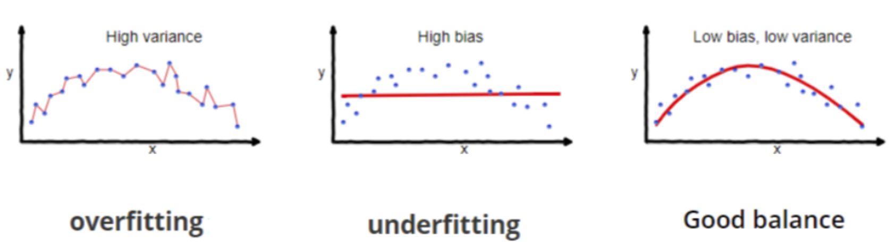
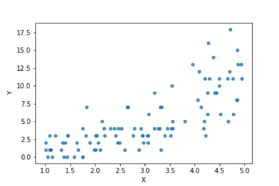
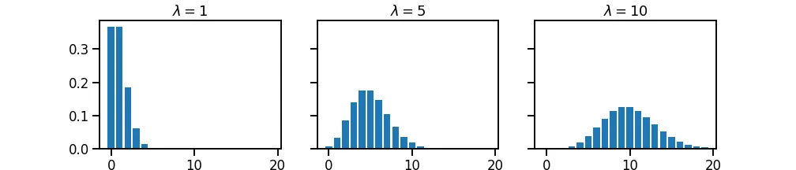
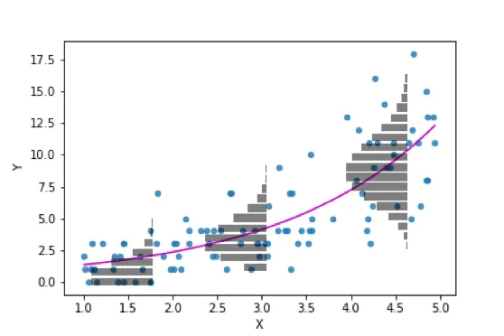

```{r setup, include=FALSE}
knitr::opts_chunk$set(echo = TRUE, cache = TRUE)
options(width = 70)
library(tidyverse)
library(gridExtra)
img_path <- "regfigs/"
```

\tableofcontents

## Introduction

In MATH 2140 or 3150 - Applied Statistics, we discussed many topics in
regression. We'll discuss a few more advanced regression techniques:

-   Weighted least squares
-   Regularization
    -   Ridge regression
    -   LASSO
    -   Elastic net
-   Poisson regression
-   Partial least squares regression

# Weighted Least Squares

## WLS - Matrix Formulation

We are used to regression models being written $$
\hat{y}_i = \hat{\beta}_0 + \hat{\beta}_1x_{i1} + \dots + \hat{\beta}_{p-1}x_{i,p-1}
$$ We can write this in matrix-vector form. If we define
$\boldsymbol{\hat{y}}=[\hat{y}_1, \hat{y}_2, \dots, \hat{y}_n]^T_{n\times 1}$,
$\boldsymbol{\beta}=[\beta_0, \beta_1, \dots, \beta_{p-1}]^T_{p\times 1}$,
and
$\mathbf{X}=\begin{bmatrix} 1 & x_{11} & x_{12} & \dots & x_{1,p-1}\\ 1 & x_{21} & x_{22} & \dots & x_{2,p-1}\\ \vdots & \vdots & \vdots & \dots & \vdots\\ 1 & x_{n1} & x_{n2} & \dots & x_{n,p-1}\\ \end{bmatrix}_{n\times p}$
then that equation above can be written $$
\boldsymbol{\hat{y}_i} = \mathbf{X}_i\boldsymbol{\beta}
$$ and then all $n$ equations for the $y$ values can be written $$
\boldsymbol{\hat{y}} = \mathbf{X}\boldsymbol{\beta}
$$

## WLS - Matrix Formulation

In ordinary least squares (OLS) regression, we determine the estimates
for the $\beta$ values by computing $$
\boldsymbol{\hat{\beta}}=(\mathbf{X}^T\mathbf{X})^{-1}\mathbf{X}^T\boldsymbol{y}
$$ Then we can compute standard errors for these estimates as long as
the **linear regression assumptions** hold:

1.  The residuals have zero mean (the relationship is linear).
2.  The residuals are normally distributed.
3.  The residuals have the same variance.
4.  The residuals are independent.

If the homogeneity of variance assumption is violated, then the standard
errors of the estimated $\beta_i$ values are usually incorrect and not
especially helpful when constructing confidence intervals.

## WLS - Standard Errors

We can obtain the standard errors of the estimates by computing the
variance-covariance matrix in the following manner: $$
\boldsymbol{\sigma^2_B}=\begin{bmatrix}
\text{Var}(\hat{\beta}_0) & \text{Cov}(\hat{\beta}_0, \hat{\beta}_1) & \dots & \text{Cov}(\hat{\beta}_0, \hat{\beta}_{p-1}) \\
\text{Cov}(\hat{\beta}_1, \hat{\beta}_0) & \text{Var}(\hat{\beta}_1) & \dots & \text{Cov}(\hat{\beta}_1, \hat{\beta}_{p-1}) \\
\vdots & \vdots & \ddots & \vdots\\
\text{Cov}(\hat{\beta}_{p-1}, \hat{\beta}_{0}) & \text{Cov}(\hat{\beta}_{p-1}, \hat{\beta}_{1}) & \dots & \text{Var}(\hat{\beta}_{p-1})
\end{bmatrix}=\sigma^2_{\epsilon}(\mathbf{X}^T\mathbf{X})^{-1}
$$ This means that the standard errors can be obtained by taking the
square root of the diagonals of this matrix.

## WLS - Standard Errors

Consider this example of attempting to predict blood pressure using age.

```{r bp, echo = T, eval = F, message = F}
library(tidyverse)
bp <- read_table("blood_pressure.txt") |>
  rename(bp = diastolic_blood_pressure)
bp_mod <- lm(bp ~ age, data = bp)
X <- model.matrix(bp_mod)
var_matrix <- summary(bp_mod)$sigma^2 * solve(t(X) %*% X)
std_errors <- var_matrix |> diag() |> sqrt()
std_errors
```

```{r bp1, echo = F, eval = T, message = F}
library(tidyverse)
bp <- read_table("~/My Drive/Math 3190 - Fundamentals of Data Science/Data/blood_pressure.txt") |> 
  rename(bp = diastolic_blood_pressure)
bp_mod <- lm(bp ~ age, data = bp)
X <- model.matrix(bp_mod)
var_matrix <- summary(bp_mod)$sigma^2 * solve(t(X) %*% X)
std_errors <- var_matrix |> diag() |> sqrt()
std_errors
```

## WLS - Standard Errors

\footnotesize

```{r bp2, echo = T, eval = T, message = F}
# Compare to summary output
summary(bp_mod)
```

## WLS - Original Diagnostic Plots

Below is what the diagnostic plots looks like for this example:

```{r bp_plots, echo = F, eval = T, message = F, fig.height = 4, fig.width=8}
library(gridExtra)
bp_df <- tibble(fitted = fitted.values(bp_mod),
                resids = rstudent(bp_mod))
p <- ggplot(bp_df, aes(x = fitted, y = resids)) +
  geom_point(size = 1.5) +
  geom_hline(yintercept = 0, linewidth = 1) +
  labs(x = "Fitted Values", y = "Jackknife Residuals")
p2 <- ggplot(bp_df, aes(sample = resids)) +
  geom_qq() +
  geom_qq_line(linewidth = 1) +
  labs(x = "Theoretical Quantiles", y = "Jackknife Residuals")
grid.arrange(p, p2, ncol = 2)
```

## WLS - Weighted Least Squares

In order to adjust so the estimates and standard errors are not as
effected by the points that have large residuals, we can **weight** each
observation. We will define a vector of weights as
$\boldsymbol{w}=[w_1, w_2, \dots, w_n]^T$ and a matrix of the weights as
$$
\mathbf{W}=\begin{bmatrix}
w_1 & 0 &  \dots & 0\\
0 & w_2  & \dots & 0\\
\vdots & \vdots &  \ddots & \vdots\\
0 & 0 & \dots & w_n
\end{bmatrix}
$$

We can then obtain the weighted estimates of the coefficients, called
$\boldsymbol{\hat{\beta}_w}$, by computing $$
\boldsymbol{\hat{\beta}_w}=(\mathbf{X}^T\mathbf{W}\mathbf{X})^{-1}\mathbf{X}^T\mathbf{W}\boldsymbol{y}
$$ with variance-covariance matrix $$
\boldsymbol{\sigma^2_B}=\sigma^2_\epsilon\cdot(\mathbf{X}^T\mathbf{W}\mathbf{X})^{-1}.
$$

## WLS - Selecting the Weights

In ordinary least squares (OLS), we assume
$\text{Var}(\epsilon_i)=\sigma^2_\epsilon$ for all $i$. In WLS, we
instead allow for each error to have its own variance. So, we have
$\text{Var}(\epsilon_i)=\sigma^2_i=\sigma^2_{\epsilon}/w_i$. Our best
guess for $\sigma^2_\epsilon$ is the mean square error (MSE). That is
what we typically denote as $s^2_\epsilon$.

Now we need to determine the best values for the weights. First, we must
obtain an estimate for the variance function for the residuals. This
will depend on the residual plot(s), but the most common situation for
using weighted least squares is when the residuals plotted against the
fitted values has a fan shape. In this scenario, we can estimate the
weights by:

1.  Fit an ordinary least squares model (and verify that a residual plot
    against the fitted values has a fan shape).
2.  Fit a new linear model by regressing the absolute value of the
    residuals on the fitted values. That is, use $|\hat{\epsilon}|$ as
    $y$ and $\hat{y}$ as $x$.
3.  Let the weights be the reciprocals of the squares of the fitted
    values of that second model.

## WLS - Assessing the Adequacy of the Weights

Each of the following should be true when using weighted least squares:

1.  The estimates of the $\beta$ values using WLS should be very close
    to the estimates of the $\beta$ values using OLS.
2.  The weighted mean square error ($MSE_w$) should be close to 1.
3.  The residual plot of the jackknife residuals should have constant
    variance.

Also note the following things about WLS:

1.  $R^2$ has no real meaning in weighted least squares and should not
    be considered. We should use the $R^2$ from the OLS model.
2.  Externally studentized (jackknife) residuals take into account the
    weights, so they should be used in residual plots for model
    diagnostics.
3.  For QQ plots, use the unstudentized residuals. Either the raw or
    standardized are fine.

## WLS - Weighted Fit

\small

```{r wls, echo = T, eval = F}
bp_mod <- lm(bp ~ age, data = bp)
e_mod <- lm(abs(bp_mod$residuals) ~ bp_mod$fitted.values)
w <- 1/e_mod$fitted.values^2
bp_mod_w <- lm(bp ~ age, data = bp, weights = w)
summary(bp_mod_w)
```

```{r wls2, echo = F, eval = T}
bp_mod <- lm(bp ~ age, data = bp)
abs_resids <- abs(bp_mod$residuals)
fitted <- bp_mod$fitted.values
e_mod <- lm(abs_resids ~ fitted)
w <- 1/e_mod$fitted.values^2
bp_mod_w = lm(bp ~ age, data = bp, weights = w)
```

```{=tex}
\begin{verbatim}
Coefficients:
            Estimate Std. Error t value Pr(>|t|)    
(Intercept) 55.56577    2.52092  22.042  < 2e-16 ***
age          0.59634    0.07924   7.526 7.19e-10 ***
---
Signif. codes:  0 ‘***’ 0.001 ‘**’ 0.01 ‘*’ 0.05 ‘.’ 0.1 ‘ ’ 1

Residual standard error: 1.213 on 52 degrees of freedom
Multiple R-squared:  0.5214,    Adjusted R-squared:  0.5122 
F-statistic: 56.64 on 1 and 52 DF,  p-value: 7.187e-10
\end{verbatim}
```
## WLS - Weighted Diagnostic Plots

```{r wls_plots, echo = F, eval = T, fig.height = 4, fig.width=8}
bp_w_df <- data.frame(age = bp$age,
                      bp = bp$bp,
                      jk = rstudent(bp_mod_w), 
                      fitted = fitted.values(bp_mod_w),
                      raw = residuals(bp_mod_w))
p <- ggplot(bp_w_df, aes(x = fitted, y = jk)) +
  geom_point(size = 1.5) +
  geom_hline(yintercept = 0, linewidth = 1) +
  labs(x = "Fitted Values", y = "Jackknife Residuals")
p2 <- ggplot(bp_w_df, aes(sample = raw)) +
  geom_qq() +
  geom_qq_line(linewidth = 1) +
  labs(x = "Theoretical Quantiles", y = "Raw Residuals")
grid.arrange(p, p2, ncol = 2)
```

## WLS - Confidence Intervals

We can easily obtain confidence intervals for the $\beta$'s by using the
`confint()` function. The variance-covariance matrix is now
$\sigma^2_\epsilon(\mathbf{X}^T\mathbf{W}\mathbf{X})^{-1}$.

To obtain confidence intervals for predictions, that is, a confidence
interval for $E(y|\mathbf{x}^*)$, we first consider what the CI looks
like in the OLS case. For obtaining the $(1-\alpha)\cdot 100\%$
confidence interval for $E(y|\boldsymbol{x^*})$ at a specific row vector
$\boldsymbol{x^*}=\begin{bmatrix}1 & x^*_{1} & \dots & x^*_{n}\end{bmatrix}$
is given by $$
\hat{y}|\boldsymbol{x^*}\pm t_{\alpha/2}s_\epsilon\sqrt{\boldsymbol{x^*}(\mathbf{X}^T\mathbf{X})^{-1}(\boldsymbol{x^*})^T}
$$ For weighted least squares, we just need to insert the weight matrix:
$$
\hat{y}|\boldsymbol{x^*}\pm t_{\alpha/2}s_{w}\sqrt{\boldsymbol{x^*}(\mathbf{X}^T\mathbf{W}\mathbf{X})^{-1}(\boldsymbol{x^*})^T}
$$ where $s_w$ is the square root of the weighted MSE.

## WLS - Confidence Intervals

An example for obtaining the bounds for blood pressure at age 50:
\scriptsize

```{r ols_conf_int_50, eval = T, echo = T}
W <- diag(w)
n <- nrow(bp)
alpha <- 0.05
x_star <- matrix(c(1, 50), nrow = 1)
yhat <- predict(bp_mod, data.frame(age = 50))
yhat_w <- predict(bp_mod_w, data.frame(age = 50))
se <- summary(bp_mod)$sigma
se_w <- summary(bp_mod_w)$sigma
# OLS Bounds
yhat - qt(1-alpha/2, n-2)*se*sqrt(x_star%*%solve(t(X)%*%X)%*%t(x_star))
yhat + qt(1-alpha/2, n-2)*se*sqrt(x_star%*%solve(t(X)%*%X)%*%t(x_star))
# Verify using the predict function
predict(bp_mod, data.frame(age = 50), interval = "confidence")
```

## WLS - Confidence Intervals

```{r wls_conf_int_50, eval = T, echo = T}
# WLS Bounds - Confidence Interval
yhat_w - qt(1-alpha/2, n-2)*se_w*sqrt(
  x_star%*%solve(t(X)%*%W%*%X)%*%t(x_star))
yhat_w + qt(1-alpha/2, n-2)*se_w*sqrt(
  x_star%*%solve(t(X)%*%W%*%X)%*%t(x_star))

# Verify using the predict function
predict(bp_mod_w, data.frame(age = 50), 
        interval = "confidence")
```

## WLS - Prediction Intervals

The prediction interval for OLS is computed with $$
\hat{y}|\boldsymbol{x^*}\pm t_{\alpha/2}s_\epsilon\sqrt{1 + \boldsymbol{x^*}(\mathbf{X}^T\mathbf{X})^{-1}(\boldsymbol{x^*})^T}
$$ For weighted least squares, we just need to change that 1 to 1 over
the weight for that particular $\boldsymbol{x^*}$: $$
\hat{y}|\boldsymbol{x^*}\pm t_{\alpha/2}s_{w}\sqrt{\frac{1}{w^*} + \boldsymbol{x^*}(\mathbf{X}^T\mathbf{W}\mathbf{X})^{-1}(\boldsymbol{x^*})^T}
$$ where $w^*$ is the weight for the value we are predicting.

## WLS - Prediction Intervals

```{r ols_pred_int_50, eval = T, echo = T}
# Prediction interval OLS
yhat - qt(1-alpha/2, n-2)*se*sqrt(
  1+x_star%*%solve(t(X)%*%X)%*%t(x_star))
yhat + qt(1-alpha/2, n-2)*se*sqrt(
  1+x_star%*%solve(t(X)%*%X)%*%t(x_star))
predict(bp_mod, data.frame(age = 50), 
        interval = "prediction")
```

## WLS - Prediction Intervals

\footnotesize

```{r wls_pred_int_50, eval = T, echo = T}
# Prediction interval WLS
# Get new weight for x = 50:
new_fit <- predict(bp_mod, data.frame(age = 50)) 
new_weight <- 1/predict(e_mod, data.frame(fitted = new_fit))^2
# Construct Intervals
yhat_w - qt(1-alpha/2, n-2)*se_w*sqrt(
  1/new_weight + x_star%*%solve(t(X)%*%W%*%X)%*%t(x_star))
yhat_w + qt(1-alpha/2, n-2)*se_w*sqrt(
  1/new_weight + x_star%*%solve(t(X)%*%W%*%X)%*%t(x_star))
predict(bp_mod_w, data.frame(age = 50), interval = "prediction", 
        weight = new_weight)
```

## WLS - Interval Plots

```{r wls_conf_interval, eval = T, echo = F, warning=F, fig.height=4, fig.width=8}
x_vals <- seq(20, 60, length = 54)
pred_ints <- predict(bp_mod, data.frame(age = x_vals), interval = "prediction")
new_fits <- predict(bp_mod, data.frame(age = x_vals)) 
new_weights <- 1/predict(e_mod, data.frame(fitted = new_fits))^2
pred_ints_w <- predict(bp_mod_w, data.frame(age = x_vals), 
                       interval = "prediction", weight = new_weights)

p <- ggplot(bp_w_df, aes(x = age, y = bp)) +
  geom_point() +
  geom_smooth(method = "lm", formula = "y~x") +
  geom_line(aes(x = x_vals, y = pred_ints[,2]), 
            linewidth = 1, linetype = "dashed") +
  geom_line(aes(x = x_vals, y = pred_ints[,3]), 
            linewidth = 1, linetype = "dashed") +
  labs(x = "Age", y = "Blood Pressure", 
       title = "OLS Interval Bands") +
  lims(y = c(50, 120)) 
p2 <- ggplot(bp_w_df, aes(x = age, y = bp)) +
  geom_point() +
  geom_smooth(method = "lm", formula = "y~x", aes(weight = w)) +
  geom_line(aes(x = x_vals, y = pred_ints_w[,2]), 
            linewidth = 1, linetype = "dashed") +
  geom_line(aes(x = x_vals, y = pred_ints_w[,3]), 
            linewidth = 1, linetype = "dashed") +
  labs(x = "Age", y = "Blood Pressure", 
       title = "WLS Interval Bands") +
  lims(y = c(50, 120))
grid.arrange(p, p2, ncol = 2)

```

\vspace{1in}

# Regularization -- Ridge Regression, LASSO, and Elastic Net

## Bias-Variance Trade Off

In statistical estimation, there is often a trade off between bias and
variance. Many statistical methods, like least squares regression,
guarantee that the estimate is **unbiased**, which means that the
sampling distribution of the statistic is centered at the parameter it
is estimating.

However, these unbiased estimators will often have more uncertainty, a
higher variance, than some biased estimators. When this is the case, the
biased estimator that is more precise may be preferred.

```{r, eval = T, echo = F, fig.height = 2.5, fig.width=8, warning=FALSE}
set.seed(2024)
x1 <- rnorm(100000)
x2 <- rnorm(100000, 0.3, 0.5)

p <- ggplot(data.frame(x1, x2), aes(x = x1)) +
  geom_histogram(color = "black", fill = "lightgray", bins = 30) +
  geom_vline(xintercept = 0, linewidth = 1) + 
  lims(x = c(-3.5,3.5)) +
  labs(x = expression(x[1]), y = "Frequency",
       title = "No Bias, Larger Variance")
p2 <- ggplot(data.frame(x1, x2), aes(x = x2)) +
  geom_histogram(color = "black", fill = "lightgray", bins = 30) +
  geom_vline(xintercept = mean(x2), linewidth = 1) + 
  lims(x = c(-3.5,3.5)) +
  labs(x = expression(x[2]), y = "Frequency",
       title = "Some Bias, Smaller Variance")
grid.arrange(p, p2, ncol = 2)
```

## Bias-Variance tradeoff

In statistics and machine learning, the **bias–variance tradeoff** is
the property of a model that the variance of the parameter estimated
across samples can be reduced by increasing the bias in the estimated
parameters.

The **bias–variance dilemma** or **bias–variance problem** is the
conflict in trying to simultaneously minimize these two sources of error
that prevent supervised learning algorithms from generalizing beyond
their training set

(Source: Wikipedia)

## Bias-Variance tradeoff

The **bias** is an error from faulty assumptions or mispecification of
the learning algorithm. High bias can cause an algorithm to miss the
relevant relations between features and target outputs (underfitting).

The **variance** is an error from sensitivity to small fluctuations in
the training set. High variance may result from an algorithm modeling
the random noise in the training data (overfitting).



## Bias-Variance tradeoff

\center

{width="70%"}

## Bias-Variance tradeoff

The bias–variance tradeoff is a central problem in supervised learning.
Ideally, one wants to choose a model that both accurately captures the
regularities in its training data, but also generalizes well to unseen
data.

Unfortunately, it is typically impossible to do both simultaneously.
High-variance learning methods may be able to represent their training
set well but are at risk of overfitting to noisy or unrepresentative
training data. In contrast, algorithms with high bias typically produce
simpler models that may fail to capture important regularities (i.e.
underfit) in the data.

## Regularization in Machine Learning

In regression analysis, the features are estimated using coefficients
while modeling. In small sample sizes or noisy data coefficient
estimates could be anecdotally incorrect (e.g., overfitting) or
inaccurate.

If the estimates can be restricted, penalized, or shrunk towards zero,
then the impact of insignificant features might be reduced and would
prevent models from high variance with a stable
fit.^[Adapted from: https://www.analyticssteps.com/blogs/l2-and-l1-regularization-machine-learning]

## Regularization in Machine Learning

**Regularization** is the most used technique to penalize complex models
in machine learning, it is deployed for reducing overfitting (or,
contracting generalization errors) by putting small network weights into
the model (adding a small amount of bias). Also, it enhances the
performance of models for new inputs.

Examples of regularization in machine learning, include:

-   K-means: Restricting the segments for avoiding redundant groups.
-   Neural networks: Confining the complexity (weights) of a model.
-   Random forests: Reducing the depths of tree and branches (new
    features).

## Ridge Regression

Ridge regression **regularizes** (shrinks) coefficients by imposing a
penalty on their size. The ridge coefficients minimize a penalized sum
of squared error:
$$\hat{\boldsymbol{\beta}}_{\text{ridge}}=\underset{\boldsymbol{\beta}}{\arg\min}\left\{\sum_{i=1}^{n}(y_i-\sum_{j=1}^{p-1}x_{ij}\beta_j)^2+\lambda\sum_{j=1}^{p-1}\beta_j^2\right\},$$
where $\lambda\ge 0$ is a parameter that controls the shrinkage. The
larger the value of $\lambda$ the more shrinkage (towards 0).

## Ridge Regression

Or in matrix form, ridge regression minimizes:
$$\hat{\boldsymbol{\beta}}_{\text{ridge}}=\underset{\boldsymbol{\beta}}{\arg\min}\left\{({\bf y}-{\bf X}\boldsymbol{\beta})^T({\bf y}-{\bf X}\boldsymbol{\beta}) + \lambda\boldsymbol{\beta}^T\boldsymbol{\beta}\right\}.$$
With a little work, the ridge regression solution can be shown to be:
$$\hat{\boldsymbol{\beta}}_{ridge}=({\bf X}^T{\bf X}+\lambda {\bf I}_N)^{-1}{\bf X}^T{\bf y}$$

## Penalty Terms

The regularization for ridge regression, $\lambda\beta^T\beta$, is
usually denoted as an **L2 regularization** or **L2 penalty**, as it
adds a penalty which is equal to the square of the magnitude of
coefficients. Both Ridge regression and Support Vector Machines (SVMs)
implement this method.

L2 regularization can deal with
$\text{\underline{multicollinearity problems}}$ (independent variables
are highly correlated) through constricting the coefficient while
keeping all the variables in a model.

However, L2 regularization is not an effective method for selecting
relevant predictors (or removing redundant parameters). We will use a
**L1 regularization** for this purpose.

<!-- ## Ridge Regression: a Bayesian Perspective -->

<!-- Ridge regression also has a clear Bayesian interpretation. It can be shown  -->

<!-- that the Ridge penalty can be interpreted as a 'zero' prior (Normal prior with  -->

<!-- zero mean), and the $\lambda$ is related to the variance of the prior. -->

## LASSO Regression

LASSO (Least Absolute Shrinkage and Selection Operator) regression also
**regularizes** coefficients by imposing a penalty on their size, but it
uses an **L1** penalty. The LASSO coefficients minimize the following
cost function:
$$\hat{\boldsymbol{\beta}}_{\text{lasso}}=\underset{\boldsymbol{\beta}}{\arg\min}\left\{\sum_{i=1}^{n}(y_i-\sum_{j=1}^{p-1}x_{ij}\beta_j)^2+\alpha\sum_{j=1}^{p-1}|\beta_j|\right\},$$
where $\alpha\ge 0$ is a parameter that controls the shrinkage. The
larger the value of $\alpha$ the more shrinkage (towards 0).

## LASSO Regression

Notice the similarity to the ridge regression problem: the L2 ridge
penalty $\sum_{j=1}^{p-1}\beta_j^2$ is replaced by the L1 lasso penalty
$\sum_{j=1}^{p-1}|\beta_j|$.

This latter constraint makes the solutions nonlinear in the $y_i$, and
there is no closed form expression for the LASSO as was the case in
ridge regression.

Because of the nature of the constraint, making $\alpha$ sufficiently
small will cause some of the coefficients to be exactly zero. Thus the
LASSO does a kind of continuous subset selection, or conducts a
**variable selection**.

## LASSO vs Ridge Regression

\center

{width="80%"}

\scriptsize

([Elements of Statistical
Learning](https://hastie.su.domains/Papers/ESLII.pdf), Hastie,
Tibshirani, Friedman, by Springer)

## LASSO vs Ridge Regression

\center

{width="85%"}

\tiny

(<https://www.analyticssteps.com/blogs/l2-and-l1-regularization-machine-learning>)

## Elastic Net Regularization

Which should we choose? Ridge or LASSO? Well, why do we have to choose?!

Instead use the **Elastic Net** that minimizes:
$$\hat{\boldsymbol{\beta}}_{\text{elastic net}}=\underset{\boldsymbol{\beta}}{\arg\min}\left\{\sum_{i=1}^{n}\left(y_i-\sum_{j=1}^{p-1}x_{ij}\beta_j\right)^2+\alpha_1\sum_{j=1}^{p-1}|\beta_j|+\alpha_2\sum_{j=1}^{p-1}\beta_j^2\right\},$$
for some $\alpha_1\ge 0$ and $\alpha_2\ge 0$.

The quadratic penalty term makes the loss function strongly convex, and
it therefore has a unique minimum. The elastic net method includes Ridge
regression, LASSO, and OLS by setting either $\alpha_1=0$, $\alpha_2=0$,
or both to 0.

## Regression Regularization in R: glmnet

We can use the **glmnet** package to apply regularization in R:

```{r, eval=F}
install.packages("glmnet")
```

The default model used in the package is the “least squares” regression
model and glmnet actually optimizes: \small
$$\hat{\boldsymbol{\beta}}_{\text{elastic net}}=\underset{\boldsymbol{\beta}}{\arg\min}\left\{\sum_{i=1}^{n}\left(y_i-\sum_{j=1}^{p-1}x_{ij}\beta_j\right)^2+ \lambda \left( \alpha\sum_{j=1}^{p-1}|\beta_j|+ \frac{(1-\alpha)}{2}\sum_{j=1}^{p-1}\beta_j^2 \right)  \right\},$$
\normalsize with $\alpha=1$ as a default (so LASSO!).

## Regression Regularization in R: glmnet

As an example, let's look at a dataset for predicting body fat of a
person using a variety of variables:

```{r}
library(glmnet) |> suppressPackageStartupMessages()
library(faraway) |> suppressPackageStartupMessages()
fat_mod <- lm(
  brozek ~ age + weight + height + neck + chest + 
    + abdom + hip + thigh + knee + ankle + biceps + 
    forearm + wrist, data = fat
  )
# Removes intercept column since that is automatically added
X <- model.matrix(fat_mod)[,-1] 
y <- fat$brozek
```

## Regression Regularization in R: glmnet

We fit the model using the most basic call to glmnet. $\alpha=1$ by
default, but let's also specified it here.

```{r}
fit_lasso <- glmnet(X, y, alpha = 1) # Fits a LASSO
```

**fit_lasso** is now an object of class glmnet that contains all the
relevant information of the fitted model for further use. There are
various functions that work well with this class ob object such as
`plot`, `print`, `coef` and `predict`.

## Regression Regularization in R: glmnet

We can visualize the size of the coefficients for different $\lambda$
values by using the `plot()` function:

```{r fig.height = 3, fig.width = 6, out.width="100%", fig.align="center"}
plot(fit_lasso, "lambda")
```

## Regression Regularization in R: glmnet

A summary of the glmnet path at each step is displayed if we just enter
the object name or use the print function: \small

```{r}
print(fit_lasso)
```

## Regression Regularization in R: glmnet

We can obtain the model coefficients at one or more $\lambda$ values
within the range of the sequence: \footnotesize

```{r}
coef(fit_lasso, s = 0.1)
```

## Regression Regularization in R: glmnet

The function **glmnet** returns a sequence of models for the users to
choose from. **Cross-validation** is perhaps the simplest and most
widely used method to select a model. **cv.glmnet** is the main function
to do cross-validation here, along with various supporting methods such
as plotting and prediction.

<!-- The nonzero is the number of non-zero coefficients at that lambda value. -->

```{r fig.height = 3, fig.width = 6, out.width="75%", fig.align="center"}
set.seed(2024)
cvfit_lasso <- cv.glmnet(X, y)
plot(cvfit_lasso)
```

## Coefficients Using Minimum Lambda

We can get the value of $\lambda_{min}$ and the model coefficients:
\scriptsize

```{r }
cvfit_lasso$lambda.min
coef(cvfit_lasso, s = "lambda.min")
```

## Coefficients Using Lambda within 1 SE of Min

The output of the `cv.glmnet()` function also gives us the largest
$\lambda$ that is within 1 SE of the $\lambda$ that gave the smallest
MSE. This $\lambda_{1se}$ value penalizes the coeficicients more and
therefore choses a simpler model. \scriptsize

```{r }
cvfit_lasso$lambda.1se
coef(cvfit_lasso, s = "lambda.1se")
```

## Fitting Model with Selected $\lambda$

Then we can fit our model using the $\lambda$ value that we choose.

\small

```{r }
fit_min <- glmnet(X, y, lambda = cvfit_lasso$lambda.min)
fit_min
fit_1se <- glmnet(X, y, lambda = cvfit_lasso$lambda.1se)
fit_1se
```

<!-- ## LASSO vs Stepwise Selection -->

<!-- Since LASSO is primarily used for model selection, it makes sense to compare it to another common model selection tool: the step wise selection.  -->

<!-- ```{r lasso_select1, eval = T, echo = T,message=F} -->

<!-- library(AER) -->

<!-- data(CASchools) -->

<!-- CASchools <- tibble(CASchools) -->

<!-- CA_mod <- lm(math ~., data = CASchools[, 5:14]) -->

<!-- # step(CA_mod) # Using AIC -->

<!-- # step(CA_mod, k = log(dim(mtcars)[1])) # Using BIC -->

<!-- set.seed(2024) -->

<!-- CA_lasso <- cv.glmnet(x = model.matrix(CA_mod)[, -1],  -->

<!--           y = CASchools$math, alpha = 1, -->

<!--           thresh = 1e-14)  -->

<!-- # coef(CA_lasso, s = "lambda.min") # LASSO coefficients -->

<!-- ``` -->

## LASSO vs Stepwise Selection

Since LASSO is primarily used for model selection, it makes sense to
compare it to another common model selection tool: the step wise
selection.

\footnotesize

```{r lasso_select1, eval = T, echo = T,message=F}
# step(fat_mod) # Using AIC
# step(fat_mod, k = log(nrow(fat))) # Using BIC
# coef(cvfit_lasso, s = "lambda.min") # LASSO
# coef(cvfit_lasso, s = "lambda.1se") # LASSO
```

## LASSO vs Stepwise Selection

\small

<!-- \begin{center} -->

<!-- \begin{tabular}{|c|c|c|c|c|} -->

<!-- \hline -->

<!-- {\bf Method} & {\bf Model}\\ -->

<!-- \hline -->

<!--  & $93.6 - 0.064\cdot \text{calworks} + 0.0013\cdot\text{computer}$\\ -->

<!-- Stepwise AIC & $- 0.0018\cdot\text{expenditure} + 0.203\cdot\text{income}$\\ -->

<!-- & $ + 0.095\cdot\text{english} + 0.866\cdot\text{read}$\\ -->

<!-- \hline -->

<!-- Stepwise BIC & $79.1 - 0.0022\cdot\text{expenditure} + 0.2432\cdot\text{income}$\\ -->

<!-- & $+ 0.1134\cdot\text{english} + 0.886\cdot\text{read}$\\ -->

<!-- \hline -->

<!--  & $104.3 - 0.068\cdot\text{calworks} + 0.0013\cdot\text{computer}$ \\ -->

<!-- LASSO & $ -0.0015\cdot\text{expenditure} + 0.204\cdot\text{income} $\\ -->

<!-- & $ + 0.079\cdot\text{english} +  0.845\cdot\text{read}$\\ -->

<!-- \hline -->

<!-- \end{tabular} -->

<!-- \end{center} -->

<!-- \vspace{1.5in} -->

```{=tex}
\begin{center}
\begin{tabular}{|c|c|c|c|c|}
\hline
{\bf Method} & {\bf Model}\\
\hline
 & $-20.1 + 0.059\cdot \text{age} - 0.084\cdot\text{weight}$\\
Stepwise AIC & $- 0.432\cdot\text{neck} + 0.877\cdot\text{abdom}$\\
& $ - 0.186\cdot\text{hip} + 0.286\cdot\text{thigh}$\\
& $ + 0.483\cdot\text{forearm} -1.40\cdot\text{wrist}$\\
\hline
Stepwise BIC & $-31.3 - 0.126\cdot\text{weight} + 0.921\cdot\text{abdom}$\\
& $+ 0.446\cdot\text{forearm} - 1.39\cdot\text{wrist}$\\
\hline
 &$-14.3 + 0.055\cdot \text{age} - 0.069\cdot\text{weight}$\\
LASSO (min $\lambda$) & $ -0.077\cdot\text{height} - 0.411\cdot\text{neck} + 0.840\cdot\text{abdom} $\\
& $  - 0.159\cdot\text{hip} + 0.186\cdot\text{thigh} + 0.104\cdot\text{ankle}$\\
& $ + 0.121\cdot\text{biceps} + 0.397\cdot\text{forearm} -1.45\cdot\text{wrist}$\\
\hline
LASSO (1 SE $\lambda$)& $-15.7 + 0.028\cdot\text{age} -0.138\cdot\text{height}$\\
& $+ 0.560\cdot\text{abdom} - 0.479\cdot\text{wrist}$\\
\hline
\end{tabular}
\end{center}
\vspace{1.5in}
```
## LASSO vs Stepwise Selection

Note that the variables selected by the LASSO are **not unique** due to
the randomness associated with choosing $\lambda$. The cross-validation
randomly selects groups from the data to fit the model and that can lead
to a different \`\`best" $\lambda$ value. For example, if our seed is
set to a different number, we obtain a different result. The $\lambda$
can change in ridge regression as well, but the number of variables will
not change with ridge.

\scriptsize

```{r lasso_select3, eval = T, echo = T}
set.seed(2024)
cv.glmnet(x = X, y = y, alpha = 1)$lambda.min
set.seed(1)
cv.glmnet(x = X, y = y, alpha = 1)$lambda.min
```

## Ridge Regression Example

Now let's use ridge regression to get estimates for the coefficients. We
will set $\alpha=0$ here. This does not reduce the number of predictors
at all.

\scriptsize

```{r}
cvfit_ridge <- cv.glmnet(X, y, alpha = 0)
fit_ridge <- glmnet(X, y, alpha = 0, lambda = cvfit_ridge$lambda.min)
coef(cvfit_ridge)
```

## Ridge Regression VIF Reduction

One common use of ridge regression is eliminating some problems causes
by multicollinearity, which occurs when the predictors are highly
correlated with each other. When this is the case, the slopes are
difficult to interpret and the standard errors in the slope estimates
get inflated. Let's check this in our model for body fat.
<!-- \footnotesize --> <!-- ```{r ridge_vif, eval=T, message=F} -->
<!-- options(width = 70) -->
<!-- library(car) # vif() function is in the car package -->
<!-- #set.seed(2024) --> <!-- #x1 <- rnorm(1000) -->
<!-- #x2 <- x1 + rnorm(1000, 0, 0.3) -->
<!-- #y <- x1 + x2 + rnorm(1000, 0, 1) -->
<!-- #cor(x1, x2); cor(x1, y); cor(x2, y) -->
<!-- #mod <- lm(y ~ x1 + x2) --> <!-- #vif(mod) -->
<!-- vif(fat_mod) --> <!-- ``` -->

\footnotesize

```{r ridge_vif, eval=T, message=F}
options(width = 70)
library(car) # vif() function is in the car package
vif(fat_mod)
```

\vspace{.1in}

\normalsize

The VIF tells us how much the variance of the estimates of the slopes
are inflated. For example, the variance of the `abdom` variable is
11.767 times higher (so the SE is about 3.43 times larger) than it would
be if multicollinearity was not present.

## Ridge Regression VIF Reduction

\small

```{r ridge_vif2, eval=F}
summary(fat_mod)
```

```{=tex}
\begin{verbatim}
Coefficients:
             Estimate Std. Error t value Pr(>|t|)    
(Intercept) -15.29255   16.06992  -0.952  0.34225    
age           0.05679    0.02996   1.895  0.05929 .  
weight       -0.08031    0.04958  -1.620  0.10660    
height       -0.06460    0.08893  -0.726  0.46830    
neck         -0.43754    0.21533  -2.032  0.04327 *  
chest        -0.02360    0.09184  -0.257  0.79740    
abdom         0.88543    0.08008  11.057  < 2e-16 ***
hip          -0.19842    0.13516  -1.468  0.14341    
thigh         0.23190    0.13372   1.734  0.08418 .  
knee         -0.01168    0.22414  -0.052  0.95850    
ankle         0.16354    0.20514   0.797  0.42614    
biceps        0.15280    0.15851   0.964  0.33605    
forearm       0.43049    0.18445   2.334  0.02044 *  
wrist        -1.47654    0.49552  -2.980  0.00318 ** 
\end{verbatim}
```
## Ridge Regression VIF Reduction

While there is not a closed-form expression for the standard error of
the ridge regression estimates, we can obtained estimated standard
errors using either bootstrapping or Bayesian methods (we must wait
until Notes 9 for Bayesian!). Let's look at an example using
bootstrapping:

\small

```{r ridge_vif3, eval=T,echo=F}
set.seed(2024)
nboot <- 1000
coefs <- matrix(rep(0, nboot*14), nrow = nboot)
for(i in 1:nboot) {
  index <- sample(1:nrow(X), nrow(X), replace = T)
  mod <- cv.glmnet(X[index,], y[index], alpha = 0)
  coefs[i,] <- coef(mod, s = "lambda.min")[1:14]
}
```

```{r ridge_vif4, eval=F}
set.seed(2024)
nboot <- 1000
coefs <- matrix(rep(0, nboot*14), nrow = nboot)
for(i in 1:nboot) {
  index <- sample(1:nrow(X), nrow(X), replace = T)
  mod <- cv.glmnet(X[index,], y[index], alpha=0)
  coefs[i,] <- coef(mod, s = "lambda.min")[1:14]
}
sd(coefs[,2]); sd(coefs[,3]); sd(coefs[,7])
```

```{=tex}
\begin{verbatim}
## [1] 0.02120437; 0.01584251; 0.04055876
\end{verbatim}
```
## Ridge Regression VIF Reduction

The standard errors for the slope of `age` decreased from 0.02996 to
0.02120 (a factor of about 1.41). The SE for the slope for `weight`
decreased from 0.04958 to 0.01584 (a factor of about 3.13), and the SE
for the slope of `abdom` decreased from 0.08008 to 0.04056 (a factor of
about 1.97).

Of course, these estimates are now biased. By exactly how much is hard
to determine.

## Ridge Regression VIF Reduction

Another way to obtain the VIF values in OLS is by computing the
diagonals of the inverse of the correlation matrix for the predictors:
$\mathbf{r}_{xx}^{-1}.$

In ridge regression, the VIF values can be computed by taking the
diagonal elements of $$
(\mathbf{r}_{xx}-\lambda\mathbf{I})^{-1}\mathbf{r}_{xx}(\mathbf{r}_{xx}-\lambda\mathbf{I})^{-1}.
$$ The original VIF values: \footnotesize

```{r ridge_vif5, eval=T}
options(width = 70)
r_xx <- cor(X)
r_xx |> solve() |> diag() |> round(5)
```

## Ridge Regression VIF Reduction

In our case for this toy example, a good $\lambda$ value was 0.6294.

The reduced ridge regression VIF values: \footnotesize

```{r ridge_vif6, eval=T}
options(width = 70)
diag(
  solve(r_xx + 0.6294*diag(rep(1, 13))) %*% 
    r_xx %*% 
    solve(r_xx + 0.6294*diag(rep(1, 13)))
  ) |> round(5)
```

\normalsize

We actually obtain VIF values less than 1. This can happen under ridge
regression and indicates that the multicollinearity issue has likely
been resolved. There are some articles that propose different ways to
calculate VIF in ridge regression, however, like this one
\href{https://www.tandfonline.com/doi/abs/10.1080/02664763.2014.980789}{here}.

## `glmnet` in the `caret` package

While we were able to obtain an "optimal" $\lambda$ value using the
`cv.glmnet()` function, it did not have an option to optimize $\alpha$
as well. If all we care about are predictions and are not trying to use
LASSO for model selection or ridge regression for VIF reduction, then
choosing $\alpha$ via cross validation can make sense.

\scriptsize

```{r}
library(caret) |> suppressPackageStartupMessages()
set.seed(2024)
search_grid <- expand.grid(alpha = seq(0, 1, length = 20), 
                           lambda=seq(0, 1, by = 0.1))
train_glmnet <- train(
  brozek ~ age + weight + height + neck + chest + 
    + abdom + hip + thigh + knee + ankle + biceps + 
    forearm + wrist, data = fat, method = "glmnet",
  tuneGrid = search_grid, trControl = trainControl(method = "cv", number = 5)
  )
train_glmnet$bestTune
```

## `glmnet` in the `caret` package

The best $\lambda$ was chosen to be zero, which likely means are search
grid steps were too large.

\scriptsize

```{r}
library(caret) |> suppressPackageStartupMessages()
set.seed(2024)
search_grid <- expand.grid(alpha = seq(0, 1, length = 20), 
                           lambda=seq(0, 0.1, by = 0.001))
train_glmnet <- train(
  brozek ~ age + weight + height + neck + chest + 
    + abdom + hip + thigh + knee + ankle + biceps + 
    forearm + wrist, data = fat, method = "glmnet",
  tuneGrid = search_grid, trControl = trainControl(method = "cv", number = 5)
  )
train_glmnet$bestTune
```

\normalsize

This found that an elastic net with $\alpha=0.2616$ and $\lambda=0.008$
is best in terms of minimizing the MSE.

## Example: Logistic Regression Elastic Net

We can do regularization using ridge regression, LASSO, or elastic net
in other models as well, like logistic regression.

Logistic regression is a widely-used model when the response is binary.
Suppose the response variable $y$ takes values {0,1}. We model
$$P(y=1|{\bf X}_i)=\frac{e^{{\bf X_i\boldsymbol{\beta}}}}{1+e^{X_i\boldsymbol{\beta}}},$$
which can be written in the following form:
$$\log\left(\frac{P(y=1|{\bf X}_i)}{P(y=0|{\bf X}_i)}\right)={\bf X}_i\boldsymbol{\beta},$$
the so-called “logistic” or log-odds transformation.

## Example: Logistic Regression Elastic Net

We seek to minimize the following loss function: \small
$$\underset{\boldsymbol{\beta}}{\arg\min}\left\{-\frac{1}{n}\sum_{i=1}^n y_i\log({\bf X}\boldsymbol{\beta})-\log\left(1+e^{{\bf X}\boldsymbol{\beta}}\right)+ \lambda \left( \alpha\sum_{j=1}^{p-1}|\beta_j|+ \frac{(1-\alpha)}{2}\sum_{j=1}^{p-1}\beta_j^2 \right)\right\},$$
\normalsize where the left hand side is the loss function for standard
logistic regression, and the right hand side is the elastic net
regularization.

Logistic regression is often plagued with degeneracies when $p>n$ and
exhibits wild behavior even when $n$ is close to $p$; the elastic net
penalty alleviates these issues, and regularizes and selects variables
as well.

## Example: Logistic Regression Elastic Net

Using the example data set from the glmnet package:

```{r}
library(glmnet)
data(BinomialExample)
x <- BinomialExample$x
y <- BinomialExample$y
```

## Example: Logistic Regression without Elastic Net

Let's try to fit a logistic regression to this dataset with $n=100$ and
$p=30$.

\scriptsize

```{r}
logistic_fit <- glm(y ~ x, family = "binomial")
summary(logistic_fit)
```

## Example: Logistic Regression Elastic Net

Now let's try with the elastic net with $\alpha=1/3$ (equal weight on
the L1 and L2 penalty).

Set family option to “binomial” in the `glmnet` or `cv.glmnet`
functions. The code below uses misclassification error as the criterion
for 10-fold cross-validation:

```{r }
set.seed(2024)
cvfit <- cv.glmnet(x, y, family = "binomial", alpha = 1/3, 
                   type.measure = "class")
```

## Example: Logistic Regression Elastic Net

Now we can plot the cross-validation results and find the 'best'
$\lambda_{min}$:

```{r fig.height = 4, fig.width = 10, out.width="100%", fig.align="center"}
plot(cvfit)
cvfit$lambda.min
```

## Example: Logistic Regression Elastic Net

\tiny

```{r}
fit <- glmnet(x, y, family = "binomial", alpha = 1/3,
              lambda = cvfit$lambda.min)
coef(fit)
```

# Poisson Regression

## Poisson Regression Intro

When doing regression analysis in Applied Statistics, we discussed
linear regression with a continuous response variable, logistic
regression where the response variable is binary, and multinomial
logistic regression where the response variable is nominal with several
(more than two) categories.

We did not discuss the best way to handle a discrete, quantitative
response variable. If this is the case, the possible values range from 0
to infinity, and large counts are rare, then **Poisson regression** is
most appropriate.

## Poisson Distribution

Recall the Poisson distribution from MATH 1040 or MATH 3700: $$
P(Y=y) = f(y) = \dfrac{e^{-\lambda}\lambda^y}{y!} \quad \text{ for } y = 0, 1, 2, \dots
$$ with $E[Y]=\text{Var}(Y)=\lambda$. So, the variance increases as the
mean of $Y$ increases.

We often use capital letters (like $Y$) to denote the variable name and
lowercase letters (like $y$) to denote values of that variable.

## Poisson Link Function

Like when doing logistic regression, we need a link function for Poisson
regression. In logistic regression, the most common link function is the
logit function:
$\log\left(\dfrac{\widehat{P(Y=1|\mathbf{X}_i)}}{1-\widehat{P(Y=1|\mathbf{X}_i)}}\right)$
and when using that function, the model becomes linear. That is,
$\log\left(\dfrac{\widehat{P(Y=1|\mathbf{X}_i)}}{1-\widehat{P(Y=1|\mathbf{X}_i)}}\right)=\mathbf{X}_i\boldsymbol{\beta}$.

The most common link function for Poisson regression is just the $\log$
function. Typically, we just write "log" to indicate the natural log function. That is, \vspace{-.1in}$$
\log(\widehat{E[Y|\mathbf{X}_i]})=\mathbf{X}_i\boldsymbol{\beta}
$$ where $\mathbf{X}_i$ is the $i$th row of the model matrix
$\mathbf{X}$.

Of course, the expected value of $Y$ is $\lambda$, so this model is
really for predicting $\lambda$ at certain values of $X$:
$\log(\hat{\lambda}_i|x_i)=\beta_0+\beta_1x_i$ or
$\hat{\lambda}_i|x_i =e^{\beta_0+\beta_1x_i}$in the SLR case.

## Poisson Data Model

With the Poisson regression, we model the data by thinking about $Y$ as
following a Poisson distribution with a different mean at every value of
$x$. So, if we begin with a dataset that looks like the one in the image
below, which is fairly common for Poisson regression, then we can
imagine a different Poisson distribution at each $x$ value.

{width="60%"}

## Poisson Data Model

{width="75%"}\vspace{-.1in}
{width="75%"}

## Poisson Regression Assumptions

1.  **Poisson Response**: The response variable is conditionally a count
    per unit of time or space, described by a Poisson distribution.

2.  **Independence**: The observations must be independent of one
    another.

3.  **Mean = Variance**: By definition, the mean of a Poisson random
    variable must be equal to its variance.

4.  **Linearity**: The log of the mean rate, $\log(\lambda)$, must be a
    linear function of $x$.

## Finding Parameter Estimates

The parameters, $\beta_0, \beta_1, \dots, \beta_{p-1}$ are not estimated
using least squares. Instead, like for logistic regression, these are
estimated using **maximum likelihood estimation** (MLE). The way MLE
works is to determine the values of $\boldsymbol{\beta}$ such that it
maximizes the likelihood function of obtaining these data.

The likelihood function is essentially the joint probability density
function (pdf), but we think of the data as fixed and the $\beta's$ as
random. For the poisson, assuming independent data values, the
likelihood function is \begin{align*}
L(\boldsymbol{\beta})&=\prod_{i=1}^nf_i(y_i)=f_1(y_1)\cdot \dots \cdot f_n(y_n)\\
&=\dfrac{e^{-\lambda_1}\lambda_1^{y_1}}{y_1!}\cdot \dots\cdot \dfrac{e^{-\lambda_n}\lambda_n^{y_n}}{y_n!}
\end{align*} Let's continue this on the next slide.

## Maximum Likelihood Estimation

\vspace{-.32in}

\begin{align*}
L(\boldsymbol{\beta})&=\prod_{i=1}^nf_i(y_i)=f_1(y_1)\cdot \dots \cdot f_n(y_n)\\
&=\dfrac{e^{-\lambda_1}\lambda_1^{y_1}}{y_1!}\cdot \dots\cdot \dfrac{e^{-\lambda_n}\lambda_n^{y_n}}{y_n!}\\
&=\dfrac{\prod_{i=1}^n\lambda_i^{y_i}\cdot \exp\left\{-\sum_{i=1}^n\lambda_i\right\}}{\prod_{i=1}^ny_i!}
\end{align*} Now it is common to take the log of the likelihood to make
the actual maximizing easier: \begin{align*}
\ln(L(\boldsymbol{\beta}))=\ell(\boldsymbol{\beta})&=\ln\left(\dfrac{\prod_{i=1}^n\lambda_i^{y_i}\cdot \exp\left\{-\sum_{i=1}^n\lambda_i\right\}}{\prod_{i=1}^ny_i!}\right)\\
&=\ln\left(\prod_{i=1}^n\lambda_i^{y_i}\right) + \ln\left(\exp\left\{-\sum_{i=1}^n\lambda_i\right\}\right) - \ln\left(\prod_{i=1}^ny_i!\right)\\
&=\sum_{i=1}^ny_i\ln(\lambda_i)  -\sum_{i=1}^n\lambda_i - \sum_{i=1}^n\ln(y_i!)
\end{align*}

## Maximum Likelihood Estimation

Now we can substitute for $\lambda_i$. That is,
$\lambda_i=E(Y|\mathbf{X}_i)=\exp(\mathbf{X}_i\boldsymbol{\beta})$:
\begin{align*}
\ell(\boldsymbol{\beta})&=\sum_{i=1}^ny_i\ln(\lambda_i)  -\sum_{i=1}^n\lambda_i - \sum_{i=1}^n\ln(y_i!)\\
&=\sum_{i=1}^ny_i\ln(\exp(\mathbf{X}_i\boldsymbol{\beta}))  -\sum_{i=1}^n\exp(\mathbf{X}_i\boldsymbol{\beta}) - \sum_{i=1}^n\ln(y_i!)\\
&=\sum_{i=1}^ny_i(\mathbf{X}_i\boldsymbol{\beta})  -\sum_{i=1}^n\exp(\mathbf{X}_i\boldsymbol{\beta}) - \sum_{i=1}^n\ln(y_i!)
\end{align*} Now, to maximize this, like in calculus, we take the
derivative with respect to one of the parameters (one of the $\beta$'s)
and set the equation equal to zero.

## Maximum Likelihood Estimation

Let's do an example in the SLR case where
$\mathbf{X}_i\boldsymbol{\beta}=\beta_0+\beta_1x_i$. \begin{align*}
\ell(\boldsymbol{\beta})&=\sum_{i=1}^ny_i(\mathbf{X}_i\boldsymbol{\beta})  -\sum_{i=1}^n\exp(\mathbf{X}_i\boldsymbol{\beta}) - \sum_{i=1}^n\ln(y_i!)\\
&=\sum_{i=1}^ny_i(\beta_0+\beta_1x_i)  -\sum_{i=1}^n\exp(\beta_0+\beta_1x_i) - \sum_{i=1}^n\ln(y_i!)
\end{align*} Take the derivative with respect to $\beta_0$ and set it
equal to zero: \begin{align*}
\dfrac{\partial\ell}{\partial\beta_0}=\sum_{i=1}^ny_i - \sum_{i=1}^n\exp(\beta_0+\beta_1x_i)=0
\end{align*} Take the derivative with respect to $\beta_1$ and set it
equal to zero: \begin{align*}
\dfrac{\partial\ell}{\partial\beta_1}=\sum_{i=1}^nx_iy_i - \sum_{i=1}^nx_i\exp(\beta_0+\beta_1x_i)=0
\end{align*}

## Maximum Likelihood Estimation

Now, these equations need to be solved numerically (unlike ordinary
least squares), so they do not have a closed-form solution. Just to
verify that these are correct, though, let's simulate a little toy
example:

\small

```{r MLE_equations}
set.seed(2024)
x <- rnorm(5) # Simulate 5 random values for x
# Simulate 5 random values for y (with a couple different means)
y <- c(rpois(3, 2), rpois(2, 6))
mod <- glm(y ~ x, family = "poisson") # Fit the Poisson model
b0 <- coef(mod)[1] # Extract the intercept
b1 <- coef(mod)[2] # Extract the slope
sum(y) - sum(exp(b0 + b1 * x)) # First MLE equation
sum(x * y) - sum(x * exp(b0 + b1 * x)) # Second MLE equation
```

## Other Poisson Regression Functions in **R**

In **R**, we can use the `glm()` function to fit a Poisson model. Like
we do with logistic regression, we need to specify the family and the
link function. By default, the link function in the "poisson" family is
the log, so we will keep it as the default.

```{r, eval = F, echo = T}
glm(y ~ x, data = poisson_df, family = "poisson")
```

## Illustrative Example - Lumber

The Miller Lumber Company is a large retailer of lumber and paint, as
well as of plumbing, electrical, and other household supplies. During a
representative two-week period, in-store surveys were conducted and
addresses of customers were obtained. The addresses were then used to
identify the metropolitan area census tracts in which the customers
reside. At the end of the survey period, the total number of customers
who visited the store from each census tract within a 10-mile radius was
determined and relevant demographic information for each tract (average
income, number of housing units, etc.) was obtained. Several other
variables expected to be related to customer counts were constructed
from maps, including distance from census tract to nearest competitor
and distance to store.

We will try to predict the number of customers from a Census tract using
two variables: the distance the track is to the Miller Lumber Company
store (quantitative in miles) and the distance from a competitor's store
(categorical with categories "\<2", "2-4", or "4+" miles.)

## Illustrative Example - Lumber Model

\small

```{r, message = F, fig.width = 8, fig.height = 4}
library(tidyverse) |> suppressPackageStartupMessages()
lumber <- read_table(
  paste0("~/My Drive/Math 3190 - Fundamentals of Data ",
         "Science/Data/lumber_company.txt")
  ) |>
  mutate(competitor_dist = factor(case_when(
    competitor_distance <= 2 ~ "<2",
    competitor_distance > 2 & competitor_distance <= 4 ~ "2-4",
    competitor_distance > 4 ~ ">4"
    ), levels = c("<2", "2-4", ">4"))
  )
lumber_mod <- glm(customers ~ store_distance * competitor_dist,
                  data = lumber, family = "poisson")
```

## Illustrative Example - Lumber Scatter Plot

\small

```{r, message = F, fig.width = 8, fig.height = 3}
ggplot(lumber, aes(x = store_distance, y = customers,
                   shape = competitor_dist,
                   color = competitor_dist)) +
  geom_point() +
  labs(x = "Store Distance", y = "Number of Customers",
       shape = "Competitor Distance", color = "Competitor Distance")
```

## Illustrative Example - Lumber Model Output

```{r, message = F, fig.width = 8, fig.height = 3, eval = F}
summary(lumber_mod)
```

\footnotesize

```{verbatim}
Coefficients:
                                  Estimate Std. Error z value Pr(>|z|)    
(Intercept)                        4.32561    0.50344   8.592  < 2e-16 ***
store_distance                    -0.32659    0.06425  -5.083 3.71e-07 ***
competitor_dist2-4                -1.12808    0.54137  -2.084  0.03718 *  
competitor_dist>4                 -0.89883    0.50992  -1.763  0.07795 .  
store_distance:competitor_dist2-4  0.20830    0.07034   2.961  0.00306 ** 
store_distance:competitor_dist>4   0.19871    0.06623   3.000  0.00270 ** 
---
Signif. codes:  0 ‘***’ 0.001 ‘**’ 0.01 ‘*’ 0.05 ‘.’ 0.1 ‘ ’ 1

(Dispersion parameter for poisson family taken to be 1)

    Null deviance: 422.22  on 109  degrees of freedom
Residual deviance: 132.35  on 104  degrees of freedom
AIC: 588.39
```

## Illustrative Example - Lumber Model Equations

We will get one equation for each category of the categorical variable.
Letting $x_i$ be the $i$th value of store_distance, we obtain:

Model 1 (\<2 Group): $\ln(\hat{\lambda}_i) = 4.32561-0.32659\cdot x_i$
\vspace{.5in}

Model 2 (2-4 Group): $\ln(\hat{\lambda}_i) = 3.19753-0.11829\cdot x_i$
\vspace{.5in}

Model 2 (4+ Group): $\ln(\hat{\lambda}_i) = 3.42678-0.12788\cdot x_i$

## Illustrative Example - Lumber Model Plot with Models

We can use the `geom_smooth()` function to plot the models curves.

\footnotesize

```{r, message = F, fig.width = 8, fig.height = 2.5}
ggplot(lumber, aes(x = store_distance, y = customers,
                  shape = competitor_dist,
                  color = competitor_dist)) +
  geom_point() +
  labs(x = "Store Distance", y = "Number of Customers",
       shape = "Competitor Distance", color = "Competitor Distance") +
  geom_smooth(method = "glm", method.args = list(family = "poisson"),
             formula = "y ~ x", se = F) 
```

## Interpreting the Model Coefficients

The interpretation of the coefficients here is quite similar to
interpreting the coefficients of a log-transformed linear regression
model.

**Intercept**: The predicted mean of the Poisson distribution when $x=0$
is $\exp(\hat{\beta}_0)$.

**Slope**: The predicted change in the mean of the Poisson distribution
when $x$ increases by one is $\exp(\hat{\beta}_1)$. \vspace{1in}

## Confidence Intervals for the Model Coefficients

We can obtain confidence intervals for the intercept and slope(s) using
normal approximations as long as our sample size is fairly large:
$$
\left(\hat{\beta}_i-z_{\alpha/2}\cdot SE(\hat{\beta}_i), \hat{\beta}_i+z_{\alpha/2}\cdot SE(\hat{\beta}_i)\right)
$$ 
Then we can exponentiate these to get the confidence intervals back
on the original scale:
$$
\left(\exp\left\{\hat{\beta}_i-z_{\alpha/2}\cdot SE(\hat{\beta}_i)\right\}, \exp\left\{\hat{\beta}_i+z_{\alpha/2}\cdot SE(\hat{\beta}_i)\right\}\right)
$$

Using the `confint()` function in **R** uses what is called the "profile
likelihood" method for computing these intervals, which we will not
discuss here, so the results will be a bit different. Note that the
`MASS` package must be installed for this to work.

## Lumber Example Confidence Intervals

For the "store_distance" variable, the $\beta_1$ estiamte is $-0.32659$
with a standard error of $0.06425$. We can obtain an approximate 95%
interval using

```{r, eval = T}
-0.32659 - qnorm(1-0.05/2) * 0.06425
-0.32659 + qnorm(1-0.05/2) * 0.06425
```

So the interval is $-0.453<\beta_1<-0.201$.

Using the `confint()` function:

```{r}
confint(lumber_mod)[2,]
```

We obtain an interval of $-0.452<\beta_1<-0.200$.

## Confidence Intervals for the Mean Response

We can obtain an approximate confidence interval for
$E(Y_i|\boldsymbol{x}_i)$ using the `predict()` function with the
options `type = "response"` and `se.fit = T`. This won't create for CI
for us, though. We can approximate using a normal distribution. This approximation is better for larger values of $\lambda_i$.

```{r, echo = F}
lumber_pred <- predict(lumber_mod, 
                       data.frame(store_distance = 5, 
                                  competitor_dist = "2-4"),
                       type = "response", se.fit = T)
```

```{r, eval = F}
lumber_pred <- predict(lumber_mod, 
                       data.frame(store_distance = 5, 
                                  competitor_dist = "2-4"),
                       type = "response", se.fit = T)
lumber_pred$fit - 1.96 * lumber_pred$se.fit
lumber_pred$fit + 1.96 * lumber_pred$se.fit
```

```{verbatim}
11.7594; 15.33278
```

So, the interval is $11.76<E(Y^*|\boldsymbol{x}^*)<15.33$ or
$11.76<\lambda^*|\boldsymbol{x}^*<15.33$.

## Confidence Intervals for Predictions

These confidence intervals are for the mean Poisson response at a given
row vector $\boldsymbol{x}$. Then, to get predictions for the actual
count, we can use percentiles for Poisson distribution.

For the [lower bound]{.underline} of a $(1-\alpha)\times100\%$
confidence interval, we can use the $\alpha/2\times100$th percentile
using the lower bound of the CI for the mean.

For the [upper bound]{.underline} of a $(1-\alpha)\times100\%$
confidence interval, we can use the $(1-\alpha/2)\times100$th percentile
using the upper bound of the CI for the mean.

```{r, eval = T}
qpois(0.025, 11.7594)  # 2.5th percentile using lower mean
qpois(0.975, 15.33278) # 97.5th percentile using upper mean
```

That gives an interval of $6<y^*|\boldsymbol{x}^*<23$.

## Lumber Model Plot with CI

We can plot the CI for the mean with the `geom_smooth()` function as
well. These intervals are constructed using the profile likelihood
method rather than normal approximations, but they are similar.

\small

```{r, message = F, fig.width = 8, fig.height = 2.5, eval = F}
ggplot(lumber, aes(x = store_distance, y = customers,
                  shape = competitor_dist,
                  color = competitor_dist)) +
  geom_point() +
  labs(x = "Store Distance", 
       y = "Number of Customers",
       shape = "Competitor Distance", 
       color = "Competitor Distance") +
  geom_smooth(method = "glm",
              method.args = list(family = "poisson"),
              formula = "y ~ x", se = T) 
```

## Lumber Model Plot with CI

```{r, message = F, fig.width = 8, fig.height = 5, echo = F}
ggplot(lumber, aes(x = store_distance, y = customers,
                  shape = competitor_dist,
                  color = competitor_dist)) +
  geom_point() +
  labs(x = "Store Distance", y = "Number of Customers",
       shape = "Competitor Distance", color = "Competitor Distance") +
  geom_smooth(method = "glm", method.args = list(family = "poisson"),
             formula = "y ~ x", se = T) 
```

## Poisson Residuals

There are several different types of residuals for a Poisson regression
model. The first is called the **Pearson residual**, which is computed using
\vspace{-0.05in} $$
\hat{\epsilon}_i^P = \dfrac{y_i-\hat{y}_i}{\sqrt{\hat{y}_i}}
$$ \vspace{-0.05in} where
$\hat{y}_i=\exp(\mathbf{X}_i\hat{\boldsymbol{\beta}})=\hat{\lambda}_i$.

Then there is the **deviance residual**, which is computed using
\vspace{-0.05in} $$
\hat{\epsilon}_i^D = \text{sgn}(y_i-\hat{y}_i)\sqrt{2\left(y_i\cdot \ln\left(y_i/\hat{y}_i\right)-y_i+\hat{y}_i\right)}
$$ where $\text{sgn}$ is the sign function that is positive when its
input is positive and negative otherwise. Note that when $y_i=0$, we
take $y_i\cdot \ln\left(y_i/\hat{y}_i\right)$ to also equal $0$.

It can be shown that both of these residuals are approximately normally
distributed.

## Other Poisson Regression Functions in **R**

To obtain the fitted values on the original data scale, we can either
use the
\vspace{-.05in}
```{r, eval = F}
fitted.values()
```
\vspace{-.15in}
function or use
\vspace{-.05in}
```{r, eval = F}
predict(model, type = "response")
```
\vspace{-.05in}
If we just use
\vspace{-.05in}
```{r, eval = F}
predict(model)
```
\vspace{-.15in}
it will return the linear predictors. To get back to the original scale, we
would need to exponentiation those values.

To obtain the Pearson residuals, we can use
\vspace{-.05in}
```{r, eval = F}
residuals(model, type = "pearson")
```
\vspace{-.05in}
The deviance residuals are the
default, so they be obtained using either
```{r, eval = F}
residuals(model)
residuals(model, type = "deviance")
```

## Poisson Regression Diagnostics

We can perform **diagnostics** for Poisson regression using hypothesis tests
and plots. Each of the following are helpful:

1.  A residual plot of the Pearson residuals vs the predicted values.
    These residuals should appear randomly spread.
2.  A QQ-plot of the Pearson or deviance residuals. These should be
    approximately normally distributed.
3.  A deviance goodness-of-fit (GOF) test.
4.  A check for overdispersion.

## Poisson Regression Diagnostics - Residual Plot

```{r pois_resid, fig.width=3, fig.height=1.8, eval = T}
p_resids <- residuals(lumber_mod, type = "pearson")
resid_df <- data.frame(p_resids,
                       linear_pred = lumber_mod$linear.predictors)
ggplot(resid_df, aes(x = linear_pred, y = p_resids)) +
  geom_point(size = 0.5) + 
  labs(x = "Linear Predictors", y = "Pearson Residuals")
```

## Poisson Regression Diagnostics - QQ Plot

We can use a **QQ plot** to check if the Pearson residuals are approximately
normal. This can be done with the `qqnorm()` and `qqline()` function in
base **R** or the `geom_qq()` and `geom_qq_line()` in ggplot2. The
closer to the line, the better.

```{r pois_qq, fig.width=5, fig.height=4, eval = F}
ggplot(resid_df, aes(sample = p_resids)) +
  geom_qq() +
  geom_qq_line(linewidth = 1) +
  labs(x = "Theoretical Quantiles",
       y = "Sample Quantiles")
```

## Poisson Regression Diagnostics - QQ Plot

```{r pois_qq2, fig.width=6, fig.height=3.8, echo = F}
ggplot(resid_df, aes(sample = p_resids)) +
  geom_qq() +
  geom_qq_line(linewidth = 1) +
  labs(x = "Theoretical Quantiles",
       y = "Sample Quantiles")
```

## Poisson Regression Diagnostics - GOF Test

A **deviance goodness-of-fit** (GOF) test tests the hypotheses

$H_0:$ The model is correctly specified.\
$H_A:$ The model is incorrectly specified.

The test statistic is $$
D = 2\sum_{i=1}^n\left(y_i\ln(y/\hat{y}_i)-(y_i-\hat{y}_i)\right)=\sum_{i=1}^n\left(\hat{\epsilon}_i^D\right)^2,
$$ the sum of the squared deviance residuals. This statistic
approximately follows a $\chi^2$ distribution with $n-p$ degrees of
freedom when the predicting means as not too small. It is also given in
the output of the Poisson model as the "Residual deviance".

If this statistic is large relative to the degrees of freedom, we have
evidence that the model does not fit well, and we would reject the null
hypothesis. Therefore, this is a [right-tailed test]{.underline}.

## Poisson Regression Diagnostics - GOF Test Example

```{r}
1 - pchisq(lumber_mod$deviance, df = lumber_mod$df.residual)
```

\vspace{.5in}

We have evidence here that this model does not fit well. In this case,
that is likely becuase the model is **overdispersed**. We can alleviate
this issue by adding more important variables. If we add more variables,
we lose evidence the model is poorly fitting. \small

```{r}
lumber_mod2 <- glm(customers ~ store_distance + competitor_dist + 
                     average_income + average_age + housing_units,
                  data = lumber, family = "poisson")
1 - pchisq(lumber_mod2$deviance, df = lumber_mod2$df.residual)
```

## Poisson Regression Diagnostics - Overdispersion

One important property of a Poisson distribution is that $E(Y)=\lambda$
and $Var(Y)=\lambda$. That is, both the mean and the variance are equal.
**Overdispersion** occurs when the variance of a model is greater than
its mean.

-   Overdispersion is caused by a positive correlation between responses
    or by too much variation between response probabilities or counts.
    Overdispersion also arises when there are violations in the
    distributional assumptions of the data as well as when the data are
    prone to it (i.e., when earlier events cause or influence the
    existence of subsequent events).

-   Overdispersion is an issue because it may cause standard errors of
    the estimates to be underestimated (i.e., a variable may appear to
    be a significant predictor when it is in fact not significant).

## Poisson Regression Diagnostics - Overdispersion

-   A model may be overdispersed if the value of the sum of the squared
    Pearson residuals divided by the degrees of freedom (df) is greater
    than 1.0. This quotient is called the dispersion. Small amounts of
    overdispersion are of little concern; however, if the dispersion
    statistic is greater than 1.25 for moderate-sized models, then a
    correction may be warranted. Models with large numbers of
    observations may be overdispersed with a dispersion statistic of
    1.05.

-   We can alleviate the issue overdispersion issue by adding other
    predictors, transforming the count data, or **changing models**.

If we are using Poisson regression in its proper context, than the most
common way to alleviate overdispersion is to change from a Poisson model
to a **quasi-Poisson model**.

## Quasi-Poisson Regression

The quasi-Poisson distribution is very similar to the Poisson, except it
allows for the mean and variance to differ: \begin{align*}
E[Y] = \lambda\\
Var(Y) = \phi\lambda
\end{align*} where $\phi$ is known as the [dispersion
parameter]{.underline} that is estimated from the data.

In particular, $\displaystyle\phi=\dfrac{1}{n-p}\sum_{i=1}^n\hat{\epsilon}^P_i$, the
sum of the squared Pearson residuals divided by the residual degrees of
freedom.

## Quasi-Poisson Example

In our example, let's check the estimate for $\phi$:

```{r}
sum(residuals(lumber_mod, type = "pearson")^2)
lumber_mod$df.residual # n - p = 110 - 6
phi <- sum(residuals(lumber_mod, type = "pearson")^2)/lumber_mod$df.residual
phi
```

\vspace{.05in}

The dispersion estimate of 1.199 is not above the 1.25 cutoff, but it
fairly large. Let's fit a new model using a "quasi-poisson" family.

```{r}
lumber_mod_quasi <- glm(
  formula = customers ~ store_distance * competitor_dist, 
  family = "quasipoisson", data = lumber)
```

Let's compare the output.

## Quasi-Poisson Example - Poisson Output

```{r, eval = F}
summary(lumber_mod)
```

\footnotesize

```{verbatim}
Coefficients:
                                  Estimate Std. Error z value Pr(>|z|)    
(Intercept)                        4.32561    0.50344   8.592  < 2e-16 ***
store_distance                    -0.32659    0.06425  -5.083 3.71e-07 ***
competitor_dist2-4                -1.12808    0.54137  -2.084  0.03718 *  
competitor_dist>4                 -0.89883    0.50992  -1.763  0.07795 .  
store_distance:competitor_dist2-4  0.20830    0.07034   2.961  0.00306 ** 
store_distance:competitor_dist>4   0.19871    0.06623   3.000  0.00270 ** 
---
Signif. codes:  0 ‘***’ 0.001 ‘**’ 0.01 ‘*’ 0.05 ‘.’ 0.1 ‘ ’ 1

(Dispersion parameter for poisson family taken to be 1)

    Null deviance: 422.22  on 109  degrees of freedom
Residual deviance: 132.35  on 104  degrees of freedom
AIC: 588.39
```

## Quasi-Poisson Example - Quasi-Poisson Output

```{r, eval = F}
summary(lumber_mod_quasi)
```

\footnotesize

```{verbatim}
Coefficients:
                                  Estimate Std. Error t value Pr(>|t|)    
(Intercept)                        4.32561    0.55133   7.846 3.99e-12 ***
store_distance                    -0.32659    0.07036  -4.642 1.01e-05 ***
competitor_dist2-4                -1.12808    0.59287  -1.903  0.05984 .  
competitor_dist>4                 -0.89883    0.55843  -1.610  0.11052    
store_distance:competitor_dist2-4  0.20830    0.07703   2.704  0.00800 ** 
store_distance:competitor_dist>4   0.19871    0.07253   2.740  0.00724 ** 
---
Signif. codes:  0 ‘***’ 0.001 ‘**’ 0.01 ‘*’ 0.05 ‘.’ 0.1 ‘ ’ 1

(Dispersion parameter for quasipoisson family taken to be 1.199297)

    Null deviance: 422.22  on 109  degrees of freedom
Residual deviance: 132.35  on 104  degrees of freedom
AIC: NA
```

## Quasi-Poisson Regression

Some things to notice:

-   The parameter estimates are the same.

-   We estimate the standard errors of the $\hat{\beta}_i$ coefficients
    by taking the SE estimates in the regular Poisson regression model
    and multiplying them by $\sqrt{\phi}$.

-   These estimates for the quasi-Poisson approximately follow a $t$
    distribution rather than a normal distribution.

-   AIC is not defined for the quasi-Poisson family.

An alternative to using the quasi-Poisson is to use **negative binomial
regression**. Poisson regression is actually just a special case of
negative binomial regression regression and the latter has more than one
parameter to allow for the mean and variance to differ.

<!-- \begin{center} -->

<!-- \begin{tabular}{|c|c|c|c|c|} -->

<!-- \hline -->

<!-- & {\bf Poisson} & {\bf Quasi-Poisson}\\ -->

<!-- \hline -->

<!-- Standard Error & $SE(\hat{\beta}_i)$ & $\sqrt{\phi}\cdot SE(\hat{\beta}_i)$\\ -->

<!-- \hline -->

<!-- Distribution & Normal & $t$\\ -->

<!-- \hline -->

<!-- \end{tabular} -->

<!-- \end{center} -->

<!-- ## Poisson Regression Example -->

<!-- Let's do an example trying to predict the number of awards earned by students at one high school. Predictors of the number of awards earned include the type of program in which the student was enrolled (e.g., vocational, general or academic) and the score on their final exam in math. -->

<!-- [UCLA Example Link](https://stats.oarc.ucla.edu/r/dae/poisson-regression/#:~:text=Examples%20of%20Poisson%20regression,the%20course%20of%2020%20years.) -->

<!-- ```{r poisson_problen, eval = F} -->

<!-- # Likelihood Ratio Tests -->

<!-- for(var in ) -->

<!-- anova(glm(customers ~ . - housing_units, data = lumber, family = "poisson"), lumber_mod, test = "Chisq") -->

<!-- awards <- read.csv("https://stats.oarc.ucla.edu/stat/data/poisson_sim.csv") |> -->

<!--   as_tibble() |> -->

<!--   mutate(prog = as_factor(prog)) -->

<!-- awards_mod <- glm(num_awards ~ prog + math, data = awards, family = "poisson") -->

<!-- awards_mod2 <- glm(num_awards ~ prog + math, data = awards, family = "quasipoisson") -->

<!-- awards2 <- awards |> -->

<!--   mutate(y_hat = predict(awards_mod, type = "response"), -->

<!--          prog = as_factor(prog)) |> -->

<!--   arrange(prog, math) -->

<!-- awards2 |> -->

<!--   ggplot(aes(x = math, y = y_hat, color = prog)) + -->

<!--   geom_point(aes(y = num_awards), position = position_jitter(h = 0.2)) + -->

<!--   #geom_smooth(method = "glm", method.args = list(family = "poisson")) + -->

<!--   geom_smooth(method = "glm", method.args = list(family = "poisson"), -->

<!--               se = TRUE) -->

<!-- ``` -->

## Just for Fun - Poisson Bootstrap

The bootstrap never (or at least rarely) lies! Compare these standard
errors to the Poisson and quasi-Poisson ones.

\small

```{r pois_bootstrap, eval = T, cache = T}
nsims <- 5000
betas <- matrix(rep(0, 6*nsims), nrow = nsims)
for(i in 1:nsims) {
  index = sample(1:nrow(lumber), nrow(lumber), replace = T)
  betas[i,] <- coef(
    glm(customers ~ store_distance * competitor_dist, 
        family = "poisson", data = lumber[index,])
    )
}
apply(betas, 2, mean) |> round(4) # Take mean of each column
apply(betas, 2, sd) |> round(4)   # Take SD of each column
```

# Partial Least Squares Regression

## PLS Intro

**Partial Least Squares** (PLS) Regression is a **dimension reduction** tool
similar to **Principal Component Analysis** (PCA). Let's first review PCA.

## PCA Review

The idea of PCA is to obtain $k$ new predictors, called components, with $k<p-1$ where each
new predictor is a linear combination of the original predictor
variables. PCA is useful for:

-   Reducing the dimension of the problem so we are using $k$ predictors
    instead of $p-1$ predictors.
-   Reducing problems associated with multicollinearity.
    -   Slopes being hard to interpret.
    -   Standard errors being inflated.

## PCA Review

The way PCA works is that we create orthogonal predictor components using information from all the original predictors. The first component explains as much of the variation (or information) as possible in the original explanatory variables. The second component then explains as much as possible of the remaining variation, and so on. The more correlated the original variables are, the more variation can be explained with each new linear combination.
\vspace{-.25in}

{width="185px"} {width="185px"}

## PCA Review

Those images came from the PCA on the `cars99` dataset that is in the Math3190_Sp24 GitHub repo. 

\footnotesize
```{r read_cars, message = F}
cars <- read_csv(
  "~/My Drive/Math 3190 - Fundamentals of Data Science/Data/cars99.txt"
  ) |>
  na.omit()
head(cars)
```

## PCA Review

We can find the components using the `prcomp()` function in **R**. Let's use PCA to try to predict highway mpg using fuel capacity, weight, front weight, 0-30 mph acceleration time, 0-60 mph acceleration time, and quarter mile time. Since the scale is so vastly different between the variables, we will center and scale them.

```{r pca1, eval = T}
X <- cars[,5:10]
y <- cars$HwyMPG
pca <- prcomp(X, scale = T)
```

## PCA Review

The amount of variation explained by each component can be found using the standard deviations of the components. 
```{r}
round(pca$sdev, 3)
round(pca$sdev^2/sum(pca$sdev^2), 3)
```
\vspace{.4in}

```{r}
round(cumsum(pca$sdev^2/sum(pca$sdev^2)), 3)
```
\vspace{.3in}


## PCA Review

```{r pca2, echo = T}
round(pca$rotation, 3)
```

\vspace{1.2in}


## PCA Review

These components are related to how correlated the predictor variables are. The way we find these components is by finding the eigenvectors of the correlation matrix (for scaled PCA) or the covariance matrix (for un-scaled). Then the standard deviations are the square roots of the eigenvalues.
```{r}
eig <- eigen(cor(X))
sqrt(eig$values) |> round(3)
```
\small
```{r}
eig$vectors |> round(3)
```

## Unsupervised vs Supervised Learning

Notice that the response variable, $y$, is never used to find the components in PCA. Because of this, PCA is known as an **unsupervised** statistical learning algorithm. 

However, a natural idea is to do something similar to PCA, but to make the algorithm **supervised**. That is, we can try to find these components using information from $\boldsymbol{y}$ in addtion to $\mathbf{X}$. This is essentially what partial least squares (PLS) is. We will find these components by balancing explaining variation in the predictors and correlation with the response variable. 


## PLS and PCA in **R**

We can use the `plsr()` function in the `pls` package to perform partial least squares regression. There is also a `pcr()` function to implement PCA.

```{r}
library(pls) |> suppressPackageStartupMessages()
cars_pls <- plsr(HwyMPG ~ FuelCap + Weight + FrontWt + 
       Accel0_30 + Accel0_60 + QtrMile, 
       data = cars, scale = TRUE)
cars_pcr <- pcr(HwyMPG ~ FuelCap + Weight + FrontWt + 
       Accel0_30 + Accel0_60 + QtrMile,
    data = cars, scale = TRUE)
```

## `pcr` Function Output 

Let's compare the output of the `pcr()` function to our PCA.

\small
```{r, eval = F}
summary(cars_pcr)
```
```{verbatim}
Number of components considered: 6
TRAINING: % variance explained
        1 comps  2 comps  3 comps  4 comps  5 comps  6 comps
X         62.81    84.74    96.49    98.53    99.91   100.00
HwyMPG    38.86    56.53    66.22    71.13    71.14    71.87
```

```{r, eval = T}
round(cars_pcr$projection, 3)
```


## `plsr` Function Output 

Let's check out the `plsr()` output.

\small
```{r, eval = F}
summary(cars_pls)
```
```{verbatim}
Number of components considered: 6
TRAINING: % variance explained
        1 comps  2 comps  3 comps  4 comps  5 comps  6 comps
X         60.26    82.64    95.66    98.53    98.91   100.00
HwyMPG    53.42    66.40    68.78    71.22    71.74    71.87
```

```{r, eval = T}
round(cars_pls$projection, 3)
```


## `plsr` Function Output Interpretation

<!-- This slide intentionally left blank -->


## More Differences Between PCA and PLS

In PCA, the loading matrix comes from the eigenvectors, which are orthogonal, so if we call the loading matrix $\mathbf{P}$ (as is common in the literature), we have that $\mathbf{P}^{-1}=\mathbf{P}^T$.

We can obtain the components (also called the scores) using $\mathbf{T}=\mathbf{X}\mathbf{P}$. That means $\mathbf{X}=\mathbf{T}\mathbf{P}^T$. Then we regress $\boldsymbol{y}$ on the first $k$ columns of $\mathbf{T}$ instead of $X$. That gives us 

\vspace{.3in}

In PLS, the loadings are not orthogonal. So, while we can still decompose $\mathbf{X}$ using $\mathbf{X}=\mathbf{T}\mathbf{P}^T$, the components can be found using $\mathbf{T}=\mathbf{X}\left(\mathbf{P}^{T}\right)^{-1}$. That matrix, $\left(\mathbf{P}^{T}\right)^{-1}$, is sometimes called the **projection** matrix and it gives the linear combinations needed to obtain the components. For PCA, the loading and projection matrix are the same.


## PLS Algorithm Part 1

Unlike PCA, the PLS projection matrix is obtained iteratively rather than using eigenvalues. Here is one way to obtain the scores:

1. Center and scale the original data matrix $\mathbf{X}$ (without an intercept column) by column. We will still call this scaled matrix $\mathbf{X}$. $\boldsymbol{y}$ need not be centered or scaled.
2. Obtain the first column of the project matrix, $\boldsymbol{\phi}_{1}$, by setting the $j$th entry of $\boldsymbol{\phi}_{1}$ equal to the slope from the simple linear regression of $\boldsymbol{y}$ onto $\mathbf{X}_j$, the $j$th column of $\mathbf{X}$. \vspace{-.1in}
  - This is equivalent to taking  $\boldsymbol{\phi}_{1}=\mathbf{X}^T\boldsymbol{y}$ (up to a constant). 
  \vspace{-.05in}
3. Then normalize these values so the length of the vector $\boldsymbol{\phi}_{1}$ is 1.
4. Compute the first column of the scores matrix: $\mathbf{V}_1 = \sum_{j=1}^{p-1}\phi_{j1}X_j=\mathbf{X}\boldsymbol{\phi}_{1}$.

## PLS Algorithm Part 2  

5. Adjust each of the variables, $\mathbf{X}_1,\dots \mathbf{X}_{p-1}$, for $\mathbf{V}_1$ by regressing each variable on $\mathbf{V}_1$ and taking the residuals.\vspace{-.1in}
  - These residuals can be interpreted as the remaining information that has not been explained by the first PLS direction.
  \vspace{-.05in}
6. Create a new matrix, $\mathbf{R}$ with columns equal to the residuals of each regression conducted in step 5.  
7. Obtain $\boldsymbol{\tilde{\phi}}_{2}=\mathbf{R}^T\boldsymbol{y}$ and normalize it. \vspace{-.1in}
  - Note: this $\boldsymbol{\tilde{\phi}}_{2}$ is not exactly equal to the second column of the projection matrix, but can be used to obtain the second column of the scores.
  \vspace{-.05in}
8. Compute the second column of the scores matrix: $\mathbf{V}_2 =\mathbf{R}\boldsymbol{\tilde{\phi}}_{2}$.
9. Repeat steps 5-8 until all columns of the scores matrix have been obtained.


## PLS Algorithm in **R**

\footnotesize

```{r pls_implementation, eval = T}
y <- cars$HwyMPG # y need not be scaled. It doesn't matter.
X_s <- scale(as.matrix(X)) # Scale X
R <- X_s # Initialize R matrix
# Initialize scores matrix
Scores <- matrix(rep(0, nrow(X_s)*ncol(X_s)), ncol = ncol(X_s))

for(i in 1:6) {
  phi <- t(R) %*% y # Find phi. First time through, R = X_s
  phi <- phi/sqrt(sum(phi^2)) # Normalize phi
  v <- R %*% phi # Get column of scores
  Scores[,i] <- v # Update scores matrix
  for(j in 1:ncol(X_s)) {
    R[,j] <- lm(R[,j] ~ v)$residuals # Update R matrix
  }
}
# Get projections
Proj <- solve(t(X_s) %*% X_s) %*% t(X_s) %*% Scores
# Get loadings
P <- t(solve(Proj))
```

## PLS Algorithm in **R**


```{r pls_implementation2, eval = T}
round(Proj, 3)
```


## PLS Algorithm

Note: typically the algorithm used in software finds the loadings first and then inverts the transpose of that matrix to give the projections. More info on the algorithm can be found in the ["pls" package documentation](https://cran.r-project.org/web/packages/pls/vignettes/pls-manual.pdf).

I implemented their method in the notes in the R Markdown file, but I will not show it here since the one I showed above makes more sense (to me).


```{r pls_algorithm, echo = F, eval = F}
# PLS Package algorithm
X_s <- scale(as.matrix(X))
E = X_s
Fm = y
P = matrix(rep(0, ncol(X_s)^2), nrow = ncol(X_s))

for(i in 1:ncol(X_s)) {
  S = svd(t(E) %*% Fm)
  w = S$u 
  t = E %*% w 
  t = t/sqrt(sum(t^2))
  u = y_s
  p = t(E) %*% t  # Be careful. There is difference between the vector t
  q = t(Fm) %*% t #   and the function t() for the transpose.
  
  E = E - t %*% t(p)
  Fm = Fm - t %*% t(q)
  
  P[,i] = p # Add column to loading matrix
}

# Obtain the projection matrix as the transpose of the 
# inverse of the loadings matrix
Proj_unscaled <- t(solve(P))

# Scale each column of the projection matrix by its norm
Proj <- t(
  t(Proj_unscaled) / 
    apply(Proj_unscaled, 2, function(x) norm(x, type = "2"))
  )

# Scale each column of the outputted projection matrix by its norm
pls_proj <- t(
  t(cars_pls$projection) /
    apply(cars_pls$projection, 2, function(x) norm(x, type = "2"))
)

# Compare matrices. They are the same! 
Proj; pls_proj

```


## PLS Surrogates

Like with PCA, we can obtain surrogates using PLS. We don't want to ignore any with a loading around 0.3 or higher unless others are quite a bit larger. Let's think about what they would be in this case:
\vspace{3in}

## PLS Surrogates

\vspace{1.3in}
Creating these surrogates in **R**:

\small
```{r}
X_s <- scale(as.matrix(X))
surrogate1 <- (X_s[,1] + X_s[,2])/2 - 
                (X_s[,3] + X_s[,4] + X_s[,5] + X_s[,6])/4
surrogate2 <- (X_s[,1] + X_s[,2] + X_s[,4] + X_s[,5] + X_s[,6])/5
surrogate3 <- (X_s[,1] + X_s[,3])/2
surrogate4 <- X_s[,1] - X_s[,2]
surrogate5 <- X_s[,6] - X_s[,5]
surrogate6 <- (X_s[,4] + X_s[,6])/2 - X_s[,5]
```


## Cross Validation in PLS

The `plsr()` function has an option built in for cross validation to pick the number of components. The options are "none", "CV" for 10-fold cross validation (by default, using the `segments` option can change how many folds are used), and "LOO" for leave-one-out cross validation. 

The "adjCV" is a biased-corrected CV estimate. 

\small
```{r, eval = F}
set.seed(2024)
cars_pls_cv <- plsr(HwyMPG ~ FuelCap + Weight + FrontWt + 
       Accel0_30 + Accel0_60 + QtrMile, 
       data = cars, scale = TRUE, validation = "CV")
summary(cars_pls_cv)
```

## Cross Validation in PLS

\small
```{r, eval = T, echo = F}
set.seed(2024)
cars_pls_cv <- plsr(HwyMPG ~ FuelCap + Weight + FrontWt + 
       Accel0_30 + Accel0_60 + QtrMile, 
       data = cars, scale = TRUE, validation = "CV")
summary(cars_pls_cv)
```


## Cross Validation in PLS with Caret

The `caret` package also has `pls` and `pcr` methods for partial least squares and PCA, respectively.

\small
```{r, eval = T, echo = T}
set.seed(2024)
cars_pls_train <- train(HwyMPG ~ FuelCap + Weight + FrontWt + 
       Accel0_30 + Accel0_60 + QtrMile, 
       data = cars, method = "pls", scale = T,
       trControl = trainControl(method = "cv", number = 10),
       tuneGrid = data.frame(ncomp = 1:6))
summary(cars_pls_train$finalModel)
```


## Fitting Final PLS Model
\small
```{r, eval = F}
car_pls_mod <- lm(
  HwyMPG ~ surrogate1 + surrogate2 + surrogate3 + surrogate4, 
  data = cars)
summary(car_pls_mod)
```
```{verbatim}
Coefficients:
            Estimate Std. Error t value Pr(>|t|)    
(Intercept)  28.9726     0.1983 146.103  < 2e-16 ***
surrogate1   -1.7875     0.1528 -11.699  < 2e-16 ***
surrogate2   -2.4234     0.4767  -5.084 3.11e-06 ***
surrogate3    0.8460     0.4053   2.087  0.04060 *  
surrogate4    1.1692     0.4205   2.780  0.00702 ** 
---
Signif. codes:  0 ‘***’ 0.001 ‘**’ 0.01 ‘*’ 0.05 ‘.’ 0.1 ‘ ’ 1

Residual standard error: 1.694 on 68 degrees of freedom
Multiple R-squared:  0.7112,	Adjusted R-squared:  0.6942 
F-statistic: 41.87 on 4 and 68 DF,  p-value: < 2.2e-16
```


## Conclusion

Regression is fun! 


## Session

\tiny

```{r session info}
sessionInfo()
```
